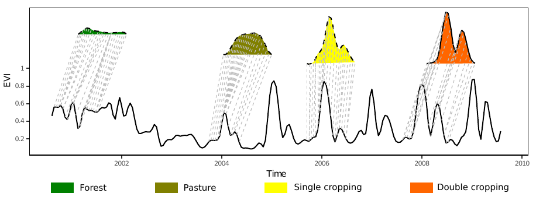
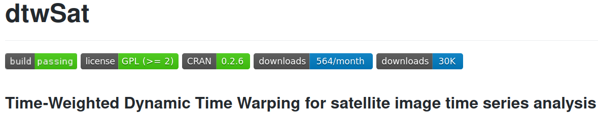
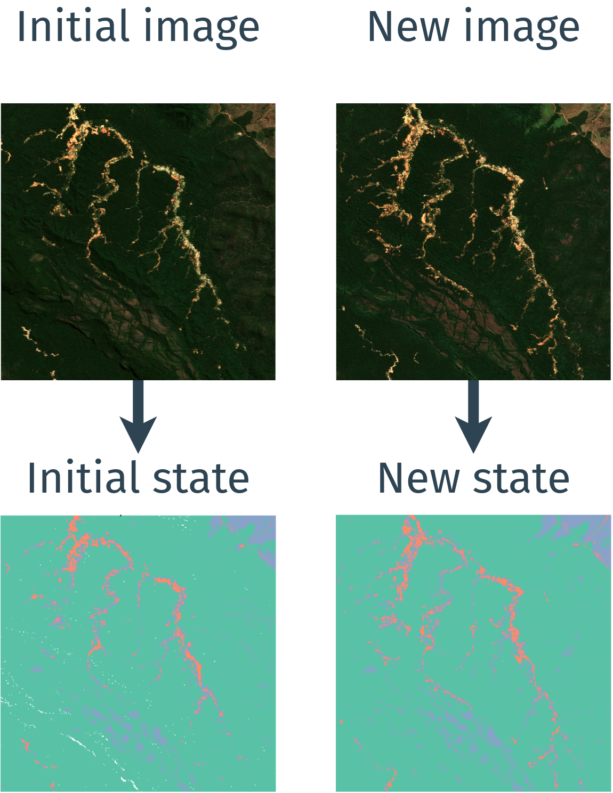
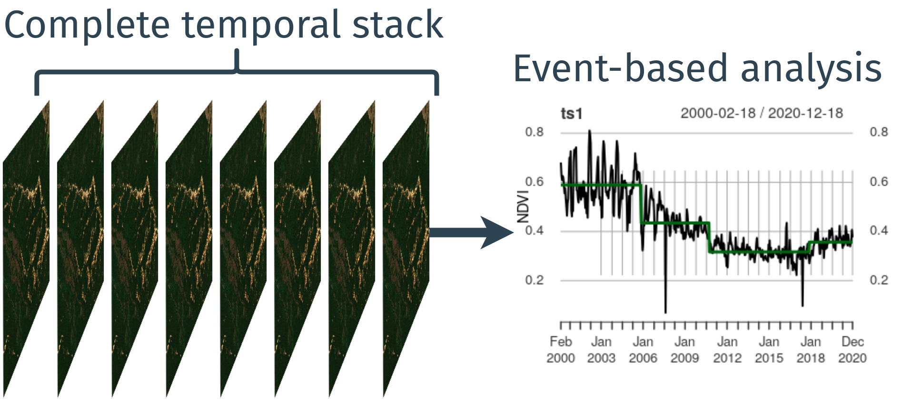
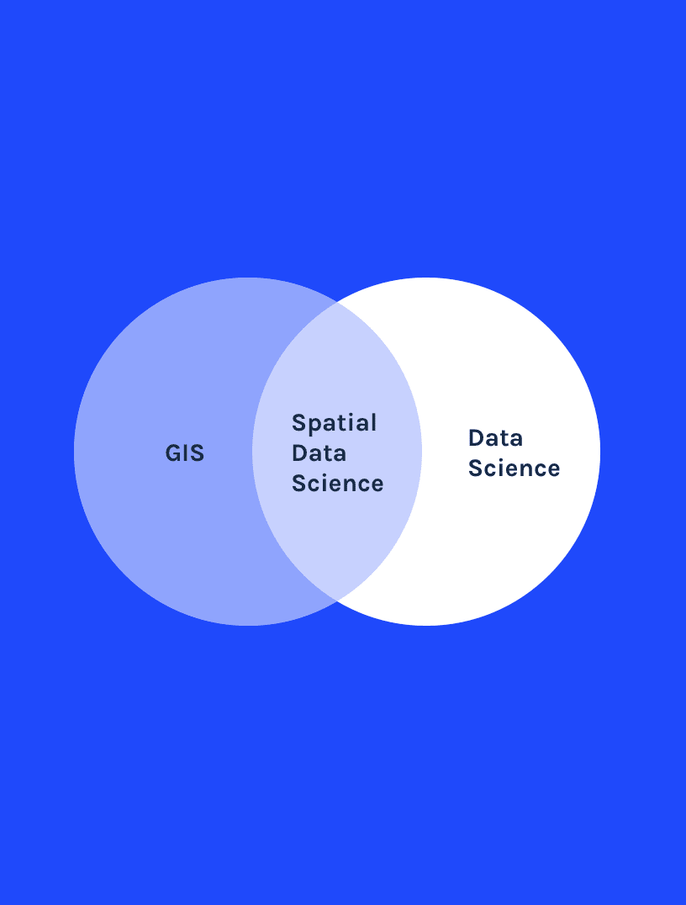
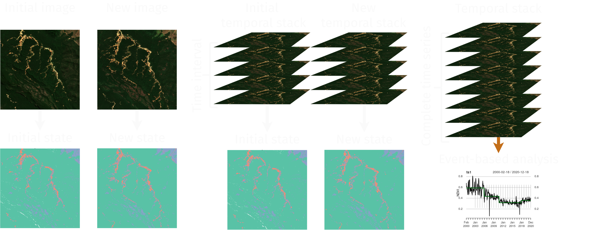
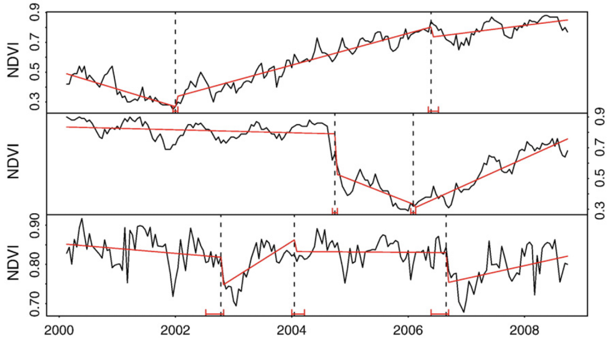

class: clear
```{r setup, include=FALSE, echo=FALSE}
library(magrittr)
library(xaringanExtra)
options(htmltools.dir.version = FALSE)
xaringanExtra::use_panelset()
```

.center.bg-washed-red.b--dark-red.ba.bw2.br3.shadow-5.ph4.mb5[
**Here insert a motivational figure about global environmental changes**
]


---
class: 
# Big-Data supporting interdisciplinary research

<div class="grid-4-1">
--
<div class="extension-tile lemon-meringue"><div>Earth observation</div></div>
--
<div class="extension-tile maximum-yellow-red"><div>In situ<br>data</div></div>
--
<div class="extension-tile prussian-orange"><div>Statistics and surveys</div></div>
--
<div class="extension-tile maximum-red"><div>Citizen science</div></div>
</div>

--

.center.bg-washed-blue.b--dark-red.ba.bw0.br3.shadow-5.ph4.mt1.ma0.pb4[
### **I investigate how to integrate and extract information from a variate of data sources and develop spatial analysis tools to support real world applications.**
]


???

- XXXXXX, thank you for the introduction and for the opportunity to share and discuss my work with you 

- Today we face big environmental and sustainability challenges: climate changes, biodiversity loss, inequality, everything in a globalized world 

- To tackle these challenges a interdisciplinary research is needed

- usually, requiring a great deal of heterogeneous data sets, including different space and time scales, as well as data quality

- Including, for example, EO, In situ sensors, Statistics and surveys, and more, such as citizen science sources 

- Therefore, it is not always easy to extract information from such sources 

- In my research, in Geoinformatics and GIScience I investigate how to integrate and extract information from a variate of data sources

- I develop new methods and tools to support real world applications and eventually also decision making and policy making

---
# Time-Weighted Dynamic Time Warping (TWDTW)

.footnote-left[[Maus et al. (2016)](https://doi.org/10.1109/JSTARS.2016.2517118) and [Maus et al. (2019)](http://dx.doi.org/10.18637/jss.v088.i05)]

.pull-left.center[
#### TWDTW matches well known temporal profiles to segments of satellite image time series to produce land-use/land-cover information.
]

--

.pull-right.center[]

--


.pull-left.mt3[]

.pull-right.pl2[
- More than 30K downloads from [CRAN](https://cran.r-project.org/web/packages/dtwSat) with known applications in research and business
`install.package("dtwSat")`
- Development version [github.com/vwmaus/dtwSat](https://github.com/vwmaus/dtwSat)]

???

- My main contribution to that was the development of a novel method to extract land-use and land-cover information from EO time series (EOTS)

- My motivation to develop the new method was that the current state-of-the-art machine learning algorithms require enormous amounts of labeled training data

- (The data used to calibrate classification land-use and land-cover classification models)

- However, this data is not always easy to collect or sometimes even impossible, for example wen we want to produce information of historical land-use and land-cover changes

- While investigating how to overcome this limitation 

- I discovered that by adding a "temporal-weight" to a method called dynamic time warping (developed in the 70s in the field of speak recognition) I could produce accurate land-use and land-cover maps using as little as one sample per land-use or land-cover class -- while machine learning algorithms require the order of thousands samples per class. 

- The main limitation of the method is its computational time. However, The method is proven to be robust to variations in the phelogical cycles, to noise and gaps in the EO satellite time series.

- Dynamic Time Warping searches for similar temporal profiles by minimizing the difference between them

- For example, in the top of the figure in the left hand side is a well known temporal profile (e.g. Vegetation Index)

- TWDTW finds the matches of the profile to segments of an arbitrary vegetation time series

- Besides the scientific publication, I also published the novel method as an open source R package called dtwSat. 

- I was very happy that the package was well received, it has been downloaded more than 30K times and I haven been contacted by researcher and private sector (mostly remote sensing companies) that use the software on their applications.

---
class: 

# Where are minerals extracted from? 

.left-column[


- Mapping raw material extraction and related impacts with global coverage

- Linking the extraction pacts to supply chains to calculate final consumption footprints.
]

--

.footnote-right[Screenshot of [ESA CCI Land cover viewer](http://maps.elie.ucl.ac.be/CCI/viewer/)]

.right-column.center[

.bg-washed-blue.b--dark-blue.ba.bw0.br3.shadow-5.mh1.mt0.font110[
**Mining is dismissed from the classification system of most land cover data products**
]
]

???

- Besides methods my research has also produced novel data sets. 

- My most recent data contribution was the production of a global mining map

- This work was developed in the context of the ERC project FINEPRINT, for which I lead a work package on geodata integration and analysis

- In this project I identified a large data gap on global mining areas

- Although, mining is an important economic activity and critical to our modern society, providing materials for buildings, cars, mobile phones, computers you name it.... almost everything we use this days

- Global scale land cover maps usually disregard mining areas 

- As an example, look at these red areas in CCI Land cover map from the European Space Agency (ESA). 

- The red area in the right hand side is the Urban area of Paraupebas municipality in Brazil

- The area in the left hand side is the largest Iron mine in the world, the Carajá Iron Ore mine

- Although, these two areas have different uses and also different land-covers (biophysical cover), for this map's classification system they are the same

---
class: 
# Algorithms' fault or lack of labeled data?

.footnote-left[Screenshots of [FINEPRINT Viewer](https://www.fineprint.global/viewer)]

.pull-left.center[
.bg-washed-blue.b--dark-blue.ba.bw0.br3.shadow-5.mh1.mt0.font100[
**Carajás Iron Mine, Brazil**
]

]

.pull-right.center[
.bg-washed-blue.b--dark-blue.ba.bw0.br3.shadow-5.mh1.mt0.font100[
**Parauapebas, Brazil**
]

]

???

- In these two figures we can see the two areas in a I just mentioned, 

- The Carajás Iron Ore mine in the left hand side and 

- The Urban area of Paraupebas in the right hand side

- If the areas so different even from a satellite image

- Why we do still do not have mining areas in the classification system of land-use and land-cover maps? 

- Is it the algorithms' fault or lack of labeled data?

- State-of-the-art machine learning algorithms can produce extremely accurate maps but require lots of training data 

- This data should cover the full variance/variability of each land cover class

- which is really bad new for mapping mining areas as they are extremely heterogeneous around the world, because of different landscapes, mining techniques, and of course the types of minerals extracted 

- Therefore, automated mining mapping was not an option, and I had to step back and start collecting data

---
layout: false
class: clear, middle, center
background-image: url(img/global-mining-map.png)

.footnote-right[.font-light[Data source: [Maus et al. (2020)](https://www.nature.com/articles/s41597-020-00624-w)]]

.footnote-left[.font-light[Screenshot of [FINEPRINT Viewer](https://www.fineprint.global/viewer)]]

.left-column.pl1.mt0.font120.left.bottom.font-light[
<br><br><br><br><br><br><br><br><br>
**21,060 Polygons**

**57,000 km²**

**88 % Overall Acc.**

]

--

.right-column[
.bg-washed-green.br3.pl3.left[
  ## Ongoing research and collaborations on mining
]

.bg-washed-green.br3.pl3.left[
- **Mining and regional development in Brazil**

- **Unemployment in coal mining regions (World Bank)**

- **Impact of heavy sand extraction in ecosystems (University of Copenhagen)**

- **Modeling mining indirect land-use changes (University of Queensland and University of Melbourne, Australia)**

- **Mining and tropical forest loss (WWF Germany)**
]]

???

- This map shows the locations of more than 21,000 polyogns which my team produced to fill the mining data gap

- This data has been produce via visual interpretation of satellite images from various sources 

- I am now finishing a second release of the data set which will include more than 50,000 polygons

- This data set is open and anyone can use it for research or other applications 

- The new data set was well received and has generated several follow up research and collaboration (examples in the slide) 

- As you can see there is a vast range of research topics are making use of the data and which I would never have imaged

- This also, highlights the importance of open data and open science

---
layout: false
class: 
# Automatic mining mapping and volumetric changes

.left-column[
- **Deep Learning for mining detection (University of Münster, Germany and Federal University of Pampa, Brazil)**

- **Synthetic-aperture radar for measuring extraction volume (DLR - German Aerospace Center)**
]

.right-column[
 <div class="copyright-container">
  
  <div class="copyright-bottom-right font-dark">&copy; Marie Lachaise (DLR)</div>
</div>
]

---
class: inverse, middle, center

.font300[**How do we measure land-use changes using satellite earth observations?**]

???

- You might be wandering what this all have to do with the title of this presentation! 

- Well, everything we have been talking about has to do with land-use and land-cover changes. 

- But how do we measure land-use and land-cover changes using satellite EO? 

---
class:
# Change analysis based on comparison of states

--

.footnote-left[.font80[Contains modified Copernicus Sentinel data 2018-2020.]]

.pull-left.center[
<figure>
  <figcaption>.bg-washed-blue.b--dark-green.ba.bw0.br3.shadow-5.mt0.font150.ph2[
  **Snapshots**
  ]</figcaption>
  <p>
</figure>
]

--

.pull-right.center[
<figure>
  <figcaption>.bg-washed-blue.b--dark-green.ba.bw0.br3.shadow-5.mt0.font150.ph2[
  **Time series**
  ]</figcaption>
  <p>
</figure>
]

.bg-washed-red.b--dark-green.ba.bw0.br3.shadow-5.mt0.font130.ph2.center[**The higher accuracy comes at a cost of an arbitrary selection of intervals that violates time**]

???

- When satellite EO data was more scarce, we could measure changes by using single images taken at a different time, as we can see in this figure

- We take two images from different dates and produce a map of states for each image

- let's say a two land-cover maps and compare them to capture the changes 

- These approach can be strongly affected by the accuracy of the map which is highly dependent on the period of the year when the images were acquired 

- Today more sophisticate classification algorithms use multiple images to produce each land cover map with higher accuracy than using a single image for each period

- As we see in the illustration in the right hand side, where the maps are produced using two temporal stacks

- However, the higher accuracy comes at a cost of an arbitrary selection of intervals that violates time

- The arbitrary length of the stacks adds additional error to change measurements and can distort causal links between variables in land change analysis

- This happens because events and process taking place on the ground can irregular and have variable duration 

- For example, a fast forest clear cut event can take place at any time, but not over the complete arbitrary time period 

- On the other hand, a forest degradation process can be slower, holding from several months to years with consecutive events of selective logging or forest fires


This has been allowed by the increasing availability of satellite images with high spatial temporal resolution, for example, Sentinel-2

In the past when only a few satellite images were availabel over time, the best we could do to analyse changes was to compare them.  Today we still continue to compare images, alghough on a higher temporal resolution.The full potential of the currently tempral available satellite images time series is still to be explored in a continuus manner. For example moving from comparing time series to events, would improve studies on land use trajectories and extraction of causal rules. 

Ignoring the order of time can destor causal links between variables. Runge 2018 (Other others do) shows that time aggregation can create spurious causal links as it can violate the Markov assumption. 

According to Runge 2018 the strengh of the causal machanisms can fluctuate onver time. Could the strengh of spefic causal machanism Z --> Y be hold null for a time period given an intervention machanism (Z _||_ Y | X)?  In that case does the causal machanism exists or it does not exist during the time period? Peters et al (2016) will explain this better! 

<!-- .bg-washed-green.b--dark-green.ba.bw0.br3.shadow-5.mt0.font120.ph2[ -->
<!-- **Temporal stacks have arbitrary length that violates time and add error in change measurements and distort causal links between variables in land-use change analysis.** -->
<!-- ] -->


---
layout: false
class: 
# Arbritary temporal segmentation

```{r calendar-segments-plot, eval=TRUE, echo=FALSE, warning=FALSE, message=FALSE, cache=FALSE, fig.width=15, fig.height=7}
library(plotly)
library(magrittr)
library(lubridate)
ts <- readr::read_csv("https://raw.githubusercontent.com/vwmaus/vwmaus.github.io/master/assets/data/time-series-forest-grass.csv") %>% 
  dplyr::filter((EVI > 0.4 & Time < lubridate::ymd(20061231)) | Time >= lubridate::ymd(20061231), Time > lubridate::ymd(20031220), Time < lubridate::ymd(20121001)) 

p <- plot_ly(ts, x = ~Time, y = ~EVI, type = 'scatter', mode = 'lines', name = "Time series") %>%
  layout(showlegend = TRUE, yaxis = list(title = "MODIS EVI"), font = list(family = 'Fira Sans'), title = "longitude: -52.45200 latitude: -12.33254")

for(i in 1:9){
  v.year <- seq(from = lubridate::ymd(20040101), to = lubridate::ymd(20120930), by = '1 year')[i]
  p <- add_lines(p, name = paste("Year calendar", i), x = c(v.year, v.year), y = c(0, 1), visible="legendonly", line = list(color = "#ff7f0e", widthh=1, dash="dot"), legendgroup = 'group2')
}

for(i in 1:9){
  v.year <- seq(from = lubridate::ymd(20040801), to = lubridate::ymd(20120731), by = '1 year')[i]
  p <- add_lines(p, name = paste("Crop calendar", i), x = c(v.year, v.year), y = c(0, 1), visible="legendonly", line = list(color = "#2ca02c", widthh=1, dash="dot"), legendgroup = 'group3')
}
p
```

---
layout: false
class: 

# Event-based information

.center[]

???

- Here I argue for a methodological paradigm change on land change information 

- Moving from comparing maps of states to analyzing spatiotemporal events 

- Therefore, I propose this following research question

- I intend to investigate this question during the next years 

- And I for see that ensuring this question will allow to improve land change analysis, for example, 

- It will allow to analyze land-use trajectories 

- And improve causal inference to help understand drivers of change and assess intervention outcomes that can give valuable information for sustainable land management, environmental conservation, food security and other interdisciplinary applications 

---
layout: false
class: clear, middle, center

<!-- .font-light.font300[**Applied Spatial Data Science**] -->

# .font-dark[New curricular component: <br> Applied Spatial Data Science]



???

- Data Science GIS that exploring geodata, looking at where things happen and understanding why they happen there.

- physical geography, human geography and in geographies of sustainability

- Spatial Data Science

- Using semantics and spatial data science to explore petabytes of satellite images.


---
# Applied Spatial Data Science

.left-column[
  
  
Applied because it will focus on concepts and usage of common spatial data science infrastructures and software for interdisciplinary problems.

]

--

.right-column.mt0[

### Applied Spatial Data Science I (BSc Level)

- Reproducibility and open science
- Geocomputation and programming with R
- Data cubes
- Pattern detection and clustering (e.g., using machine learning algorithms)
- Geodata visualization and sharing
]

--

.right-column.mt-1[
### Applied Spatial Data Science II (MSc Level)
- Big-Data and cloud computing
- Predictive analysis
- Deep learning
]

--
.right-column.mt-1[

### Current related courses

- Math I and II, Geoprocessing I and II, Statistics, Quantitative methods, Network analysis

]

???

- raster (satellite EO) and vector data

- methods to analyze patterns in space as well as time
 
- how to apply ML method to forecast deforestation/XXXXXXX

- It will not focus on theoretical elaboration of the mathematics, statistics and informatics.

- The learning of the topics would be via applications example.  

- Questions on the basis of available data

- communicating that effort

- showing the results

- Sharing the data used

- exposing the path that led to the answers in a comprehensive and reproducible way

- R because it offers a statistical language and environment easily extensible and broadly used by non-computer programmers to carry out programming tasks. Moreover, R plays a large role in data science and geodata analysis. Nevertheless, solid knowledge of geocomputation will allow students to use other prominent programming languages, for example, Python and Julia.

<!-- - Acknowledges the fact that available data may not be sufficient to answer questions, and that any answers are conditional on the data collection or sampling protocols employed. -->

---

# Conclusions 

--

### Short-term research
  - Developing methods to improve information on the global mining sector, including 2D and 3D
  - A range of applications on land use and and land cover change
  - Investigate whether different crop management can be detected in the satellite image time series

--

### Long-term research 
  - Develop methods to extract and analyze event using satellite earth observation time series

--

### Potential initial collaborations with GIUB (but not limited to)

- Remote sensing group: Vegetation an snow time series analysis

- Climatology: Mining patterns in long-term climate time series

- Land systems and sustainable land management: 

---
class: clear, inverse



.pull-left[
  `r rmarkdown::metadata$author`
]

.pull-right[
  **.right[.font300[Thank you!]]**
]


---
layout: false
class: inverse, middle, center, mline

# Extra slides 

---
# Events do not have a well defined interval to happen

.left-column[
Detected changes in the trend component (red) of 16-day NDVI time series
(black) extracted from a single MODIS pixel within a pine plantation, planted in 2001 (top),
harvested in 2004 (middle), and with tree mortality occurring in 2007 (bottom) (source:
source: [Verbesselt et al. (2010)](https://doi.org/10.1016/j.rse.2009.08.014)).]

.right-column.center[]


---
layout: false
class: 
# What happend to longer events/processes?

```{r segments-degradation, eval=TRUE, echo=FALSE, warning=FALSE, message=FALSE, cache=FALSE, fig.width=15, fig.height=7}
library(plotly)
library(magrittr)
library(lubridate)
ts <- readr::read_csv("https://raw.githubusercontent.com/vwmaus/vwmaus.github.io/master/assets/data/time-series-degradation.csv")

p <- plot_ly(ts, x = ~Time, y = ~EVI, type = 'scatter', mode = 'lines', name = "Time series") %>%
  layout(showlegend = TRUE, yaxis = list(title = "MODIS EVI"), font = list(family = 'Fira Sans'), title = "longitude: -56.66709, latitude: -11.92187")

for(i in 1:18){
  v.year <- seq(from = lubridate::ymd(20010101), to = lubridate::ymd(20180131), by = '1 year')[i]
  p <- add_lines(p, name = paste("Segment", i), x = c(v.year, v.year), y = c(0, 1), visible="legendonly", line = list(color = "#ff7f0e", widthh=1, dash="dot"), legendgroup = 'group2')
}
p
```


---
# Tropical forest loss due to mining

.footnote-left[Source: Giljum & Maus et al. (Manuscript under review)]

.right-column.left[
<figure>
  <figcaption>Direct forest cover loss</figcaption>
  <p>
</figure>
]

.left-column.left.mt3[**Besides direct forest cover loss, mining also causes tropical forest loss up to 50 km from the actual extraction sites due to indirect land-use changes.**]

???

- Just to bring an example of research unloked by the nove mining data 

- We have quantified the direct tropical forest loss due to mining 

- Not for example, Indonesia, where lots of coal mining has taken place over forests over the last two decades

- Besides that, mining also attracts other economic activities and settlements, which can cause further forest loss, but this time indirectly

- We found global mines can drive forest loss up to 50 km far from mining sites 
