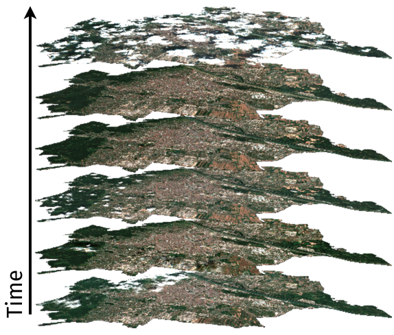
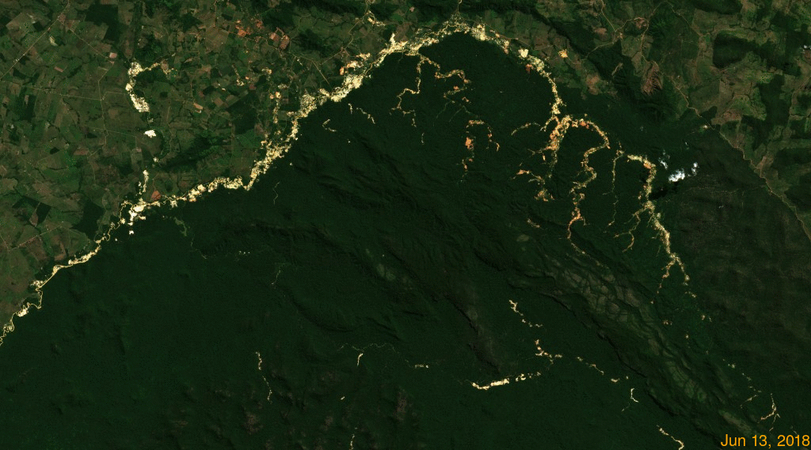
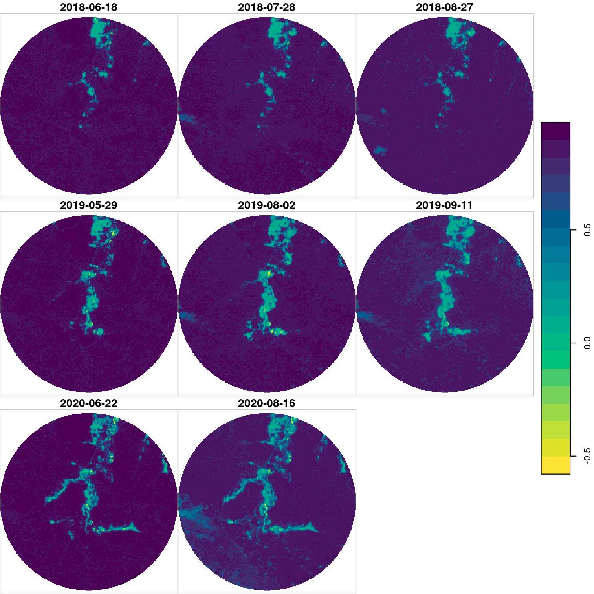

class: inverse, mline, hide_logo

```{r xaringan-logo, echo=FALSE}
xaringanExtra::use_logo(image_url = "https://github.com/vwmaus/vwmaus.github.io/raw/master/assets/img/what-is-sds.png", exclude_class = c("hide_logo"), height = "489px", width = "323px")
```

```{r xaringanExtra-clipboard, echo=FALSE}
xaringanExtra::use_clipboard()
```

```{r setup, include=FALSE}
library(magrittr)
options(htmltools.dir.version = FALSE)
library(xaringanExtra)
xaringanExtra::use_tile_view()
xaringanExtra::use_panelset()
xaringanExtra::use_extra_styles(
  hover_code_line = TRUE,         #<<
  mute_unhighlighted_code = TRUE  #<<
)
```

```{r cube-subset, eval=TRUE, echo=FALSE, warning=FALSE, message=FALSE, cache=FALSE, results='hide', fig.show='hide', fig.path="img/", fig.retina = 3}
# Create a folder to safe the data
if (!file.exists("./data/ndvi.zip")){
  dir.create("./data")
  download.file("https://cheesebox.crabdance.com/s/sTGyHGxiTFGd2aD/download", destfile = "./data/ndvi.zip")
}
unzip("./data/ndvi.zip", exdir = "./data")

library(stars)

files <- dir("./data/NDVI", pattern = ".tif$", full.names = TRUE)
dates <- readr::read_csv("data/NDVI/dates.csv")
kaiapo_cube <- read_stars(files, along = "time", proxy = TRUE)
kaiapo_cube <- st_set_dimensions(kaiapo_cube, which = "time", values = dates$date)

pto <- st_point(c(489604.1,9231193.3))
pto <- st_sfc(pto, crs = st_crs(kaiapo_cube))
pto_buffer <- st_buffer(pto, 2000)

zoom_cube <- kaiapo_cube[pto_buffer]
zoom_cube <- st_as_stars(zoom_cube)

ts1 <- tibble::as_tibble(st_extract(kaiapo_cube, pts = pto))
ts1 <- dplyr::transmute(ts1, Time = time, NDVI = attr / 10000)

pto <- st_point(c(476361.7, 9239393.0))
pto <- st_sfc(pto, crs = st_crs(kaiapo_cube))
ts2 <- tibble::as_tibble(st_extract(kaiapo_cube, pts = pto))
ts2 <- dplyr::transmute(ts2, Time = time, NDVI = attr / 10000)

plot(zoom_cube[,,,seq(2,40,5)] / 10000, breaks = "equal", col = rev(hcl.colors(20, "viridis")), key.pos = 4)
```

# Applied Spatial Data Science I

<div class="grid-3-1">
<div class="extension-tile-course font150 bg1-grey">Unit 1<br>Introduction to Spatial Data Science</div>
<div class="extension-tile-course maximum-red">Unit 2<br>Geodata visualization and sharing</div>
<div class="extension-tile-course bg1-grey">Unit 3<br>Pattern detection and clustering</div>
</div>

--

.pull-left[
## Requiriments:

- Basic concepts of remote sensing 

- Basic skills in R programming language from geodata (acquired in Units I of this course)

]

.pull-right[
## After this lecture you will:

- Recall the concept of satellite image time series and what information it can provide

- Know how to use R to visualize satellite image time series for land change analysis
]

???

- The main objective of the course on Applied Spatial Data Science I is to prepare you to solve interdisciplinary problems using geodata and programming

- In the first unit, concluded last week, we learned the basic concepts of spatial data science and how to use R programming language for geodata handling and analysis

- Today I will introduce you to data cubes and change detection

- This topic is extremely relevant, for example, to measure Sustainable Development Goals Indicators related to forest cover and land-use changes. As we will see in today's application on Iligal gold mining within the Indigenous Territory Kayapó.

- Let's start by introducing the concept of satellite image time series

---
class: hide_logo
# Sequence of images acquired at different dates

.center[]

<div style="margin-top:-30px;">
.font80[Images by Lorenz Wimmer. True color composites form Sentinel-2 images over Vienna (Contains modified Copernicus Sentinel data 2020)]
</div>

???

- SITS as the name says, is a sequence of images from the same location acquired at different times

- In this slide we see a sequence of satellite images from the city of Vienna

- Kindle prepared by my master student Lorenz Wimmer who investigated environmental inequalities in Vienna using satellite images time series 

- To make a time series, these images must be properly georeferenced so that pixel in one image correspond the same location in the other images

- If the images are correctly georeferneced we can stack them --- making a pile of images --- a time series

---
class: hide_logo
# Satellite Images Time Series

.footnote-left[Images by Lorenz Wimmer. True color composites form Sentinel-2 images over Vienna (Contains modified Copernicus Sentinel data 2020)]

.pull-left[

]

.pull-right[

]

???

- Obviously, a pile of images can produce very nice videos and animations of changes on the Earth's surface

- But it can also produce extremely relevant information for a range of applications, e.g. Urbanization, Forest and habitat loss, crop helpth monitoring relevant for food security, and many more.... 

- Look at this illustration 

---
class: hide_logo
# Land-use trajectory

.center[]

.footnote[Figure source: [Maus et al. (2019)](http://dx.doi.org/10.18637/jss.v088.i05)]

???

- Note that we move from comparing image snapshots to analysis complete time series 

- When we look into a single location we can see the history of what has happened in that location 

- On the left hand side we have a sequence of satellite images -- in this case the vegetation index EVI, which you probably remember from your Geoprocessing course -- In short higher EVI values mean more green vegetation 

- And on the right hand side we visualize the values of the vegetation index of a single pixel over time

- I have added some labels here based on ground information --- this is a real data point in the Brazilian Amazon 

- Initially the area is cover with forest, but in the beginning of 2002 a deforestation event happened 

- After that, the area has been used for cattle razing until 2005

- And converted to agriculture in 2006

- We can call that the land-use trajectory of the area, which is a extremely important information for sustainable land management and planing 

- For example, this information can be used to understand drivers of change, what caused the deforestation? Cattle razing or agriculture? 

- Soils in the amazon region are not apt for agriculture immediately after the forest cut, they require a few years of rest to correct Ph for example before crop plantations can be introduced

- Now that we know what SITS are and that time series can provide valiuable information on land-use changes

- Let's see how they look like in our computer systems 

---
class: hide_logo
background-image: url(img/kayapo_gold_mining.jpg)
# Example of time series application

.footnote-left.font-light[
Gold mine in the Kayapo indigenous territory. Image by Ibama via Wikimedia Commons [(CC BY-SA 2.0)](https://creativecommons.org/licenses/by-sa/2.0/)
]

--

.right-column[]

.left-column.font-dork.bg-washed-green.pl2.bw1.br3.mt4[Animation showing the the evolution of illegal gold mining in the northern part of the Indigenous Territory Kayapó in Brazil from 2018 to 2020. Contains modified Copernicus Sentinel data 2018-2020. More infomration [here](https://news.mongabay.com/2019/12/illegal-gold-rush-causing-irreversible-damage-to-rivers-in-the-brazilian-amazon/).
]

???

- In this animation we observe the land-cover changes in the Indigenous Territory Kayapó in Brazil from 2018 to 2020, where small scale gold mining takes place

- Small scale gold mining within Indigenous Territories in Brazil is a very old topic

- But over the last two to three years conflicts between indigenous populations and miners have increased, gaining international attention because of its effects on the well-being of indigenous populations and on the tropical forest and biodiversity conservation

- In the next slides we will build a data cube for this area and give a close look at a time series example 

---
class: clear, inverse, top, hide_logo

.panelset[

.panel[.panel-name[Interactive of the study area]

```{r, eval=TRUE, echo=FALSE, warning=FALSE, message=FALSE, fig.width=14, fig.retina = 3}
suppressPackageStartupMessages(library(leaflet))
suppressPackageStartupMessages(library(leafem))
suppressPackageStartupMessages(library(sf))

bb <- st_as_sfc("POLYGON ((-51.33316 -7.097949, -50.91623 -7.098061, -50.91628 -6.866484, -51.33299 -6.866376, -51.33316 -7.097949))") %>% 
  st_sf(crs = "EPSG:4326")
pto <- st_point(c(489604.1,9231193.3))
pto <- st_sfc(pto, crs = "EPSG:32722")
pto_buffer <- st_buffer(pto, 2000)
pto <- st_transform(pto, crs = st_crs(bb))
pto_buffer <- st_transform(pto_buffer, crs = st_crs(bb))


leaflet(bb) %>%
  leaflet::setView(lng = st_coordinates(pto)[1], lat = st_coordinates(pto)[2], zoom = 4) %>% 
  leaflet::addWMSTiles(
    "https://tiles.maps.eox.at/wms?",
    layers = "s2cloudless-2020_3857",
    group = "2020 Sentinel 2 mosaic",
    options = leaflet::WMSTileOptions(format = "image/jpeg", version = "1.1.1", transparent = FALSE),
    attribution = paste("Sentinel-2 cloudless - https://s2maps.eu by EOX",
                        "IT Services GmbH (Contains modified Copernicus",
                        "Sentinel data 2020)")) %>%
  leaflet::addWMSTiles(
    "https://tiles.maps.eox.at/wms?",
    layers = "s2cloudless-2019_3857",
    group = "2019 Sentinel 2 mosaic",
    options = leaflet::WMSTileOptions(format = "image/jpeg", version = "1.1.1", transparent = FALSE),
    attribution = paste("Sentinel-2 cloudless - https://s2maps.eu by EOX",
                        "IT Services GmbH (Contains modified Copernicus",
                        "Sentinel data 2019)")) %>%
  leaflet::addWMSTiles(
    "https://tiles.maps.eox.at/wms?",
    layers = "s2cloudless-2018_3857",
    group = "2018 Sentinel 2 mosaic",
    options = leaflet::WMSTileOptions(format = "image/jpeg", version = "1.1.1", transparent = FALSE),
    attribution = paste("Sentinel-2 cloudless - https://s2maps.eu by EOX",
                        "IT Services GmbH (Contains modified Copernicus",
                        "Sentinel data 2018)")) %>%
  addLayersControl(
    baseGroups = c("2018 Sentinel 2 mosaic", "2019 Sentinel 2 mosaic", "2020 Sentinel 2 mosaic"),
    options = leaflet::layersControlOptions(collapsed = FALSE),
    position = "bottomright") %>% 
  addPolygons(fill = FALSE, color = "#d62828ff") %>%
  addMarkers(data = pto) %>%
  addPolygons(data = pto_buffer, color = "#fcbf49ff", fill = FALSE) %>%
  addMouseCoordinates(epsg = 32722, proj4string = "+proj=utm +zone=22 +south +datum=WGS84 +units=m +no_defs")
```
]
.panel[.panel-name[Code]

```{r, eval=FALSE, echo=TRUE}
# To install the required packages run: install.packages(c("leaflet", "leafem", "sf")
library(leaflet)
library(leafem)
library(sf)

bb <- st_as_sfc("POLYGON ((-51.33316 -7.097949, -50.91623 -7.098061, -50.91628 -6.866484, -51.33299 -6.866376, -51.33316 -7.097949))") %>% 
  st_sf(crs = "EPSG:4326")
pto <- st_point(c(489604.1,9231193.3))
pto <- st_sfc(pto, crs = "EPSG:32722")
pto_buffer <- st_buffer(pto, 2000)
pto <- st_transform(pto, crs = st_crs(bb))
pto_buffer <- st_transform(pto_buffer, crs = st_crs(bb))

leaflet(bb) %>%
  leaflet::addWMSTiles(
    "https://tiles.maps.eox.at/wms?",
    layers = "s2cloudless-2020_3857",
    group = "2020 Sentinel 2 mosaic",
    options = leaflet::WMSTileOptions(format = "image/jpeg", version = "1.1.1", transparent = FALSE),
    attribution = paste("Sentinel-2 cloudless - https://s2maps.eu by EOX",
                        "IT Services GmbH (Contains modified Copernicus",
                        "Sentinel data 2020)")) %>%
  leaflet::addWMSTiles(
    "https://tiles.maps.eox.at/wms?",
    layers = "s2cloudless-2019_3857",
    group = "2019 Sentinel 2 mosaic",
    options = leaflet::WMSTileOptions(format = "image/jpeg", version = "1.1.1", transparent = FALSE),
    attribution = paste("Sentinel-2 cloudless - https://s2maps.eu by EOX",
                        "IT Services GmbH (Contains modified Copernicus",
                        "Sentinel data 2019)")) %>%
  leaflet::addWMSTiles(
    "https://tiles.maps.eox.at/wms?",
    layers = "s2cloudless-2018_3857",
    group = "2018 Sentinel 2 mosaic",
    options = leaflet::WMSTileOptions(format = "image/jpeg", version = "1.1.1", transparent = FALSE),
    attribution = paste("Sentinel-2 cloudless - https://s2maps.eu by EOX",
                        "IT Services GmbH (Contains modified Copernicus",
                        "Sentinel data 2018)")) %>%
  addLayersControl(
    baseGroups = c("2018 Sentinel 2 mosaic", "2019 Sentinel 2 mosaic", "2020 Sentinel 2 mosaic"),
    options = leaflet::layersControlOptions(collapsed = FALSE),
    position = "bottomright") %>% 
  addPolygons(fill = FALSE, color = "#d62828ff") %>%
  addMarkers(data = pto) %>%
  addPolygons(data = pto_buffer, color = "#fcbf49ff", fill = FALSE) %>%
  addMouseCoordinates(epsg = 32722, proj4string = "+proj=utm +zone=22 +south +datum=WGS84 +units=m +no_defs")
```
]
]
---
class: hide_logo
# Hands on: 

### Repeat the steps below to create and visualize a data cube for the sudy area

.panelset[

.panel[.panel-name[Visualization]

.pull-left[]
.pull-right[
```{r ts-gold-mine, eval=TRUE, echo=FALSE, warning=FALSE, message=FALSE, cache=TRUE, fig.height=6, fig.width=7}
library(plotly)
plot_ly(ts1, x = ~Time, y = ~NDVI, type = 'scatter', mode = 'lines', name = "Time series") %>% 
  add_markers() %>% 
  layout(showlegend = FALSE, font = list(family = 'Fira Sans')) %>%
  add_annotations(x = lubridate::ymd(20190110), y=0.7457, angle = 45,
            text="NDVI before deforestation event",
            showarrow=TRUE,
            arrowhead=1,
            ax = 80,
            ay = -30) %>% 
  add_annotations(x = lubridate::ymd(20190602), y=0.0897, angle = 45,
            text="NDVI after deforestation event",
            showarrow=TRUE,
            arrowhead=1,
            ax = 100,
            ay = -80)
```
]
]

.panel[.panel-name[Assignment]
.left-column[Visually investigate temporal patterns in different locations within our area. For example, the time series in the right hand side is within an agricultural crop area. How does it differ from the time series in the mining area? Can you identify other interesting patterns?]
.right-column[
```{r ts-crop, eval=TRUE, echo=FALSE, warning=FALSE, message=FALSE, cache=TRUE, fig.height=5, fig.width=10}
plot_ly(ts2, x = ~Time, y = ~NDVI, type = 'scatter', mode = 'lines', name = "Time series") %>% 
  add_markers() %>% 
  layout(showlegend = FALSE, title = "longitude: -51.21396, latitude: -6.881071", font = list(family = 'Fira Sans'))
```
]
]

.panel[.panel-name[Install]

The software [Rstudio](https://www.rstudio.com/products/rstudio) is required to run the examples. Download it for free [here](https://www.rstudio.com/products/rstudio/download).

Open Rstudio and install the package (stars)[https://r-spatial.github.io/stars/] by running the following command:
```{r eval=FALSE}
# Install the library stars - Spatiotemporal Arrays, Raster and Vector Data Cubes
install.packages("stars")

# Plotly R Open Source Graphing Library https://plotly.com/r/
install.packages("plotly")
```
]

.panel[.panel-name[Download data]
```{r eval=FALSE}
# Create a folder to safe the data
dir.create("./data")

# Download images to data folder
# 40 Sentinel-2 images from the Indigenous Territory Kayapó (~800 MB)
timeout <- getOption('timeout')
options(timeout=300)
download.file("https://cheesebox.crabdance.com/s/sTGyHGxiTFGd2aD/download", destfile = "./data/ndvi.zip")
options(timeout=timeout)

# Unzip the files in the data folder - A folder called NDVI will be created 
unzip("./data/ndvi.zip", exdir = "./data")
```
]

.panel[.panel-name[Build cube]
```{r eval=FALSE, warning=FALSE, message=FALSE, cache=TRUE}
# Load the library stars - Spatiotemporal Arrays, Raster and Vector Data Cubes
library(stars)

# Create a list with the path to all downloaded ndvi tif files
files <- dir("./data/NDVI", pattern = ".tif$", full.names = TRUE)

# A file with the dates of the images is also available. Read it into R
dates <- readr::read_csv("data/NDVI/dates.csv")

# Import the tif files as a data cube
kaiapo_cube <- read_stars(files, along = "time", proxy = TRUE)

# Set the dates of the images as the time dimension of the cube
kaiapo_cube <- st_set_dimensions(kaiapo_cube, which = "time", values = dates$date)
```
]

.panel[.panel-name[Subset cube]
```{r zoom-map, eval=FALSE, warning=FALSE, message=FALSE, cache=TRUE, results='hide', fig.show='hide'}
# Create a point 
pto <- st_point(c(489604.1,9231193.3))

# Add the coordinates reference systems (the same as the data cube)
pto <- st_sfc(pto, crs = st_crs(kaiapo_cube))

# Create a buffer a buffer around the point to subset the cube
pto_buffer <- st_buffer(pto, 2000)

# Subset the data cube to a buffer around the point 
zoom_cube <- kaiapo_cube[pto_buffer]

# Load the sub cube to memory
zoom_cube <- st_as_stars(zoom_cube)

# Plot cube subset -- not that we selecting a few date -- divided by 10000 to adjust scale factor 
plot(zoom_cube[,,,seq(2,40,5)] / 10000, breaks = "equal", col = rev(hcl.colors(20, "viridis")), key.pos = 4)
```
]

.panel[.panel-name[Extract time series]
```{r ts-plot, eval=FALSE, warning=FALSE, message=FALSE, cache=TRUE, results='hide', fig.show='hide'}
# load plotly library
library(plotly)

# Extract time NDVI series for the point location 
ts <- st_extract(kaiapo_cube, pts = pto)

# transform time series into a table 
ts <- tibble::as_tibble(ts)

# rename attributes 
ts <- rename(ts, c("Time" = "time", "NDVI" = "attr"))

# Divided by 10000 to adjust scale factor
ts$NDVI <- ts$NDVI / 10000

# Plot time series 
plot_ly(ts, x = ~Time, y = ~NDVI, type = 'scatter', mode = 'lines', name = "Time series") %>% 
  add_markers() 
```
]
]

???

---
class: hide_logo
# Online resources

.font130[The slides are available from [victor-maus.com/assets/unibern-teaching-example](https://victor-maus.com/assets/unibern-teaching-example)]

### Data cubes in R

- Pebesma, E., Bivand, R. (2021) Spatial Data Science with applications in R. Chapter 6 Data Cubes [Online](https://keen-swartz-3146c4.netlify.app/datacube.html#datacube).

- Dorman, M. (2021) Introduction to Spatial Data Programming with R. Chapter 6 Raster processing [Online](https://geobgu.xyz/r/raster-processing.html)

- Pebesma, E. (2021) R package stars vignettes. [Online](https://r-spatial.github.io/stars/articles/stars1.html)

### Additional reading

- Lovelace, R., Nowosad, J., Muenchow, J. (2021) Geocomputation with R. [Online](https://geocompr.robinlovelace.net/#)

- Baumer, B.S., Kaplan, D.T., and Horton N.J. (2021) Modern Data Science with R. [Online](https://mdsr-book.github.io/mdsr2e/index.html)

.pull-left[
  `r rmarkdown::metadata$author`
]

.pull-right[
  **.right[.font300.font-dark[Thank you!]]**
]
