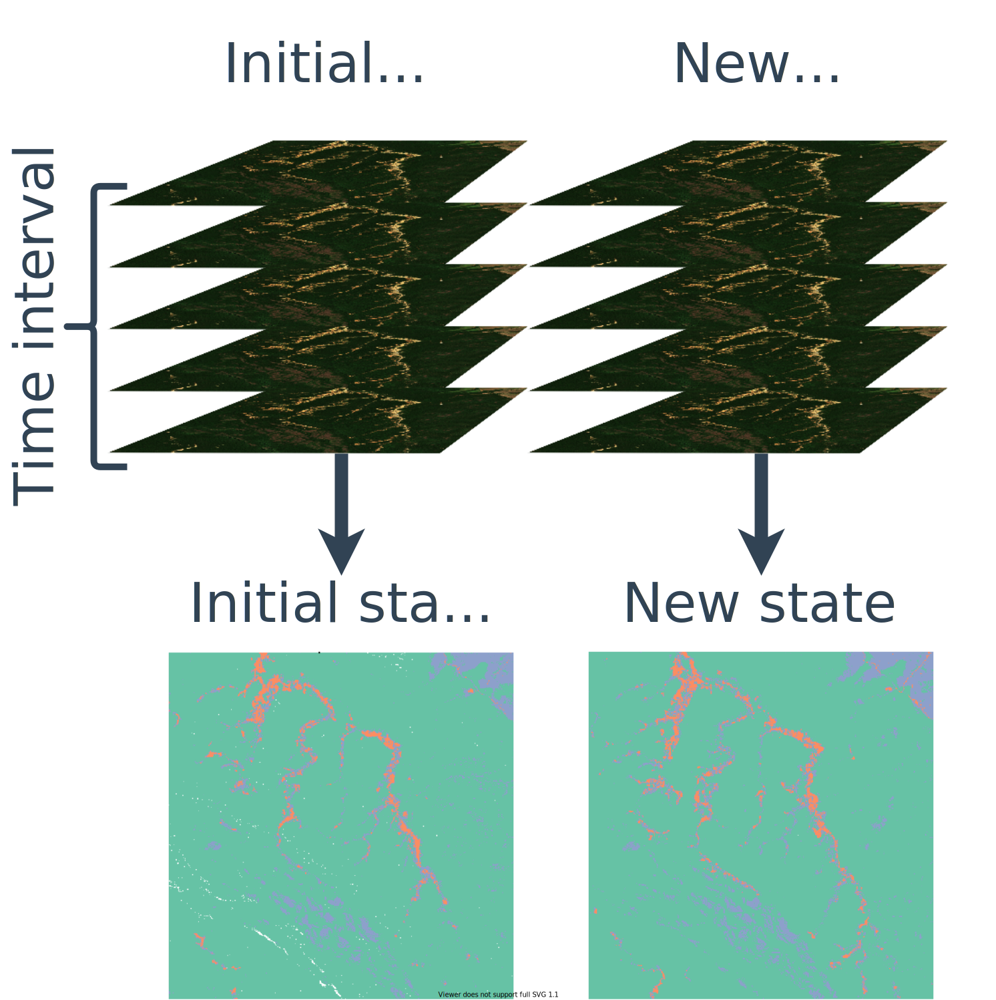
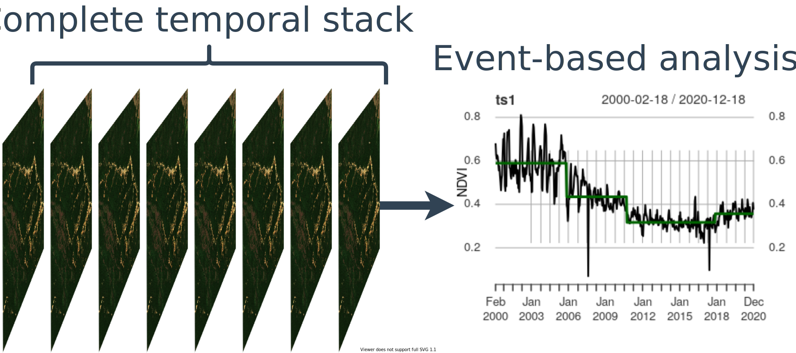

```{r setup, include=FALSE, echo=FALSE}
library(magrittr)
options(htmltools.dir.version = FALSE)
```

# Driver of environmental changes

## Motivate: why is it important to understand drivers of global environmentla changes? To plan interventions to ensure sustainability (and fairness????)

## What is needed for that -- 

.bg-washed-red.b--dark-red.ba.bw2.br3.shadow-5.ph4.mt5[
- methods that can handle large heteregionous data EO + heterogeneous data sources. 
]

---
class: inverse, middle, center, mline

# Why global?

--

.left[Externalization of adverse impacts and supply chains]

--

.center[Reason 2]

--

.left[Reason 3]

--

.right[Reason 3]

---
layout: false

# Soy supply chains in Brazil

- Applied research I contribute to...

- Explain in short the work with Boku. How does Satellite + surveis + other data source feed into reconstruct supply chains and why is it important. Close on how event-based information could improve this analysis (causal inference and indirect land-use).

- Machine learning algorithms mapping... optimization for supply chains.... ???? 

---
layout: true

# Global mining sector

---

A

---


---

- Application 2: Mineal extraction and regional developemtn

- Automated Depp-learning mapping 

- Volumetric changes using SAR data in collaboration with DLR

- Event-based reprensetation of mining: 4D entity (t, x, y, z) in contrast to 3D (t, x, y) land-use changes.

---
class: inverse, middle, center, mline
layout: false

# What about accuracy uncertanty on maps? 

---

# Copernicus land cover data set 

- I have contributed to global spatial accuracy analysis --- Copernicus global land cover data -- Refer to report. 

- It is available from Google Earth Engine plantfor or XXXXX

- Accuracy assessment and citizens science 

---
class: inverse, middle, center, mline
layout: false

# All previous applications heve something in commun, they link human activities to land **changes**

--

**How do we measure changes?**

---

# Land-use change analysis using earth observation data

.footnote-left[.font80[The figure contains modified Compernicus Sentinel-2 images showing gold mining areas within the Indigenous Territory Kaiapó in Brazil]]

.pull-left[.center[

]]

--

.pull-left[.center[

]]

--

**Current state-of-the-art methods to extract information from satellite image time series *violates* time**

???

- Changes based on two snapshots

- Changes based on two time series

---
layout: false
class: inverse, middle, center, mline

# Event-based information

--



--

**Event-based approaches help to ....**

---
layout: false
# Continue 


