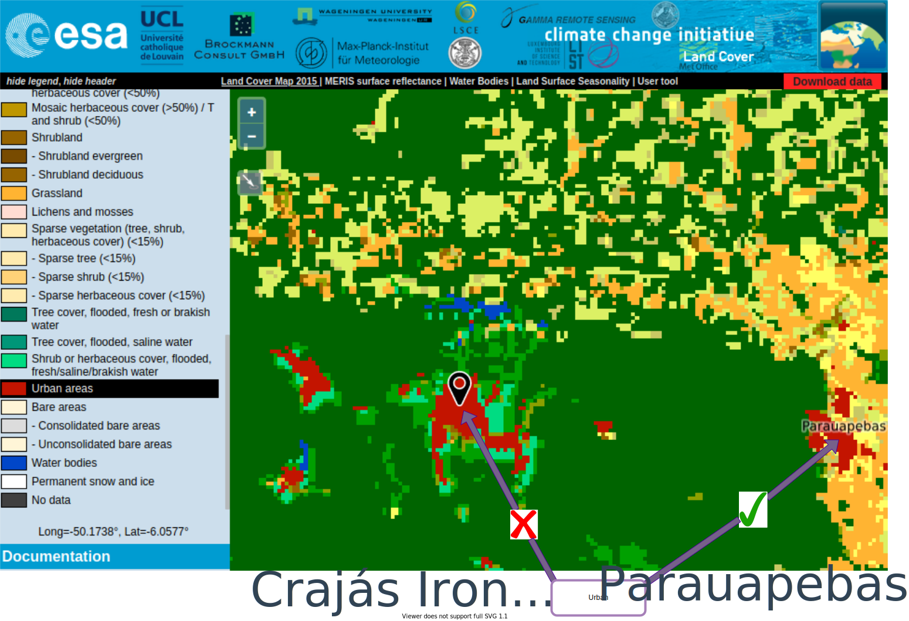
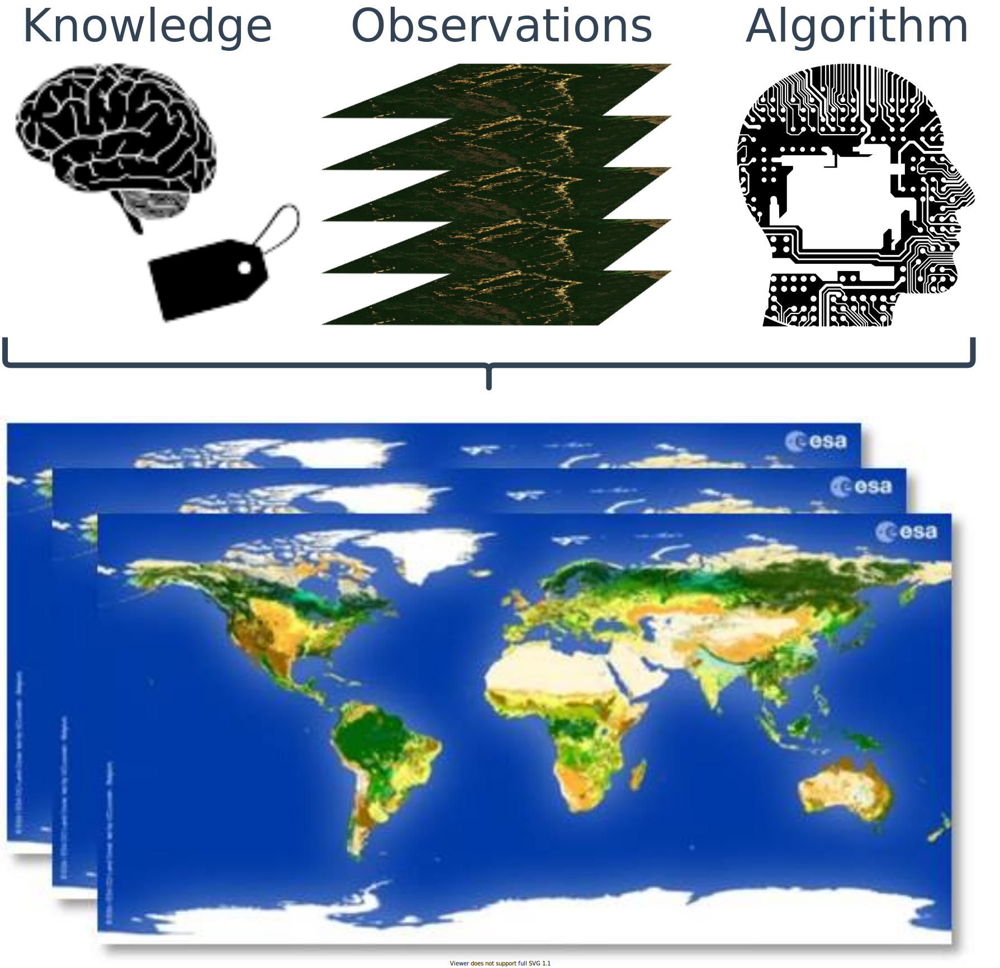
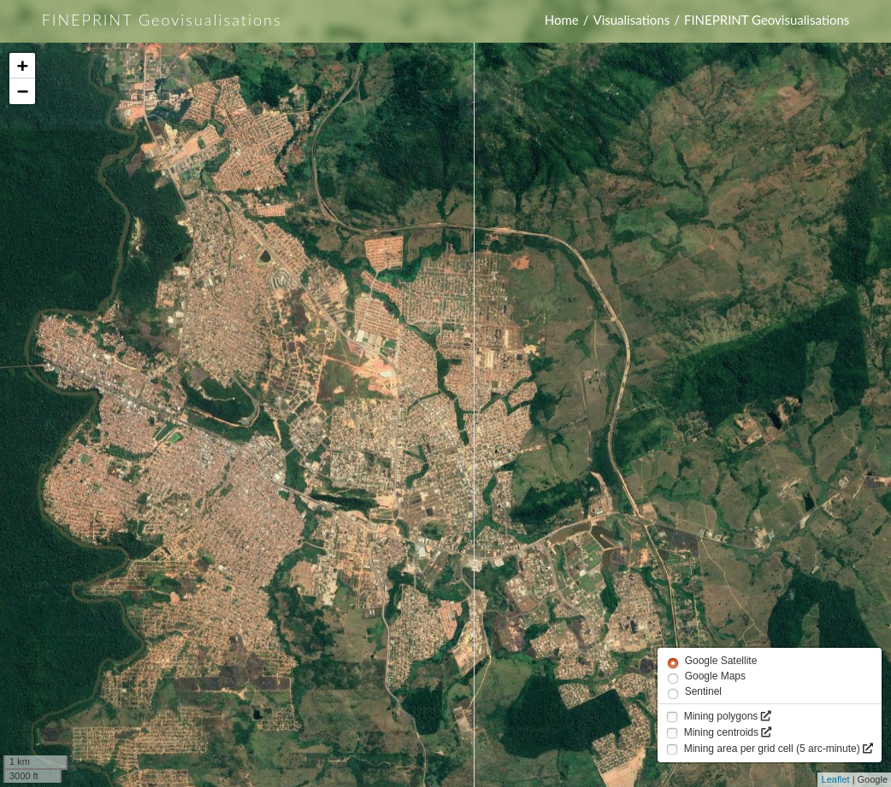

```{r setup, include=FALSE, echo=FALSE}
library(magrittr)
options(htmltools.dir.version = FALSE)
```

# Driver of environmental changes

## Motivate: why is it important to understand drivers of global environmentla changes? To plan interventions to ensure sustainability (and fairness????)

## What is needed for that -- 

.bg-washed-red.b--dark-red.ba.bw2.br3.shadow-5.ph4.mt5[
- methods that can handle large heteregionous data EO + heterogeneous data sources. 
]

---
class: inverse, middle, center, mline

# Why global?

--

.left[Externalization of adverse impacts and supply chains]

--

.center[Reason 2]

--

.left[Reason 3]

--

.right[Reason 3]

---
layout: false

# Soy supply chains in Brazil

- Applied research I contribute to...

- Explain in short the work with Boku. How does Satellite + surveis + other data source feed into reconstruct supply chains and why is it important. Close on how event-based information could improve this analysis (causal inference and indirect land-use).

- Machine learning algorithms mapping... optimization for supply chains.... ???? 

---
layout: false
class: clear

---
class: 

# Global mining land use

.pull-left[.center[

.bg-washed-blue.b--dark-blue.ba.bw2.br3.shadow-5.mh1.mt0.font100[
**Mining is dismissed from the classification system of most land cover data products**
]
]]

--

.pull-right[.center[

.bg-washed-blue.b--dark-blue.ba.bw2.br3.shadow-5.mh1.mt0.font100[
**There is a lack of data on the mining sector at global scale**
]
]]

.footnote-left[Land cover data source: [ESA CCI Land cover](http://maps.elie.ucl.ac.be/CCI/viewer/)]

---
layout: false
class: clear, middle, center
background-image: url(img/global-mining-map.png)

.footnote-right[.font-light[Data source: [Maus et al. (2020)](https://www.nature.com/articles/s41597-020-00624-w)]]

.footnote-left[.font-light[Image source: [www.fineprint.global/viewer](www.fineprint.global/viewer)]]

--

.bg-washed-green.b--dark-green.ba.bw2.br3.shadow-5.ph0.mt1.font120[
**Version 1 \>21,000 Polygons**
]

--

.bg-washed-green.b--dark-green.ba.bw2.br3.shadow-5.ph0.mt1.font120[
**Version 2 (pre-release) \>60,000 Polygons**
]

--

.bg-washed-green.b--dark-green.ba.bw2.br3.shadow-5.ph0.mt1.font120[
**Overall accuracy ........ 88.4 %** (Agreement between experts)
]

--

.pull-left[
.bg-washed-red.b--dark-red.ba.bw2.br3.shadow-5.ph0.mt5.font100[
**1. How to automatize mining monitoring on a large scale?**
]]

--

.pull-right[
.bg-washed-red.b--dark-red.ba.bw2.br3.shadow-5.ph0.mt5.font100[
**2. How to monitor the volume of extracted materials?**
]]

--

.pull-left[
.bg-washed-red.b--dark-red.ba.bw2.br3.shadow-5.ph0.mt2.font100[
**3. How to monitor the volume of extracted materials?**
]]

--

.pull-right[
.bg-washed-red.b--dark-red.ba.bw2.br3.shadow-5.ph0.mt2.font100[
**3. What is the ....**
]]

--


???

# Ongoing research
- Methodological development - Deep learning for mining mapping in collaboration with University of Münster
- Methodological development - Measuring volumetric changes using SAR data in collaboration with the German Space Agancy (DLR)
- Application - Heavy sand extraction in South Africa in collaboration with University of Copenhagen
- Application - Coal mining mapping for unemployment assessment in the transition to renewable energy

---

- Application 2: Mineal extraction and regional developemtn

- Automated Depp-learning mapping 

- Volumetric changes using SAR data in collaboration with DLR

- Event-based reprensetation of mining: 4D entity (t, x, y, z) in contrast to 3D (t, x, y) land-use changes.

---
class: inverse, middle, center, mline
layout: false

# What about accuracy uncertanty on maps? 

---

# Copernicus land cover data set 

- I have contributed to global spatial accuracy analysis --- Copernicus global land cover data -- Refer to report. 

- It is available from Google Earth Engine plantfor or XXXXX

- Accuracy assessment and citizens science 

---
class: inverse, middle, center, mline
layout: false

# All previous applications heve something in commun, they link human activities to land **changes**

--

**How do we measure changes?**

---

# Land-use change analysis using earth observation data

.footnote-left[.font80[The figure contains modified Compernicus Sentinel-2 images showing gold mining areas within the Indigenous Territory Kaiapó in Brazil]]

.pull-left[.center[

]]

--

.pull-left[.center[

]]

--

**Current state-of-the-art methods to extract information from satellite image time series *violates* time**

???

- Changes based on two snapshots

- Changes based on two time series

---
layout: false
class: clear, middle, center, mline

# .invert-font[Event-based information]

--


--

**Event-based approaches help to ....**


---
layout: false
class: inverse, middle, center, mline

# Research plan


---
layout: false
class: inverse, middle, center, mline

# Teaching plan

physical geography, human geography and in geographies of sustainability


---
layout: false
class: inverse, middle, center, mline

# Collaboration 


Remote Sensing Group - Satellite data archive NOAA/MetOp AVHRR - Vegetation and Snow time series analysis

Climate XXXXX - 

Land sustainability - 

Reginal development????? 

---

# Conclusions 

---
class: clear, inverse
.center[]

.pull-left[
  `r rmarkdown::metadata$author`
]

.pull-right[
  **.right[.font300[Thank you!]]**
]

.footnote-right[.font-light[Except where otherwise noted, content on these slides is licensed under <a href='https://creativecommons.org/licenses/by-sa/4.0'>CC BY-SA 4.0 license</a>]]

---
layout: false
class: inverse, middle, center, mline

# Extra slides 

---
class: center

# Mine *vs.* Urban 

.pull-left[.center[
.bg-washed-blue.b--dark-blue.ba.bw2.br3.shadow-5.mh1.mt0.font100[
**Carajás Iron Mine, Brazil**
]

]]

.pull-left[.center[
.bg-washed-blue.b--dark-blue.ba.bw2.br3.shadow-5.mh1.mt0.font100[
**Parauapebas, Brazil**
]

]]


