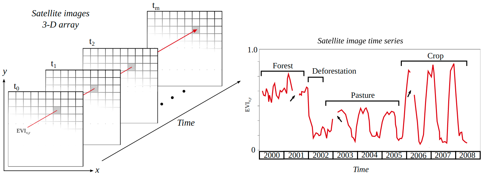

class: inverse, mline

```{r setup, include=FALSE}
library(magrittr)
options(htmltools.dir.version = FALSE)
```

# Applied Spatial Data Science I

<div class="grid-3-1">
<div class="extension-tile-course font150 bg1-grey">Unit 1<br> Introduction to Spatial Data Science</div>
<div class="extension-tile-course bg1-orange">Unit 2<br>Patterns in space and time</div>
<div class="extension-tile-course bg1-grey">Unit 3<br> Predictive analysis</div>
</div>

--

.font120[This lecture is an excerpt of the lecture: **Satellite image time series analysis and change detection**]
.left[.footnote[May 26, 2021]]

.font120[This topic is relevant for ....., for example, Sustainable Development Goals -- indicator XXXXX, which measures proportion of remaining forests in a region.]

???

- The course on Applied Spatial Data Science I is divided in three units

- In the first unit, which we have finished last week, we learned the basic concepts of spatial data science and had an introduction to R programming for geocomputation

- The unity two starts with XXXXXXX Today we will learne 

---
# Today's learning objectives

## Understand what are satellite image time series

## Identify applications of satellite image time series for SDGs

## Manipulate and visualize time series in R

---
# Satellite Images Time Series

.center[]

<div style="margin-top:-30px;">
.font80[True color composites form Sentinel-2 images over Vienna. Images by Lorenz Wimmer]
</div>

???

- I will start by introducing the concept of satellite image time series then we will learn what a satellite data cube is 

- SITS as the name says, is a sequence of images from the same location acquired at different times

- These images must be georeferenced so that pixel in one image correspond the the same location in the other images 

- What can we learn from "SITS" analysis?

---
# Satellite Images Time Series

.footnote-left[Changing from comparing snapshots to time series analysis improves information retrieval]

.pull-left[

]

.pull-right[

]

???

- Given that the images are correctly georeferneced we can then stack them --- making a pile of images --- 

- Obviously, a pile of images can produce very nice videos or animations of changes on the Earth's surface

- But it can also produce extremely relevant information to asses the environment and society

- Look at this example

---
# Land-use trajectory

.center[]

.footnote[Figure source: [Maus et al. (2019)](http://dx.doi.org/10.18637/jss.v088.i05)]

???

- When we look into a single location we can see the history of what has happened in that location 

- On the left hand side we have a sequence of satellite images -- in this case the vegetation index EVI, which you probably remember from your Geoprocessing course

- And on the right hand side we visualize the values of the vegetation index of a single pixel over time

- I have added some labels here based on ground information --- this is a real data point in the Brazilian Amazon 

- Initially the area is cover with forest, but in the beginning of 2002 a deforestation event happened 

- After that, the area has been used for cattle razing until 2005

- And converted to agriculture in 2006

- We can call that the land-use trajectory of the area, which a extremely important information for sustainable land management and planing 

- For example, this information can be used to understand drivers of change, what caused the deforestation? Cattle razing or agriculture? 

- Soils in the amazon region are not apt for agriculture immediately after forest cut, they require time to correct Ph for example before crop plantations can be introduced

- Is everything good until here? Shake your hands like this if everything is understood until now.... 

---
class: inverse, mline, middle, center
# Satellite Data Cube

---
# Satellite Data Cube

--

.center[]

.footnote-left[Figure source: [Pebesma (2021)](https://r-spatial.github.io/stars/)]

???

- Imagine what a satellite data cube is. How does that look like to you? 

- If have imagined something else then this, please let me know, because you have had an innovative idea for a data cube structure ;) 

- But forget this for a while, and look at this.... 

- A satellite data cube has at lease three dimensions, latitude, longitude, and time

- But it can also have more dimensions 

---
# Higher-dimensional cubes (hypercubes)

.center[]

.footnote-left[Figure source: [Pebesma (2021)](https://r-spatial.github.io/stars/)]

???

- As we can see in this figure, the data cube can have also several bands, which makes a hypercube

- Here the dimensions are split for visualization propose, but in the computer system, they are all part of the same data cube 

- Alright, are we still good.... hands shaking if yes.... 

---
class: inverse, mline, center, middle

# Hands on!

???

- Because, now we go to hands on... we will buld our first data cube and visualize a time series... 

---
# Step 1: Create images stack 

.smallish[
```{r eval=FALSE}
# TODO DO: Download step 

library(stars) # Spatiotemporal Arrays, Raster and Vector Data Cubes
files <- dir("./data/EVI", pattern = ".tif$", full.names = TRUE) 
dates <- readr::read_csv("data/EVI/dates.csv")

kaiapo_cube <- read_stars(files, along = list(time = dates$date))
names(kaiapo_cube) <- "evi"
```
]

???

- A

---
# Step 1: Create images stack 

```{r eval=FALSE}
pto <- st_point(c(482886.43,9233169.04))
pto <- st_sfc(pto, crs = st_crs(kaiapo_cube))
ts <- st_extract(kaiapo_cube, pts = pto) 
ts_values <- tibble::as_tibble(ts)
plot(ts_values$time, ts_values$evi, type = "l")
points(ts_values$time, ts_values$evi)

pto <- st_point(c(476361.7,9239393.0))
pto <- st_sfc(pto, crs = st_crs(kaiapo_cube))
ts <- st_extract(kaiapo_cube, pts = pto) 
ts_values <- tibble::as_tibble(ts)
plot(ts_values$time, ts_values$evi, type = "l")
points(ts_values$time, ts_values$evi)

circle = st_buffer(pto, 1000)
plot(kaiapo_cube[circle][,,,1:34], breaks = "equal", col = hcl.colors(11, "Spectral"), key.pos = 4)
plot(x[circle][, , , 1], reset = FALSE)

```


---
# Step 1: Create images stack 

Images available from: [www.victor-maus.com/assets/data/mining-kaiapo](www.victor-maus.com/assets/data/mining-kaiapo)

```{r, eval=FALSE}
url <- "www.victor-maus.com/assets/data/mining-kaiapo"
unzip("./data/evi.zip", exdir = "./data/mining-kaiapo")

library(stars)
# read time series 
```

???

- **Note:** We assume the images are georeferenced 
- The images ar eprovided with the package stars 
- 

---
# Step 2: Visual inspect: use leaflet layers sat images  

.bg-washed-green.b--dark-green.ba.bw2.br3.shadow-5.ph4.mt5[
The only way to write good code is to write tons of bad code first. 
Feeling shame about bad code stops you from getting to good code

.tr[
— Hadley Wickham
]]

---
# Extracting and visualizing a time series

```{r xaringan-panelset, echo=FALSE}
xaringanExtra::use_panelset()
```

.panelset[
.panel[.panel-name[SDG]
 - SDG 15 - Live on land
 - Extract and plot a time series for two pairs of coordinates 
]

.panel[.panel-name[Plot]

]
]

???

---
class: inverse, mline
# Wrap-up of the first part of the lecture

- ## Information on satellite images time series

- ## Satellite time series data representation 

- ## Handling and visualizing satellite images series 

## In the second part of this lecture we will learn

- ## Systematically detect change events

- ## Quantify and analysis changes

???

---
# In the remaining lecture of unit 4 we will lear how to detect patterns in satellite image time series 

???

<!-- class: clear -->

---
class: inverse, mline, center, middle

# Let's look into a real world applciation! 

Forest cover change detection due to economical drivers: the case of gold mining within the indigenous territory Kayapó, State of Pará, Brazil. 

???

- Because, now we go to hands on... we will buld our first data cube and visualize a time series... 

# SDG Goal 15: Life on land 

## The indicator 15.1.1 *Forest area as a proportion of total land area* 

Measures the status of conservation or restoration of forests in a country, indirectly contributing to measuring to what extent they are sustainably managed. Changes in forest area may reflect changes in demand for other land uses due to economic activity and pressures. To this end, this indicator provides crucial information for policies
