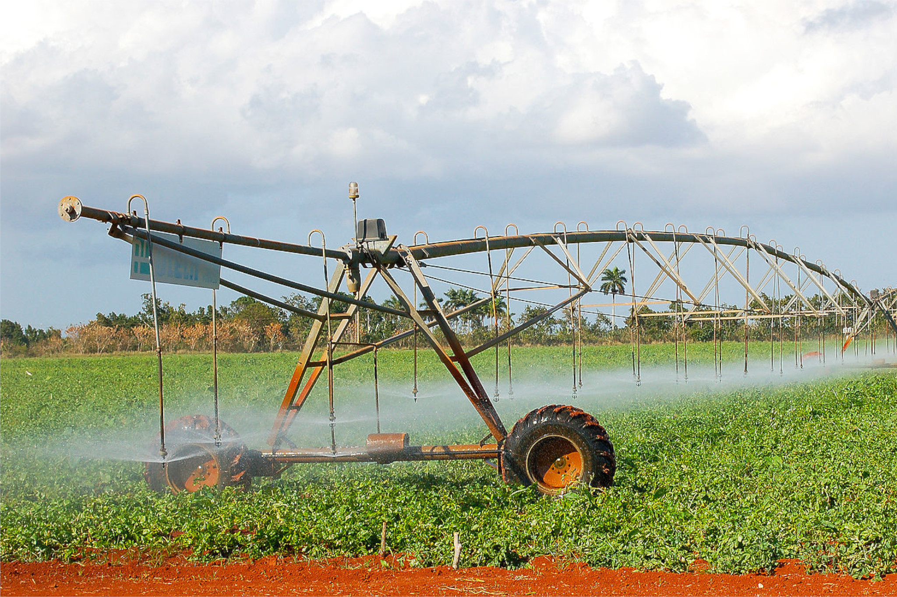
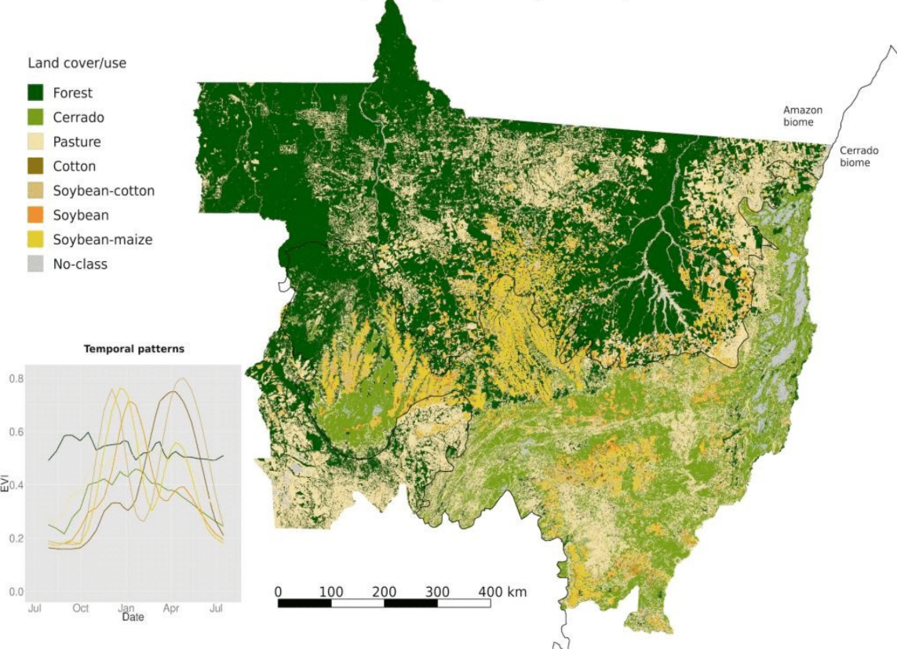
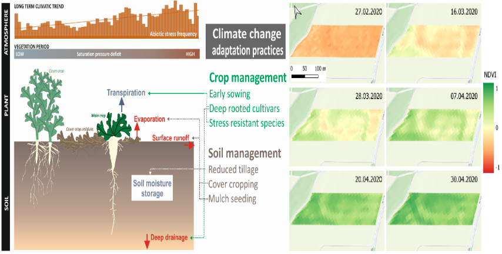
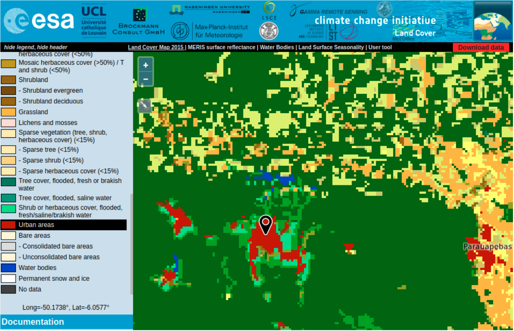
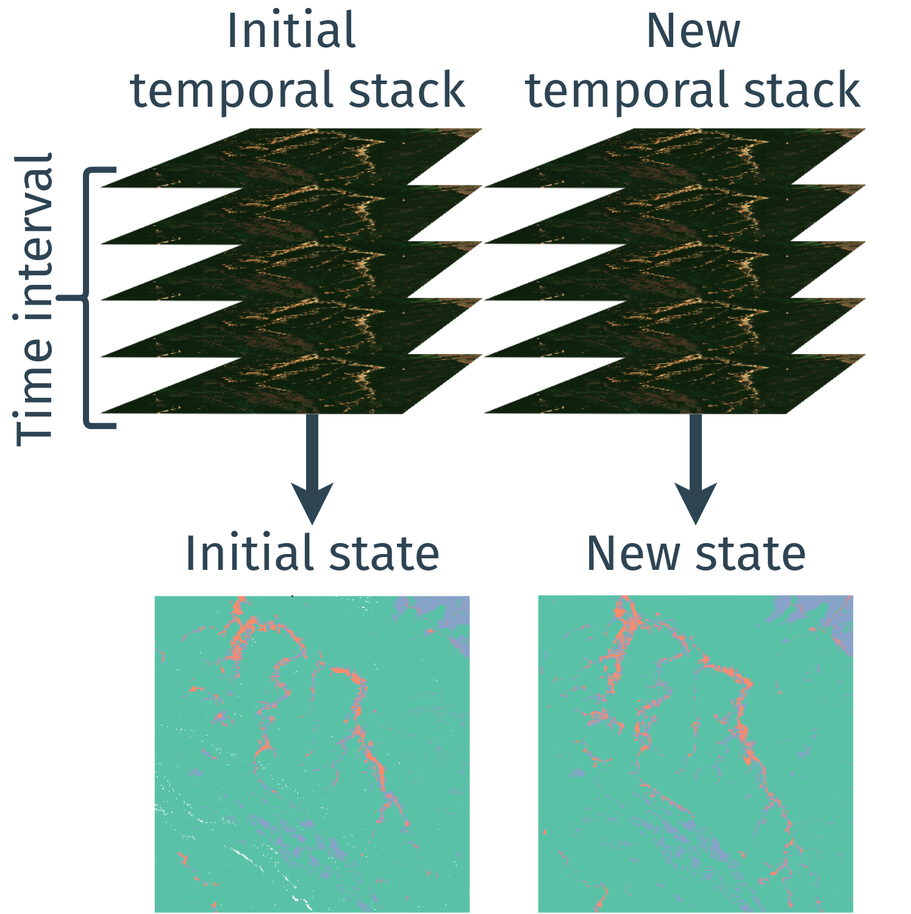
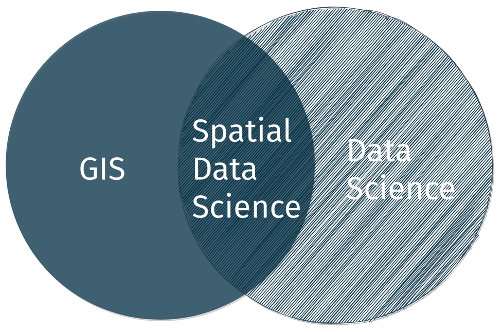
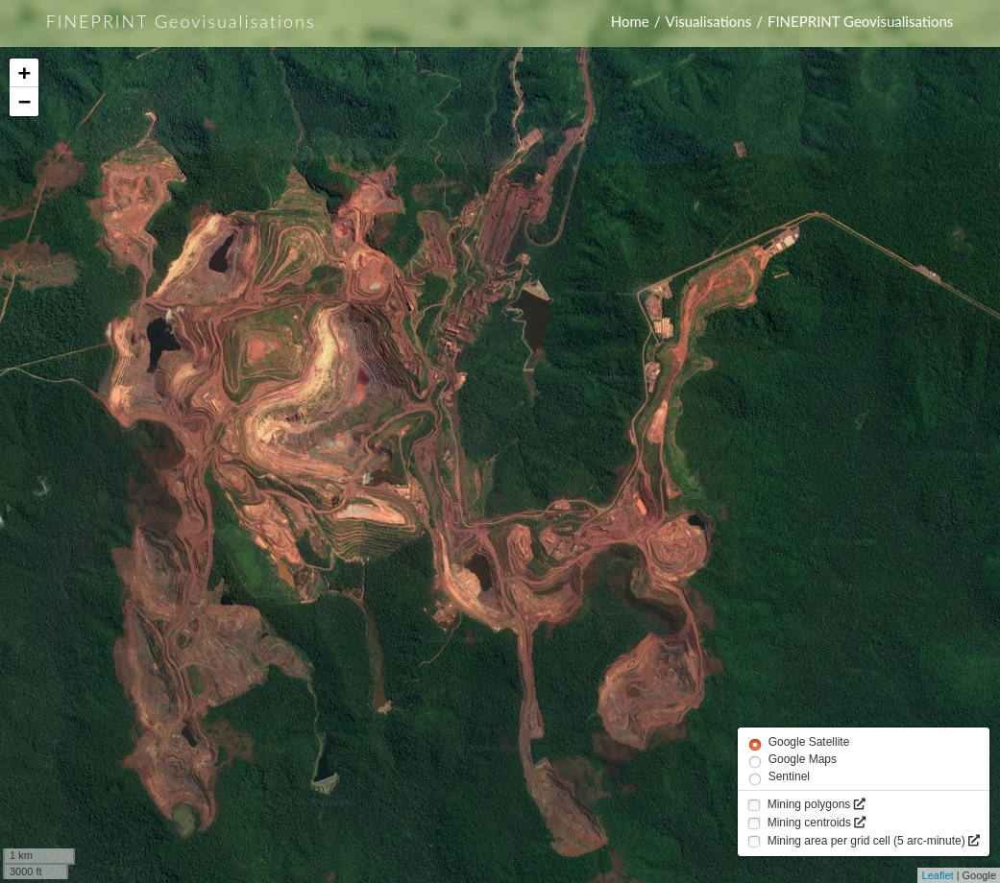

class: clear
```{r setup, include=FALSE, echo=FALSE}
library(magrittr)
library(xaringanExtra)
options(htmltools.dir.version = FALSE)
xaringanExtra::use_panelset()
```

<div class="grid-4-1-img">
<div class="copyright-container">
  
  <div class="cc-bottom-right font-light">Photo by Marco Dormino <a href="https://creativecommons.org/licenses/by-nc-nd/2.0/">CC BY-NC-ND 2.0</a></div>
  </div>
<div class="copyright-container">
  
  <div class="cc-bottom-right font-light">Photo by Nanang Sujana <a href="https://creativecommons.org/licenses/by-nc-nd/2.0/">CC BY-NC-ND 2.0</a></div>
</div>
<div class="copyright-container">
  
  <div class="cc-bottom-right font-light">Photo by Ivan2010 <a href="https://creativecommons.org/licenses/by-sa/3.0/">CC BY-SA 3.0</a></div>
</div>
<div class="copyright-container">
  
  <div class="cc-bottom-right font-light">Photo by IBAMA<a href="https://creativecommons.org/licenses/by-sa/2.0/">CC BY-SA 2.0</a></div>
</div>
</div>
<div class="grid-4-1">

--
<div class="extension-tile lemon-meringue font-dark"><div>Earth observation</div></div>
--
<div class="extension-tile maximum-yellow-red font-dark"><div>In situ<br>data</div></div>
--
<div class="extension-tile prussian-orange font-dark"><div>Statistics and surveys</div></div>
--
<div class="extension-tile maximum-red font-dark"><div>Citizen science</div></div>
</div>

--

.center.bg-washed-blue.b--dark-red.ba.bw0.br3.shadow-5.ph4.mt1.ma0.pb4[
### **I investigate how to represent, integrate and extract information from a variety of data sources and develop spatiotemporal analysis tools to support real world applications.**
]

???

1. Today we face global challenges 

2. Interdisciplinary research 

3. The most critical aspect is geodata 

4. My research on Geoinformatics 


---
# Time-Weighted Dynamic Time Warping (TWDTW)

.footnote-left[[Maus et al. (2016)](https://doi.org/10.1109/JSTARS.2016.2517118) and [Maus et al. (2019)](http://dx.doi.org/10.18637/jss.v088.i05)]

.pull-left.center[
#### TWDTW matches well known temporal profiles to segments of satellite image time series to produce land-use/land-cover information.
]

--

.pull-right.center[]

--

.pull-left.mt3[]

.pull-right.pl2[
- More than 30K downloads from [CRAN](https://cran.r-project.org/web/packages/dtwSat) with known scientific and business applications
`install.package("dtwSat")`
- Development version [github.com/vwmaus/dtwSat](https://github.com/vwmaus/dtwSat)]

???

- One of my main scientific contribution is

- Previous speakers, ...

- While investigating... 1000 times less 

- TWDTW steps -- library -- matches 

- Matches to maps time series 

- Assemble crop maps 

- Open source software 

- CRAN + GitHub


---
class: 
# Climate-smart agricultural practices

<br><br>
.left-column[
**Detecting agricultural management practices using earth observation time series and TWDTW.**
]

.right-column.left[
<div class="copyright-container">
  
  <div class="copyright-bottom-right2 font-dark">&copy; Gernot Bodner (BOKU)</div>
</div>
]

???

1. Further development - RP IIASA

2. Explain TWDTW in this context 

3. Link to ERC 

4. Dynamic programming approaches

5. Long-term climate + Vegetation + Snow

- Investigate whether different crop management practices can be detected from satellite image time series


---
class: 

# Global mining areas

.left-column[


- Map raw material extraction and related impacts with global coverage.

- Link the extraction impacts to supply chains and calculate final consumption footprints.
]

--

.footnote-right[Screenshot of [ESA CCI Land cover viewer](http://maps.elie.ucl.ac.be/CCI/viewer/)]

.right-column.center[

.bg-washed-blue.b--dark-blue.ba.bw0.br3.shadow-5.mh1.mt0.font110[
**Why most land cover maps dismiss mining in the classification system?**
]
]

???

- Contribute to open data 

- Lead geodata workpackage

- Map + Link + Calculate

- Missing data hit again 

- Dismiss mining from classification systems 

- Illustration ESA CCI Land cover 

- We see several red urban areas  

- However, the biggest Iron mine 

- Why they are dismissed from 

- Algorithm x labeled data 

- Labeled data is missing 

- They look different 


---
layout: false
class: clear, middle, center
background-image: url(./../img/global-mining-map.png)

.footnote-right[.font-light[Data source: [Maus et al. (2020)](https://www.nature.com/articles/s41597-020-00624-w)]]

.footnote-left[.font-light[Screenshot of [FINEPRINT Viewer](https://www.fineprint.global/viewer)]]

.left-column.pl1.mt0.font120.left.bottom.font-light[
<br><br><br><br><br><br><br><br><br>
**21,060 Polygons**

**57,000 km²**

**88 % Overall Acc.**

]

--

.right-column[
.bg-washed-green.br3.pl3.left[
  ## Ongoing research and collaborations on mining
]

.bg-washed-green.br3.pl3.left.pt1.pb2.mt5[
- **What is the impact of sand mining on ecosystems in South Africa? (University of Copenhagen)**

- **What is the indirect effect of mining on land-use change? (University of Queensland and University of Melbourne, Australia): Upcoming: Workshop in the Royal Geographical Society Annual International Conference 2021**

- **How much tropical forest loss is driven by mining directly and indirectly? (WWF Germany)**

- **How does closing coal mines affects unemployment? (World Bank)**

- **Does mining contribute to regional development in Brazil? (WU Vienna)**
]]

???

- I took the challenge -- visual interpretation 

- Lead research 

- We produced 

- Mining deforestation 

- Ongoing collaborations

- Collaboration - Regional development

---
layout: false
class: 
# 2D and 3D automatic mining mapping

.left-column[

## Short-term research plan

- **Deep Learning for mining detection (University of Münster, Germany)**

- **Synthetic-aperture radar for measuring extraction volume (DLR - German Aerospace Center)**
]

.right-column[
<div class="copyright-container">
  
  <div class="copyright-bottom-right font-dark">&copy; Marie Lachaise (DLR)</div>
</div>
]

???

- My short-term aims

- Automatize mining mapping

- And beyond 3D - SAR

- Illustration ground changes 

- We don't know the volumes 

- Critical to assess environmental risks 

- Austrian Science Fund 


---
class: clear, middle, center
background-image: url(./../img/Nanang_Sujana_CIFOR-CC-BY-NC-ND-2-0.jpg)


.footnote-left.font-light[Photo by Nanang Sujana [CC BY-NC-ND 2.0](https://creativecommons.org/licenses/by-nc-nd/2.0/)]

--

.font300.font-light[**How do we measure land-use change using satellite earth observations?**]

???

- Methods to map LULCC

- BUT now basic science perspective 

- Focusing.... 


---
class:
# Change analysis based on comparison of states

--

.footnote-left[.font80[Contains modified Copernicus Sentinel data 2018-2020.]]

.pull-left.center[
<figure>
  <figcaption>.bg-washed-blue.b--dark-green.ba.bw0.br3.shadow-5.mt0.font150.ph2[
  **Snapshots**
  ]</figcaption>
  <p>
</figure>
]

--

.pull-right.center[
<figure>
  <figcaption>.bg-washed-blue.b--dark-green.ba.bw0.br3.shadow-5.mt0.font150.ph2[
  **Time series**
  ]</figcaption>
  <p>
</figure>
]

???

- Explain illustration 

- BUT: What happens when we segment the time series into intervals 

---
layout: false
class: 
# Arbitrary temporal aggregation

```{r calendar-segments-plot, eval=TRUE, echo=FALSE, warning=FALSE, message=FALSE, cache=FALSE, fig.width=15, fig.height=6}
library(plotly)
library(magrittr)
library(lubridate)
ts <- readr::read_csv("https://raw.githubusercontent.com/vwmaus/vwmaus.github.io/master/assets/data/time-series-forest-grass.csv") %>% 
  dplyr::filter((EVI > 0.4 & Time < lubridate::ymd(20061231)) | Time >= lubridate::ymd(20061231), Time > lubridate::ymd(20031220), Time < lubridate::ymd(20121001)) 

p <- plot_ly(ts, x = ~Time, y = ~EVI, type = 'scatter', mode = 'lines', name = "Time series") %>%
  layout(showlegend = TRUE, yaxis = list(title = "MODIS EVI"), font = list(family = 'Fira Sans'), title = "longitude: -52.45200 latitude: -12.33254")

for(i in 1:9){
  v.year <- seq(from = lubridate::ymd(20040101), to = lubridate::ymd(20120930), by = '1 year')[i]
  p <- add_lines(p, name = paste("Year calendar", i), x = c(v.year, v.year), y = c(min(ts$EVI), max(ts$EVI)), visible="legendonly", line = list(color = "#ff7f0e", widthh=1, dash="dot"), legendgroup = 'group2')
}

for(i in 1:9){
  v.year <- seq(from = lubridate::ymd(20040801), to = lubridate::ymd(20120731), by = '1 year')[i]
  p <- add_lines(p, name = paste("Crop calendar", i), x = c(v.year, v.year), y = c(min(ts$EVI), max(ts$EVI)), visible="legendonly", line = list(color = "#2ca02c", widthh=1, dash="dot"), legendgroup = 'group3')
}
p
```

---
layout: false
class: 
# Arbitrary temporal aggregation

```{r calendar-segments-plot2, eval=TRUE, echo=FALSE, warning=FALSE, message=FALSE, cache=FALSE, fig.width=15, fig.height=6}
library(plotly)
library(magrittr)
library(lubridate)
ts <- readr::read_csv("https://raw.githubusercontent.com/vwmaus/vwmaus.github.io/master/assets/data/time-series-forest-grass.csv") %>% 
  dplyr::filter((EVI > 0.4 & Time < lubridate::ymd(20061231)) | Time >= lubridate::ymd(20061231), Time > lubridate::ymd(20031220), Time < lubridate::ymd(20121001)) 

p <- plot_ly(ts, x = ~Time, y = ~EVI, type = 'scatter', mode = 'lines', name = "Time series") %>%
  layout(showlegend = TRUE, yaxis = list(title = "MODIS EVI"), font = list(family = 'Fira Sans'), title = "longitude: -52.45200 latitude: -12.33254")

for(i in 1:9){
  v.year <- seq(from = lubridate::ymd(20040101), to = lubridate::ymd(20120930), by = '1 year')[i]
  p <- add_lines(p, name = paste("Year calendar", i), x = c(v.year, v.year), y = c(min(ts$EVI), max(ts$EVI)), line = list(color = "#ff7f0e", widthh=1, dash="dot"), legendgroup = 'group2')
}

for(i in 1:9){
  v.year <- seq(from = lubridate::ymd(20040801), to = lubridate::ymd(20120731), by = '1 year')[i]
  p <- add_lines(p, name = paste("Crop calendar", i), x = c(v.year, v.year), y = c(min(ts$EVI), max(ts$EVI)), line = list(color = "#2ca02c", widthh=1, dash="dot"), legendgroup = 'group3')
}
p
```

.bg-washed-blue.b--dark-green.ba.bw0.br3.shadow-5.mt0.font130.ph2.center[**The arbitrary temporal aggregation can cause data artifacts harming further land-use change analysis, e.g. by creating spurious causal links between variables.**]

???

- Can create spurious causal links between variables

---
layout: false
class: 

# Producing event-based information

.center[]

.bg-washed-blue.b--dark-green.ba.bw0.br3.shadow-5.mt0.font130.ph2.center[**Event-based information could support for example land trajectories analsis and extraction of causal relations from spatiotemporal data**]

???

- Therefore, I argue for a new methodological paradigm in land-use change analysis 

- Extract events from time series

- "How can we do that?" 

- Event-based land information would Open up 

- land-use trajectories 

- Causal analysis using logic of events 

- With this I close .... 

---
layout: false
class: clear, middle, center

.font-dark[.font120[New curricular component:]<br> .font300[**Applied Spatial Data Science**]]



???

- After looking

- and reflecting on future required skills for Geographers...

- I identified ASDS, as a key field

- SDS is emerging as a field -- IFGI is incorporating 

- Why Applied? 

---
# Applied Spatial Data Science

.left-column.font-dark[
  
  
Applied SDS because it will focus on concepts and usage of common spatial data science infrastructures and software for interdisciplinary problems.

]

--

.right-column.mt0[

### Applied Spatial Data Science I (BSc Level)

- Reproducibility and open science
- Geocomputation with R (e.g. GIS operations using vector data, remote sensing data, and data cubes)
- Pattern detection and clustering (e.g. using machine learning algorithms)
- Geodata visualization and sharing
]

--

.right-column.mt-1[
### Applied Spatial Data Science II (MSc Level)
- Big-Data and cloud computing
- Pattern detection (Deep learning)
- Predictive analysis
]


???

- Concepts and usage

- Not on theoretical elaboration of the mathematics, statistics and informatics

- Application oriented teaching, interdisciplinary problem

- I foresee two

- BSc level

- MSc level

- These components will strongly position the institute

---

# Conclusions 

--

### Short-term research plan
  - Developing methods and producing new data on the global mining sector, including 2D and 3D mapping
  - Investigating a range of applications related to mining and land-use change
  - Investigate whether different crop management practices can be detected from satellite image time series

--

### Long-term research plan
  - Develop methods to extract event-based information from satellite earth observation time series
  - Investigate causal links in land-use change

--

### Potential initial collaborations topics with GIUB (but not limited to)
- Remote sensing: Vegetation and snow time series analysis
- Climatology: Detecting patterns in long-term climate time series
- Land systems and sustainable land management: mapping and monitoring land management systems using earth observation data
- Economic Geography: regional development and mining

???

- Besides 

- International collaborations

- Experience in land-use change in Brazil


---
class: clear, inverse


.pull-left[`r rmarkdown::metadata$author`]

.pull-right[
  **.right[.font300[Thank you!]]**
]


---
layout: false
class: inverse, middle, center, mline

# Extra slides 

---
# Events do not have a well-defined interval to happen

.left-column[
Detected changes in the trend component (red) of 16-day NDVI time series
(black) extracted from a single MODIS pixel within a pine plantation, planted in 2001 (top),
harvested in 2004 (middle), and with tree mortality occurring in 2007 (bottom) (source:
source: [Verbesselt et al. (2010)](https://doi.org/10.1016/j.rse.2009.08.014)).]

.right-column.center[]


---
layout: false
class: 
# Iregular events/processes

```{r segments-degradation, eval=TRUE, echo=FALSE, warning=FALSE, message=FALSE, cache=FALSE, fig.width=15, fig.height=7}
library(plotly)
library(magrittr)
library(lubridate)
ts <- readr::read_csv("https://raw.githubusercontent.com/vwmaus/vwmaus.github.io/master/assets/data/time-series-degradation.csv")

p <- plot_ly(ts, x = ~Time, y = ~EVI, type = 'scatter', mode = 'lines', name = "Time series") %>%
  layout(showlegend = TRUE, yaxis = list(title = "MODIS EVI"), font = list(family = 'Fira Sans'), title = "longitude: -56.66709, latitude: -11.92187")

for(i in 1:18){
  v.year <- seq(from = lubridate::ymd(20010101), to = lubridate::ymd(20180131), by = '1 year')[i]
  p <- add_lines(p, name = paste("Interval", i), x = c(v.year, v.year), y = c(min(ts$EVI), max(ts$EVI)), visible="legendonly", line = list(color = "#ff7f0e", widthh=1, dash="dot"), legendgroup = 'group2')
}
p
```


---
# Tropical forest loss due to mining

.footnote-left[Source: Giljum & Maus et al. (Manuscript under review)]

.right-column.left[
<figure>
  <figcaption>Direct forest cover loss</figcaption>
  <p>
</figure>
]

.left-column.left.mt3[**Besides direct forest cover loss, mining also causes tropical forest loss up to 50 km from the actual extraction sites due to indirect land-use change.**]

---
class: 
# Algorithms' fault or lack of labeled data?

.footnote-left[Screenshots of [FINEPRINT Viewer](https://www.fineprint.global/viewer)]

.pull-left.center[
.bg-washed-blue.b--dark-blue.ba.bw0.br3.shadow-5.mh1.mt0.font100[
**Carajás Iron Mine, Brazil**
]

]

.pull-right.center[
.bg-washed-blue.b--dark-blue.ba.bw0.br3.shadow-5.mh1.mt0.font100[
**Parauapebas, Brazil**
]

]
