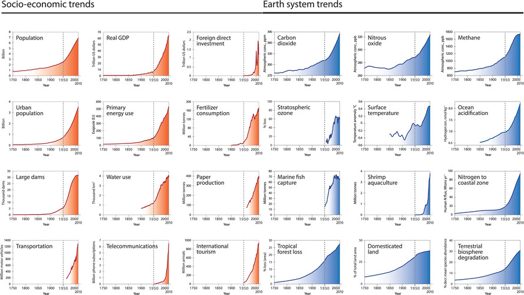
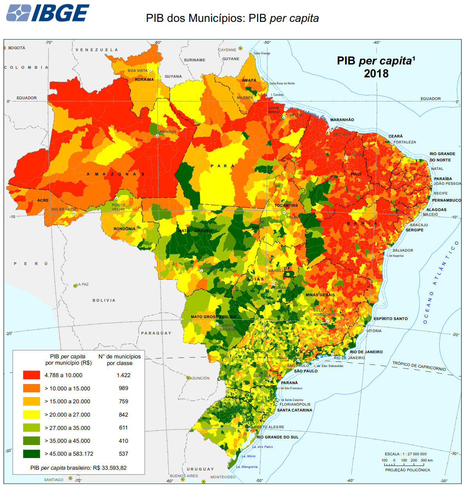
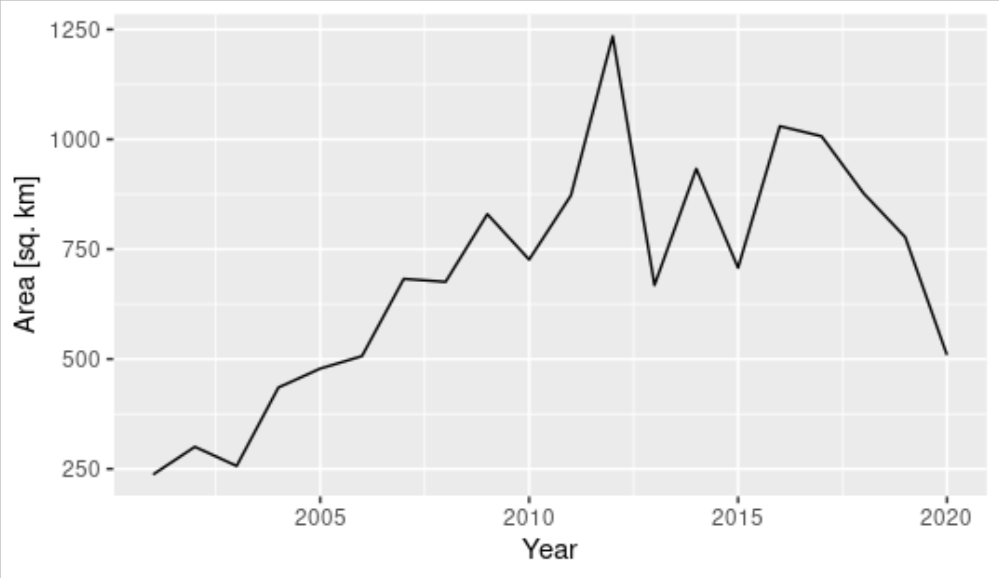
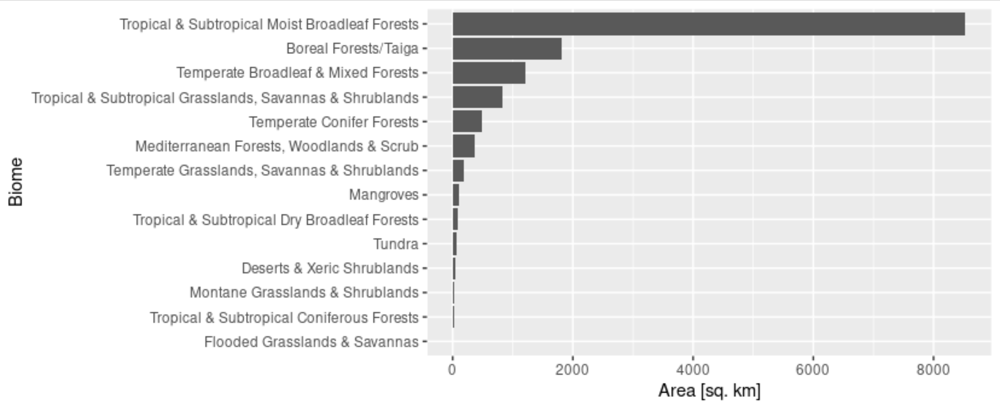
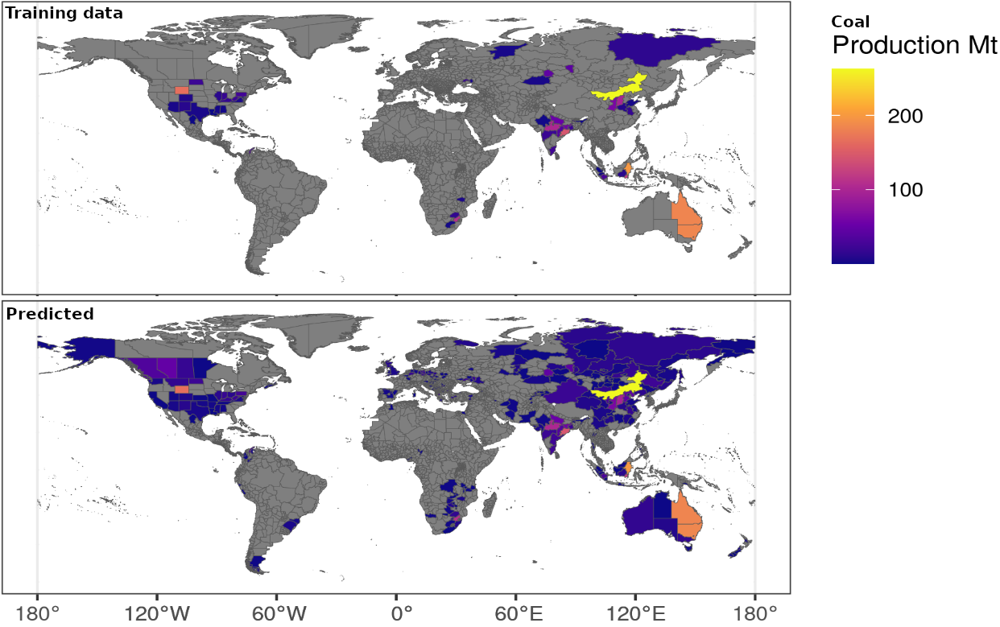

```{r setup, include=FALSE, echo=FALSE}
library(xaringanExtra)
options(htmltools.dir.version = FALSE)
xaringanExtra::use_panelset()
```

# Time-Weighted Dynamic Time Warping (TWDTW)

.footnote-left[[Maus et al. (2016)](https://doi.org/10.1109/JSTARS.2016.2517118) and [Maus et al. (2019)](http://dx.doi.org/10.18637/jss.v088.i05)]

.pull-left.center[
#### TWDTW matches well known temporal profiles to segments of satellite image time series to produce land-use/land-cover information.
]

.pull-right.center[]

.pull-left.mt3[]

.pull-right.pl2[
- TWDTW has known scientific and business applications
- Installation `install.package("dtwSat")`
- Development [github.com/vwmaus/dtwSat](https://github.com/vwmaus/dtwSat)]

---
class: 

# The great acceleration

.center[
  
]

.cc-bottom-left.font-dark[
  Figure: [Steffen et al. (2015)](https://journals.sagepub.com/doi/10.1177/2053019614564785)
] 

---
class: clear
background-image: url(https://www.cgdev.org/sites/default/files/perssonetalblog1.png?itok=TUj8JebP)
background-size: cover
.cc-bottom-right2.font-dark[
  Figure: &copy; 2021 Center for Global Development
] 

## **Information on the global drivers of local changes is critical to support sustainable development**

---
class: clear
background-image: url(./../img/mrio-vewer-soy-brazil-20211210.png)
background-size: contain
.cc-bottom-right3.font-dark[
  [MRIO-Viewer www.fineprint.global/visualisations/fabio-viewer](https://www.fineprint.global/visualisations/fabio-viewer) Gutschlhofer & Maus (Under review)
] 

---
layout: false
class: clear

.pull-left.center[
  .bg-washed-blue.b--dark-blue.ba.bw0.br3.shadow-5.mh1.mt0.font100[
    **Biomes according to Ecoregions2017**
  ]
  
]

.pull-right.center[
  .bg-washed-blue.b--dark-blue.ba.bw0.br3.shadow-5.mh1.mt0.font100[
    **GDP per capita 2018 in the Brazilian municipalities**
  ]
  
]

### **How to link spatial heterogeneous impacts to global supply chains?**


---
layout: false
class: clear, middle, center
background-image: url(./../img/Soybean-Field-by-UnitedSoybeanBoard--CC-BY-2-0.jpg)
background-size: cover
.cc-bottom-left.font-light[
  Photo "Soybean Field" by UnitedSoybeanBoard <a href="https://creativecommons.org/licenses/by/2.0/">CC BY 2.0</a>
] 

.font-dark.center.font300.font-light[
  **The biomass sector**
]

---
layout: false
class: clear, middle
background-image: url(./../img/brazil-soy-model.png)
background-size: 100% 100%

.footnote-right[Figure: Stefan Trsek]


---
layout: false
class: clear, middle
background-image: url(./../img/china-soyfootprint-in-brazil.png)
background-size: 100% 100%

.footnote-left[Figure: Stefan Trsek]

---
layout: false
class: clear, middle, center
background-image: url(./../img/mapbiomas.png)
background-size: 100% 100%
.cc-bottom-right.font-light[
  Screenshot of [MAPBIOMAS](https://plataforma.brasil.mapbiomas.org)
] 

---
class: clear, middle
background-image: url(./../img/esa-cci-land-cover.png)
background-size: 100% 100%

.footnote-right[Screenshot of [ESA CCI Land cover viewer](http://maps.elie.ucl.ac.be/CCI/viewer/)]

.center.bg-washed-blue.b--dark-red.ba.bw0.br3.shadow-5.ph4.mt1.ma0.pb4[
  ### **How to scale agricultural commodities mapping with scarce training data?**
]

---
class: clear, middle
background-image: url(https://live.staticflickr.com/8161/7650332104_ba20f66e53_b.jpg)
background-size: 100% 100%

.cc-bottom-left.font-light[
  Photo "ADM8" by Ars Electronica <a href="https://creativecommons.org/licenses/by-nc-nd/2.0/">CC BY-NC-ND 2.0</a>
] 

.center.bg-washed-blue.b--dark-red.ba.bw0.br3.shadow-5.ph4.mt1.ma0.pb4[
### **Geospatial data on commodities production, trade, use, and reserves are commercial and treated in confidence.**
]

---
layout: false
class: clear, middle, center
background-image: url(./../img/Aerial-view-of-a-small-mine-near-Mt-Isa-Queensland-by-denisbin--CC-BY-ND-2-0.jpg)
background-size: cover
.cc-bottom-left.font-light[
  Photo "Aerial view of a small mine near Mt Isa Queensland" by denisbin <a href="https://creativecommons.org/licenses/by-nd/2.0/">CC BY-ND 2.0</a>
] 

.font-dark.center.font300.font-light[
**The mining sector**
]

---
layout: false
class: clear, middle, center
background-image: url(./../img/carajas-misclassification2.png)
background-size: cover

.footnote-right[Screenshot of [ESA CCI Land cover viewer](http://maps.elie.ucl.ac.be/CCI/viewer/)]

---
layout: false
class: clear, middle, center

.pull-left.center[
.bg-washed-blue.b--dark-blue.ba.bw0.br3.shadow-5.mh1.mt0.font100[
**Open cut of the Carajás Iron Mine, Brazil**
]
<div class="copyright-container">
  
  <div class="copyright-bottom-left2 font-light">Screenshots of <a href="https://www.fineprint.global/viewer">FINEPRINT Viewer</a></div>
</div>
]

.pull-right.center[
.bg-washed-blue.b--dark-blue.ba.bw0.br3.shadow-5.mh1.mt0.font100[
**Urban area of the Parauapebas municipality, Brazil**
]
<div class="copyright-container">
  
  <div class="copyright-bottom-left2 font-light">Screenshots of <a href="https://www.fineprint.global/viewer">FINEPRINT Viewer</a></div>
</div>
]

.bg-washed-blue.b--dark-red.ba.bw0.br3.shadow-5.ph4.mt1.ma0.pb4.center[
  ### **Why most land cover maps dismiss mining in their classification system?**
]


---
layout: false
class: clear, middle, center
background-image: url(./../img/global-mining-map.png)

.footnote-right[.font-light[Figure: Screenshot of [FINEPRINT Viewer](https://www.fineprint.global/viewer) Data sources: v1 [Maus et al. (2020)](https://www.nature.com/articles/s41597-020-00624-w) v2 Maus et al. (Under review)]]

.left-column.pl1.mt0.font120.left.bottom.font-light[
<br><br><br><br><br><br><br><br><br>
**45,000 Polygons**

**100,000 km²**

]

---
layout: false
# Global forest cover loss due to mining

.center.red[
  
]

### Accumulated: 13,744 sq. km

.footnote-right[Maus et al. (In preparation)]


---
layout: false
# Global forest cover loss due to mining

.center[
  
]

### 62% (8,533 sq. km) on Tropical & Subtropical Moist Broadleaf Forests 

.footnote-right[Maus et al. (In preparation)]

---
layout: false
class: clear

.left-column.font-dark[
  
- Which regions will be affected by closing coal mines?
  
- Using EO we increased the spatial coverage of coal production from 20 % to 50 % of global production compared to national reporting.
  
]

.right-column.center[
<div class="copyright-container">
  
  <div class="copyright-bottom-right font-dark">Maus & Jasansky (2021)</div>
</div>
]

---
layout: false
class: clear


### Time is essential to answer "why" questions

.footnote-right[Maus & Luckeneder (Ongoing)]


---
layout: false
class: clear, middle, center

.pull-left.center[
.bg-washed-blue.b--dark-blue.ba.bw0.br3.shadow-5.mh1.mt0.font100[
**Small scale mining in Itaituba National Forest, Brazil**
]
<div class="copyright-container">
  
</div>
]

.pull-right.center[
.bg-washed-blue.b--dark-blue.ba.bw0.br3.shadow-5.mh1.mt0.font100[
**Super pit gold mine, Australia**
]
<div class="copyright-container">
  
</div>
]

.bg-washed-blue.b--dark-red.ba.bw0.br3.shadow-5.ph4.mt1.ma0.pb4.center[
  ### **It is not feasible to keep the mining areas data set up-to-date without automation**
]

---
layout: false
class: clear, middle

.center[
  
]

<br><br>

.bg-washed-blue.b--dark-red.ba.bw0.br3.shadow-5.ph4.mt1.ma0.pb4.center[
  ### **Deep neural networks are showing promising results in delineating mining areas**
]

.cc-bottom-left.font-dark[
  Figure: Knoth, Appel, & Maus
] 

---
layout: false
class: clear, middle, center

.pull-left.center[
.bg-washed-blue.b--dark-blue.ba.bw0.br3.shadow-5.mh1.mt0.font100[
**Regular spatial patterns**
]
<div class="copyright-container">
  
  <div class="copyright-bottom-left2 font-light">Photo by Tiina Häyhä <a href='https://creativecommons.org/licenses/by-sa/4.0'>CC BY-SA 4.0 license</a></div>
</div>
]

.pull-right.center[
.bg-washed-blue.b--dark-blue.ba.bw0.br3.shadow-5.mh1.mt0.font100[
**Irregular spatial patterns**
]
<div class="copyright-container">
  
  <div class="copyright-bottom-left2 font-light">Screenshots of <a href="https://goo.gl/maps/xDkqyGdMAn8ZJTZJ7">Google Maps</a></div>
</div>
]

.bg-washed-blue.b--dark-red.ba.bw0.br3.shadow-5.ph4.mt1.ma0.pb4.center[
  ### **Can deep neural networks learn how to identify mines with their great spatial irregularity?**
]


---
layout: false
class: clear, inverse, top, left

## Geospatial data that can link local impacts to the global economy is essential to support sustainable development

--

## Development methods to extract information from EO data can help fill this data gap

--

## Geoinformatics is a key discipline to address sustainability challenges

--
<br>
Dr Victor Maus<br>.font80[Institute for Ecological Economics<br>Vienna University of Economics and Business]<br>.font80[victor.maus@wu.ac.at]<br>.font80[<a href='https://www.victor-maus.com'>www.victor-maus.com</a>]
.right[
  .font80[Dec 14, 2021, Ifgi GI-Forum]<br>
  .font150[Thank you!]
]
