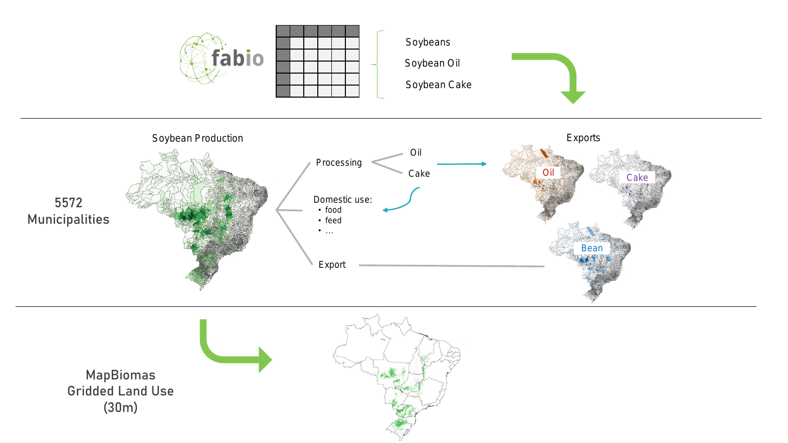
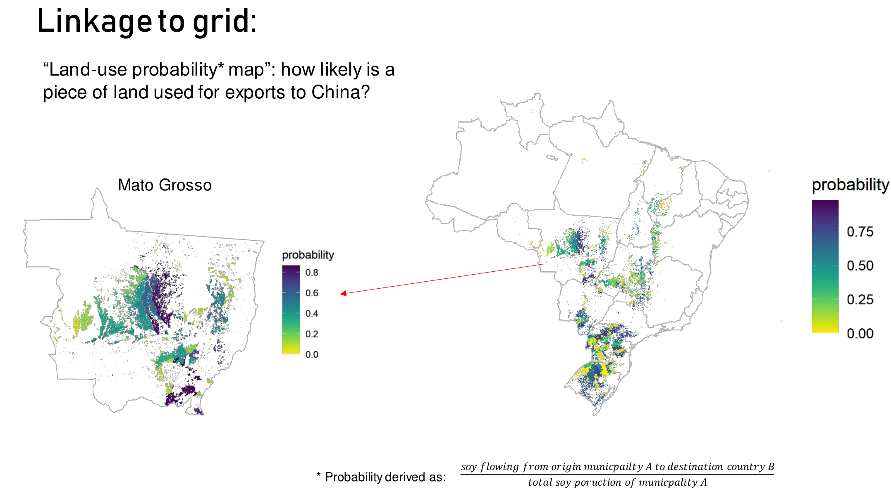

```{r setup, include=FALSE, echo=FALSE}
library(xaringanExtra)
options(htmltools.dir.version = FALSE)
xaringanExtra::use_panelset()
```

# Time-Weighted Dynamic Time Warping (TWDTW)

.footnote-left[[Maus et al. (2016)](https://doi.org/10.1109/JSTARS.2016.2517118) and [Maus et al. (2019)](http://dx.doi.org/10.18637/jss.v088.i05)]

.pull-left.center[
#### TWDTW matches well known temporal profiles to segments of satellite image time series to produce land-use/land-cover information.
]

.pull-right.center[]

.pull-left.mt3[]

.pull-right.pl2[
- More than 30K downloads from [CRAN](https://cran.r-project.org/web/packages/dtwSat) with known scientific and business applications
`install.package("dtwSat")`
- Development version [github.com/vwmaus/dtwSat](https://github.com/vwmaus/dtwSat)]

---
class: clear

.red.center[
  THE GREAT ACELERATION FIGURE
]

---
class: clear
background-image: url(https://www.cgdev.org/sites/default/files/perssonetalblog1.png?itok=TUj8JebP)
background-size: cover
.cc-bottom-right2.font-dark[
  Figure: &copy; 2021 Center for Global Development
] 

## **Information on the global drivers of local changes is critical to support sustainable development**

---
class: clear
background-image: url(./../img/mrio-vewer-soy-brazil-20211210.png)
background-size: contain
.cc-bottom-right3.font-dark[
  [MRIO-Viewer www.fineprint.global/visualisations/fabio-viewer](https://www.fineprint.global/visualisations/fabio-viewer) Gutschlhofer & Maus (Under review)
] 

---
layout: false
class: clear

.pull-left.center[
  .bg-washed-blue.b--dark-blue.ba.bw0.br3.shadow-5.mh1.mt0.font100[
    **Biomes according to Ecoregions2017**
  ]
  
]

.pull-right.center[
  .bg-washed-blue.b--dark-blue.ba.bw0.br3.shadow-5.mh1.mt0.font100[
    **GDP per capita 2018 in the Brazilian municipalities**
  ]
  
]

### **How to link spatial heterogeneous impacts to global supply chains?**


---
layout: false
class: clear, middle, center
background-image: url(./../img/Soybean-Field-by-UnitedSoybeanBoard--CC-BY-2-0.jpg)
background-size: cover
.cc-bottom-left.font-light[
  Photo "Soybean Field" by UnitedSoybeanBoard <a href="https://creativecommons.org/licenses/by/2.0/">CC BY 2.0</a>
] 

.font-dark.center.font300.font-light[
  **The biomass sector**
]


---
layout: false
class: clear, middle, center
background-image: url(./../img/mapbiomas.png)
background-size: contain
.cc-bottom-right.font-light[
  Screenshot of [MAPBIOMAS](https://plataforma.brasil.mapbiomas.org)
] 

---
layout: false
class: clear
<!-- # Sub-national miodelling  -->

.center[
  
]

.footnote-left[Figure: Stefan Trsek]


---
layout: false
class: clear

.center[
  
]

.footnote-left[Figure: Stefan Trsek]

---
# Global data sets

Image of the data gap on biomass.... world map of land cover but missing crop types which can be link to the economy. 

.center.bg-washed-blue.b--dark-red.ba.bw0.br3.shadow-5.ph4.mt1.ma0.pb4[
### **Data on production, trade, use, and reserves are commercial and treated in confidence.**
]


---
layout: false
class: clear, middle, center
background-image: url(./../img/Aerial-view-of-a-small-mine-near-Mt-Isa-Queensland-by-denisbin--CC-BY-ND-2-0.jpg)
background-size: cover
.cc-bottom-left.font-light[
  Photo "Aerial view of a small mine near Mt Isa Queensland" by denisbin <a href="https://creativecommons.org/licenses/by-nd/2.0/">CC BY-ND 2.0</a>
] 

.font-dark.center.font300.font-light[
**The mining sector**
]

---
layout: false
class: clear, middle, center
background-image: url(./../img/carajas-misclassification2.png)
background-size: cover

.footnote-right[Screenshot of [ESA CCI Land cover viewer](http://maps.elie.ucl.ac.be/CCI/viewer/)]

---
layout: false
class: clear, middle, center
background-image: url(./../img/global-mining-map.png)

.footnote-right[.font-light[Figure: Screenshot of [FINEPRINT Viewer](https://www.fineprint.global/viewer) Data sources: v1 [Maus et al. (2020)](https://www.nature.com/articles/s41597-020-00624-w) v2 Maus et al. (Under review)]]

.left-column.pl1.mt0.font120.left.bottom.font-light[
<br><br><br><br><br><br><br><br><br>
**45,000 Polygons**

**100,000 km²**

]

---
layout: false
# Global forest cover loss due to mining

.center.red[
  REPLACE FIGURE WITH NEW BAR PLOT<br>
  
]

### Accumulated: 13,744 sq. km

.footnote-right[Maus et al. (Under review)]


---
layout: false
# Global forest cover loss due to mining

.center[
  
]

### 62% (8,533 sq. km) on Tropical & Subtropical Moist Broadleaf Forests 

.footnote-right[Maus et al. (Under review)]

---
layout: false
class: inverse, middle, center, mline
# Does mining drive regional development?

---
layout: false
# Mining and regional develiopment

Figure showing the effect of the mining in Brazil efect fades off. 

.footnote-right[Luckeneder and Maus et al. (Under review)]

---
layout: false
# Estimating coal mining production

A global map of coal production. Add the percentages of coverage in the bottom. Tell that no data is available.


---
layout: false
class: clear, middle, center

.pull-left.center[
.bg-washed-blue.b--dark-blue.ba.bw0.br3.shadow-5.mh1.mt0.font100[
**Open cut of the Carajás Iron Mine, Brazil**
]
<div class="copyright-container">
  
  <div class="copyright-bottom-left2 font-light">Screenshots of <a href="https://www.fineprint.global/viewer">FINEPRINT Viewer</a></div>
</div>
]

.pull-right.center[
.bg-washed-blue.b--dark-blue.ba.bw0.br3.shadow-5.mh1.mt0.font100[
**Urban area of the Parauapebas municipality, Brazil**
]
<div class="copyright-container">
  
  <div class="copyright-bottom-left2 font-light">Screenshots of <a href="https://www.fineprint.global/viewer">FINEPRINT Viewer</a></div>
</div>
]

.bg-washed-blue.b--dark-red.ba.bw0.br3.shadow-5.ph4.mt1.ma0.pb4.center[
### **Why most land cover maps dismiss mining in the classification system?**
]


---
layout: false
class: clear, middle, center

.pull-left.center[
.bg-washed-blue.b--dark-blue.ba.bw0.br3.shadow-5.mh1.mt0.font100[
**Regular spatial patterns**
]
<div class="copyright-container">
  
  <div class="copyright-bottom-left2 font-light">Photo by Tiina Häyhä <a href='https://creativecommons.org/licenses/by-sa/4.0'>CC BY-SA 4.0 license</a></div>
</div>
]

.pull-right.center[
.bg-washed-blue.b--dark-blue.ba.bw0.br3.shadow-5.mh1.mt0.font100[
**Irregular spatial patterns**
]
<div class="copyright-container">
  
  <div class="copyright-bottom-left2 font-light">Screenshots of <a href="https://goo.gl/maps/xDkqyGdMAn8ZJTZJ7">Google Maps</a></div>
</div>
]

.bg-washed-blue.b--dark-red.ba.bw0.br3.shadow-5.ph4.mt1.ma0.pb4.center[
  ### **Can deep neural networks learn how to identify mines with their great spatial irregularity?**
]


---
layout: false
class: inverse, middle, center, mline
# Final remarks 

--
## Global supply chains assessment requries open data sources

--
## Eo can provide this data sources

--
## Thank you!
