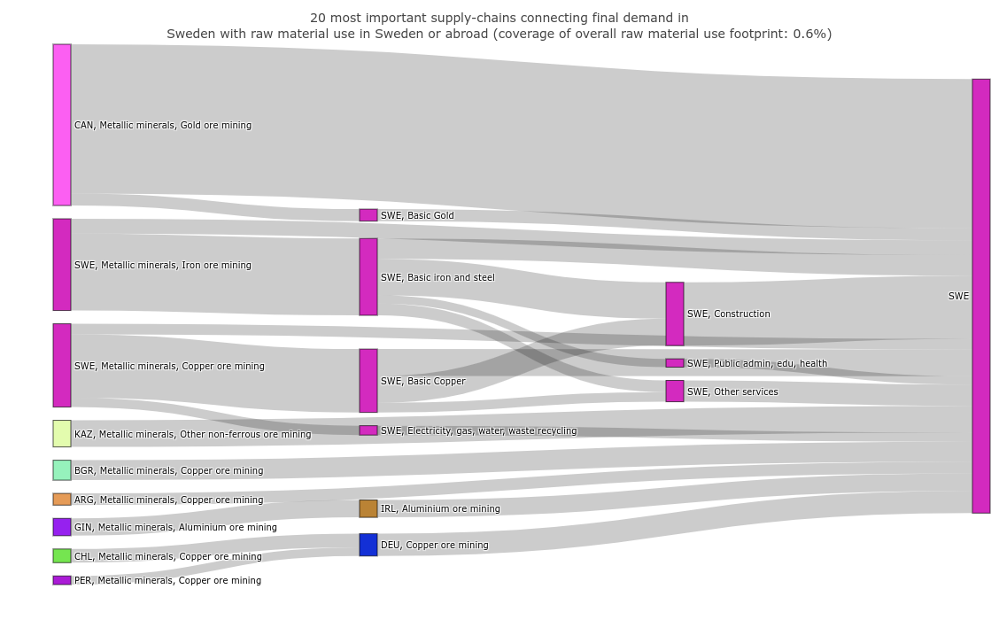
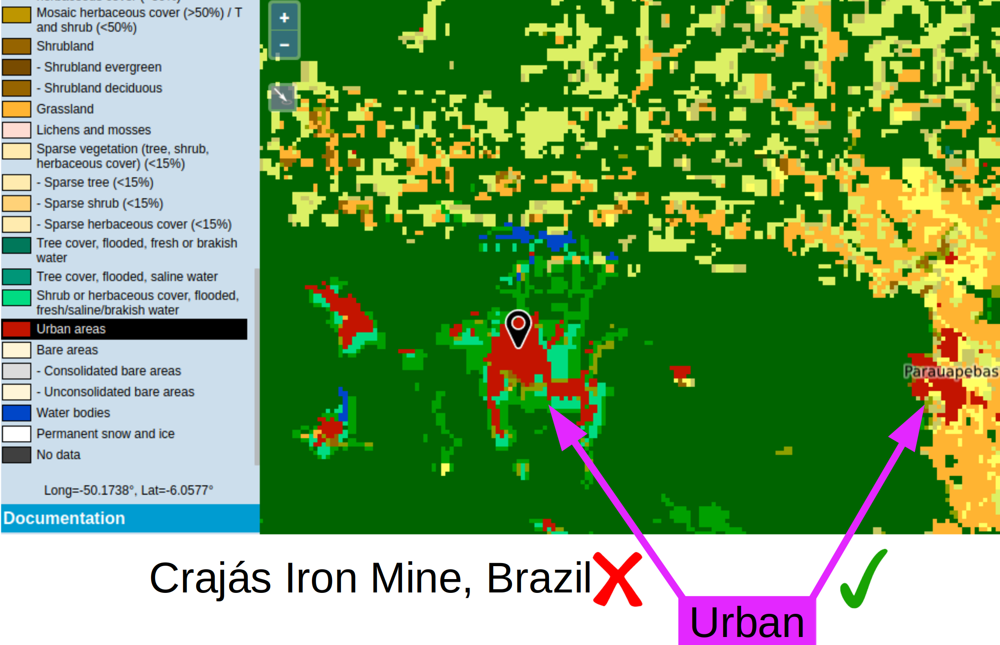
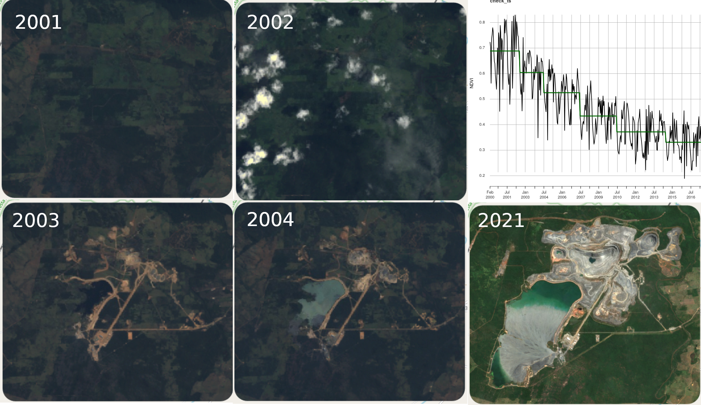
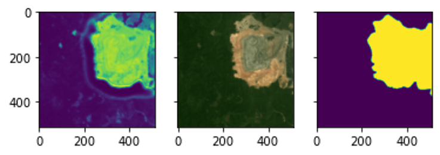
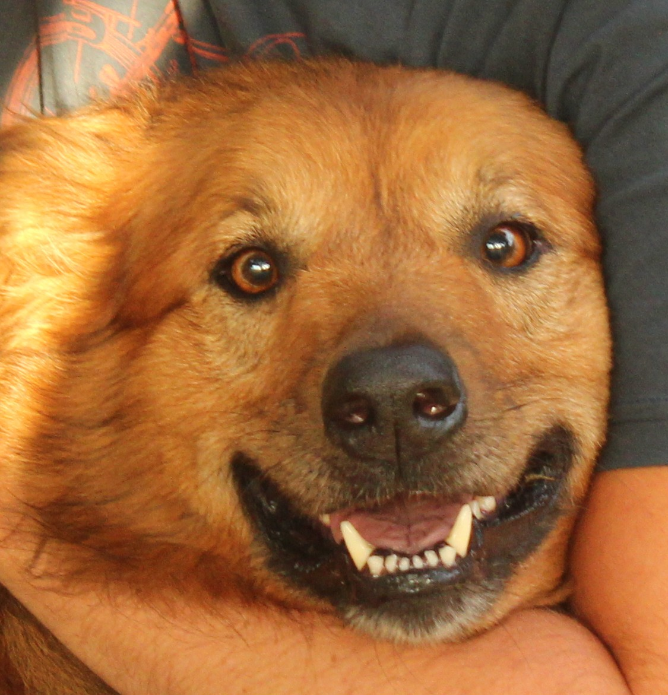
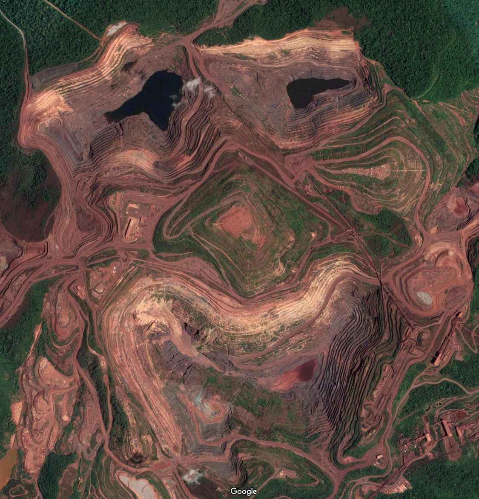
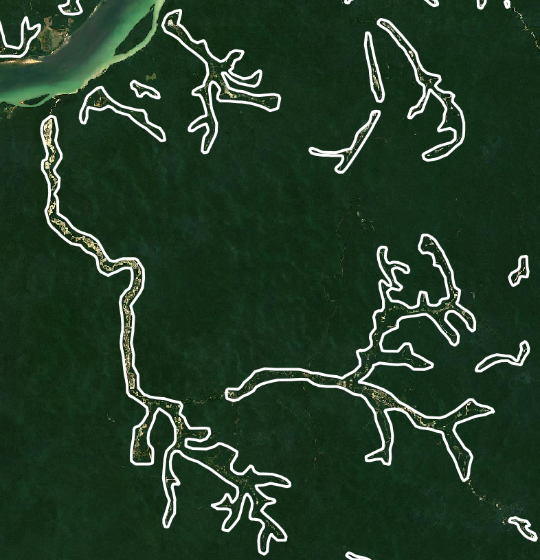
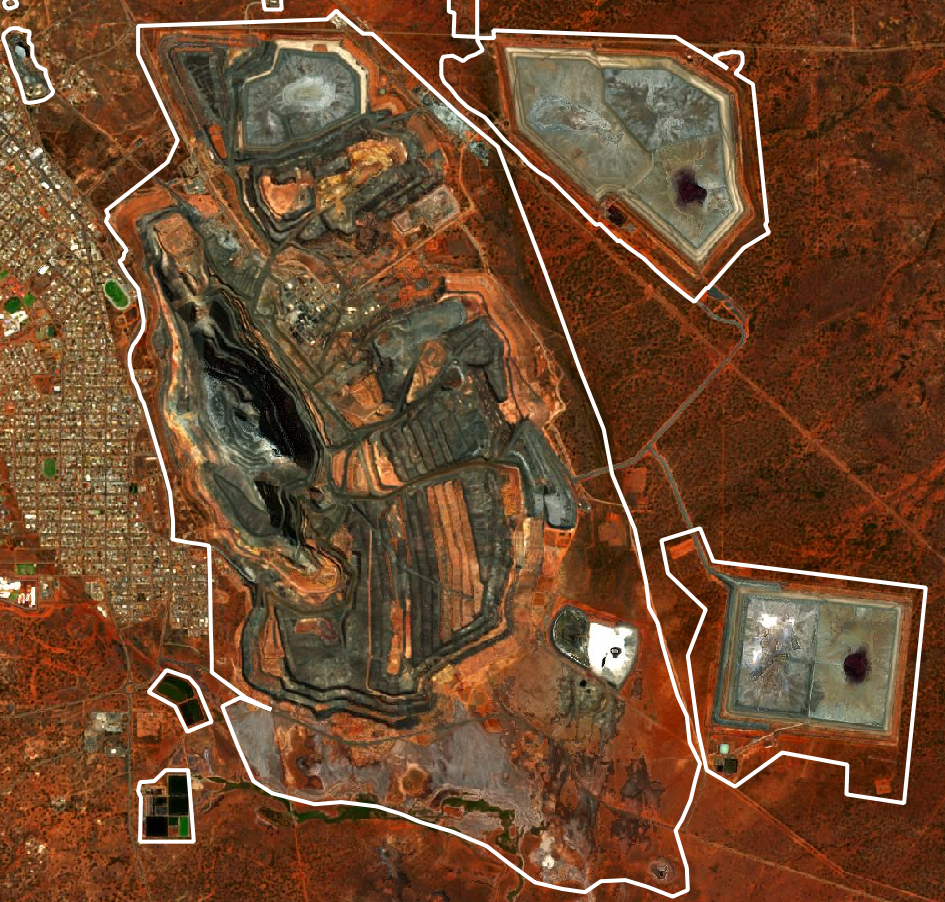
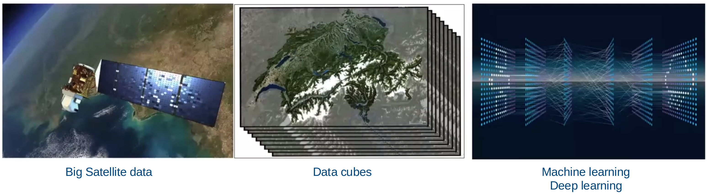

```{r setup, include=FALSE, echo=FALSE}
library(xaringanExtra)
options(htmltools.dir.version = FALSE)
xaringanExtra::use_panelset()
```

# Global Resorce Use Research Group (GRU)

The overarch aim of GRU is to quantifying society's use of natural resources and its impacts globally

### Develop methods and data for the spatially explicit assessment of resource flows

- Global Material Flows Database https://www.resourcepanel.org/global-material-flows-database

- Global mining land use https://www.nature.com/articles/s41597-022-01547-4

- Food and Agriculture Biomass Input-Output Database (FABIO) https://pubs.acs.org/doi/10.1021/acs.est.9b03554

### State-of-the-art visualization tools to support UN SDGs monitoring 

- Material flow Analysis Portal https://www.materialflows.net

- Sustainable Consumption and Production Hotspot Analysis Tool (SCP-HAT) http://scp-hat.lifecycleinitiative.org

- FINEPRINT geospatial data portal https://www.fineprint.global/visualisations

- And more https://www.fineprint.global


---
class: clear
background-image: url(https://www.cgdev.org/sites/default/files/perssonetalblog1.png?itok=TUj8JebP)
background-size: cover
.cc-bottom-right2.font-dark[
  Figure: &copy; 2021 Center for Global Development
]

## **Linking global economic drivers of local changes is critical to support sustainable development**

---
class: clear,center,top

.font-dark.center.font150[
**Global mineral extraction is growing fast increasing the impacts and pressures in extractive regions worldwide**
]




.cc-bottom-right3.font-dark[
  Source: [SCP-HAT http://scp-hat.lifecycleinitiative.org/module-2-scp-hotspots](http://scp-hat.lifecycleinitiative.org/module-2-scp-hotspots)
]


---
layout: false
class: clear, center
background-image: url(https://upload.wikimedia.org/wikipedia/commons/a/a6/Brumadinho%2C_Minas_Gerais_%2847021723582%29.jpg)
background-size: cover
.cc-bottom-right.font-light[Photo Brumadinho, Minas Gerais by Vinícius Mendonça/Ibama <a href="https://creativecommons.org/licenses/by-sa/2.0/deed.en">CC BY-SA 2.0</a>]
<!-- background-image: url(https://upload.wikimedia.org/wikipedia/commons/c/ca/Desastre_de_Brumadinho.gif) -->
<!-- background-size: cover -->
<!-- .cc-bottom-left.font-light[Photo <a href="https://commons.wikimedia.org/wiki/File:Desastre_de_Brumadinho.gif">NASA Earth Observatory images by Lauren Dauphin, using Landsat data from the U.S. Geological Survey. Caption by Adam Voiland. Public domain</a>] -->

.font-dark.center.font300.font-light[
**The mining industry does not disclose the geospatial information necessary for sustainability assessments**
]


<!-- --- -->
<!-- layout: false -->
<!-- class: clear, middle, center -->
<!-- background-image: url(./../img/Aerial-view-of-a-small-mine-near-Mt-Isa-Queensland-by-denisbin--CC-BY-ND-2-0.jpg) -->
<!-- background-size: cover -->
<!-- .cc-bottom-left.font-light[ -->
<!--   Photo Aerial view of a small mine near Mt Isa Queensland" by denisbin <a href="https://creativecommons.org/licenses/by-nd/2.0/">CC BY-ND 2.0</a> -->
<!-- ]  -->

<!-- .font-dark.center.font300.font-light[ -->
<!-- **The mining industry does not disclose the geospatial information necessary for sustainability assessments** -->
<!-- ] -->


---
layout: false
class: clear, center
background-image: url(https://www.esa.int/var/esa/storage/images/applications/observing_the_earth/copernicus/sentinel-2/19729272-10-eng-GB/Sentinel-2_pillars.jpg)
background-size: cover
.cc-bottom-left.font-light[Image: © <a href="https://www.esa.int/Applications/Observing_the_Earth/Copernicus/Sentinel-2">European Space Agency (ESA)</a>]

.center.font150.font-light[**Earth observation is the only viable data source for timely global assessments**]

---
layout: false
class: clear, middle, center
background-size: cover

.font-dark.left.font150[**Global datasets derived from Earth observation lack local relevance**]



.footnote-right[[Map from ESA CCI Land cover viewer](http://maps.elie.ucl.ac.be/CCI/viewer/)]

---
layout: false
class: clear, middle, center

.center.font150[**With little training, humans can distinguish urban from mines in satellite images**]


.pull-left.center[
.bg-washed-blue.b--dark-blue.ba.bw0.br3.shadow-5.mh1.mt0.font100[
**Open cut of the Carajás Iron Mine, Brazil**
]
<div class="copyright-container">
  
  <div class="copyright-bottom-left2 font-light">Figure: <a href="https://www.fineprint.global/viewer">FINEPRINT Viewer</a></div>
</div>
]

.pull-right.center[
.bg-washed-blue.b--dark-blue.ba.bw0.br3.shadow-5.mh1.mt0.font100[
**Urban area of the Parauapebas municipality, Brazil**
]
<div class="copyright-container">
  
  <div class="copyright-bottom-left2 font-light">Figure: <a href="https://www.fineprint.global/viewer">FINEPRINT Viewer</a></div>
</div>
]

---
layout: false
class: clear, middle, center
background-image: url(./../img/global-mining-map.png)

.footnote-right[.font-light[Figure: [FINEPRINT Viewer](https://www.fineprint.global/viewer)]]]
.footnote-left[[Maus et al. (2020, 2022)](http://doi.org/10.1038/s41597-022-01547-4)]

.left-column.pl1.mt0.font120.left.bottom.font-light[
<br><br><br><br><br><br><br><br><br>
**45,000 Polygons**

**100,000 km²**

]

---
layout: false
class: clear, center

.center.font170[**How to automatically monitor the expansion of mining?**]



.footnote-left[Luckeneder & Maus (Under review)]


---
layout: false
class: clear, middle

.center[
  
]

<br><br>

.center.font190[**Deep neural networks show promising results in delineating coal mining open pit with overall accuracy between 85% and 90%**]

.footnote-left[Maus et al. (Ongoing)]


---
layout: false
class: clear, middle, center

.pull-left.center[
.bg-washed-blue.b--dark-blue.ba.bw0.br3.shadow-5.mh1.mt0.font100[
**Regular spatial patterns**
]
<div class="copyright-container">
  
  <div class="copyright-bottom-left2 font-light">Photo by Tiina Häyhä <a href='https://creativecommons.org/licenses/by-sa/4.0'>CC BY-SA 4.0 license</a></div>
</div>
]

.pull-right.center[
.bg-washed-blue.b--dark-blue.ba.bw0.br3.shadow-5.mh1.mt0.font100[
**Irregular spatial patterns**
]
<div class="copyright-container">
  
  <div class="copyright-bottom-left2 font-light">Figure: <a href="https://goo.gl/maps/xDkqyGdMAn8ZJTZJ7">Google Maps</a></div>
</div>
]

.center.font160[**Mapping mining areas requires spatial context, e.g. edges and relative size of objects. However, the spatial context of mines is highly heterogeneous**]

---
layout: false
class: clear, middle, center

.font-dark.left.font150.center[**How to cope with different types of mining areas, e.g. small-scale mining and large-scale industrial mining?**]

.pull-left.center[
.bg-washed-blue.b--dark-blue.ba.bw0.br3.shadow-5.mh1.mt0.font100[
**Small scale mining in Itaituba National Forest, Brazil**
]
<div class="copyright-container">
  
</div>
]

.pull-right.center[
.bg-washed-blue.b--dark-blue.ba.bw0.br3.shadow-5.mh1.mt0.font100[
**Super pit gold mine, Australia**
]
<div class="copyright-container">
  
</div>
]


---
layout: false
class: clear, middle, center
.pull-left[
.font-dark.left.font160.left[
Machine learning algorithms trained with non-representative spatial distribution samples produce unreliable results!
]]

.pull-right.center[
<div class="copyright-container">
  
  <div class="copyright-bottom-left2 font-light"><a href="https://www.nature.com/articles/s41467-022-29838-9">Meyer & Pebesma, 2022</a></div>
</div>
]

---
layout: false
class: clear, middle, center, font-dark
background-size: cover

.font-dark.left.font150.center[
## Geoinformatics and Earth observation for sustainable development
]



.font-dark.left.font150.center[
**Earth observation data and processing infrastructure are available, however, it is still challenging to produce trustworthy global information that is locally relevant**
]


---
layout: false
class: clear, hide-count, middle, left

.pull-left.left[
Dr Victor Maus<br>.font100[Institute for Ecological Economics<br>Vienna University of Economics and Business]<br>.font100[victor.maus@wu.ac.at]<br>.font100[<a href='https://www.victor-maus.com'>www.victor-maus.com</a>]<br>

]

.pull-right.right[
  
]

.right[
  .font80[Nov 21, 2022, SEED KTH, Stockholm]<br>
  .font150[Thank you!]
]
