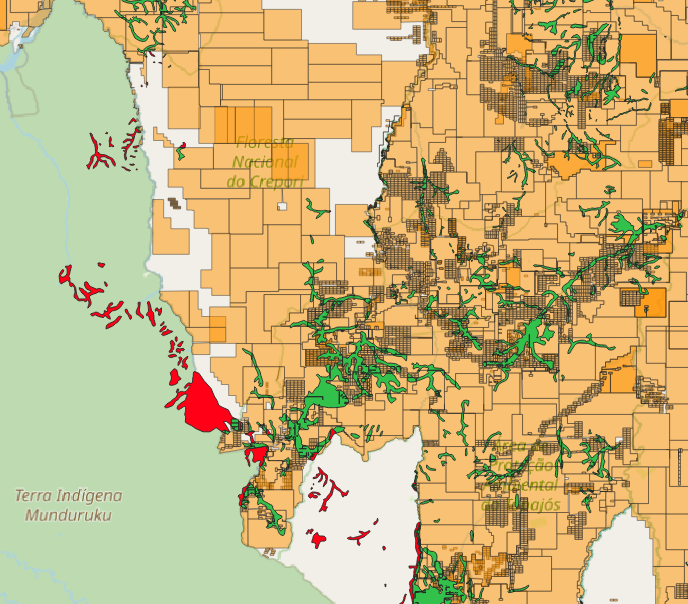
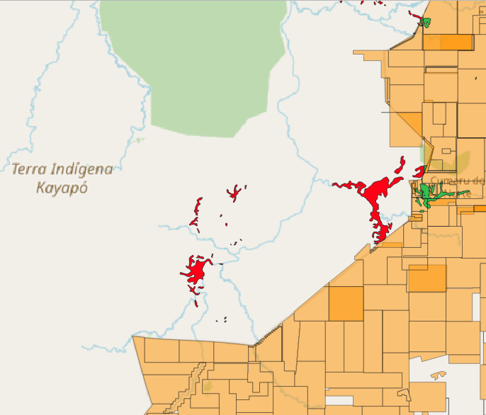
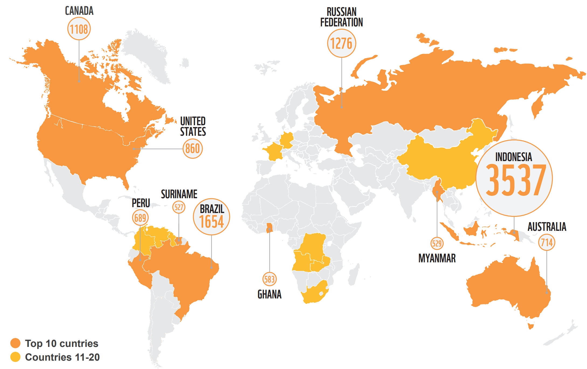
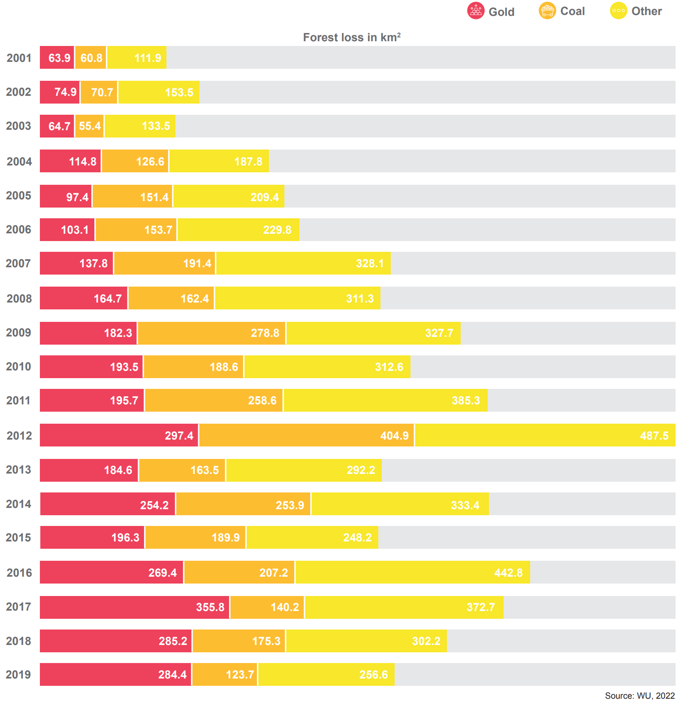

layout: false
class: clear, center
background-image: url(./../img/kayapo_gold_mining-Ibama-via-Wikimedia-CC-BY-SA-2-0.jpg)

```{r setup, include=FALSE, echo=FALSE}
library(xaringanExtra)
options(htmltools.dir.version = FALSE)
xaringanExtra::use_panelset()
```


.cc-bottom-right.font-light[Illegal gold mine in the Kayapo indigenous territory in Brazil by IBAMA via Wikimedia Commons
<a href="https://creativecommons.org/licenses/by-sa/2.0/deed.en">CC BY-SA 2.0</a>]
.font-dark.center.font250.font-light[**Currently, there is not enough geospatial information available to conduct comprehensive sustainability assessments for mining**]

???

- A link to the slides will be provided at the end of the talk, so you don't need to bother taking notes

- Companies and governments do not disclose sufficient geospatial information

- This hinders comprehensive sustainability and risk assessments of the sectors activities, particularly at global scale

---
layout: false
class: clear, center
background-image: url(https://www.esa.int/var/esa/storage/images/applications/observing_the_earth/copernicus/sentinel-2/19729272-10-eng-GB/Sentinel-2_pillars.jpg)
background-size: cover
.cc-bottom-left.font-light[Image: © <a href="https://www.esa.int/Applications/Observing_the_Earth/Copernicus/Sentinel-2">European Space Agency (ESA)</a>]

.center.font150.font-light[**Earth observation is the only viable data source for monitoring mining areas**]

???

- Earth observation satellites are the only viable data source to close this information gap

- And the open data policy by several space agencies makes it easy to access and use satellite images for a range of applications, including mapping mines

---
layout: false
class: clear, middle, center

.center.font180[**With little training, humans can identify mining in satellite images**]

.pull-left.center[
.bg-washed-blue.b--dark-blue.ba.bw0.br3.shadow-5.mh1.mt0.font100[
**Open cut of the Carajás Iron Mine, Brazil**
]
<div class="copyright-container">
  
  <div class="copyright-bottom-left2 font-light">Figure: <a href="https://www.fineprint.global/viewer">FINEPRINT Viewer</a></div>
</div>
]

.pull-right.center[
.bg-washed-blue.b--dark-blue.ba.bw0.br3.shadow-5.mh1.mt0.font100[
**Gold mining in Kayapo indigenous territory, Brazil**
]
<div class="copyright-container">
  
  <div class="copyright-bottom-left2 font-light">Figure: <a href="https://www.fineprint.global/viewer">FINEPRINT Viewer</a></div>
</div>
]

???

- My research team has been exploring this rich open satellite data archives to map mines

- As currently there are no automated algorithms that can map mines globally

- We have mapped small-scale and industrial mines via visual interpretation of satellite images

- Automated global scale mapping mines is an open scientific challenge

---
layout: false
class: clear, middle, center
background-image: url(./../img/mine-app-gui.png)
background-size: contain

.footnote-right[.font-light[[User interface of the open-source mine mapping tool](https://doi.org/10.5281/zenodo.3580739)]]

???

- We then develop a tool to support systematic visual interpretation of mining regions

- The tool brings several layers together to support experts interpretation of images

---
layout: false
class: clear, middle, center
background-image: url(./../img/mine-app-data-sources.png)
background-size: contain

.footnote-right[.font-light[[User interface of the open-source mine mapping tool](https://doi.org/10.5281/zenodo.3580739)]]

???

- We then develop a tool to support systematic visual interpretation of mining regions

- The tool brings several layers together to support experts interpretation of images

---
layout: false
class: clear, middle, center
background-image: url(./../img/global-mining-map.png)

.footnote-right[.font-light[Figure: [FINEPRINT Viewer www.fineprint.global/viewer](https://www.fineprint.global/viewer)]]]
.footnote-left[[Maus et al. (2020, 2022)](http://doi.org/10.1038/s41597-022-01547-4)]

.left-column.pl1.mt0.font120.left.bottom.font-light[
<br><br><br><br><br><br><br><br><br>
**45,000 Polygons**

**100,000 km²**

]

???

- As a result we constructed a database including about 45,000 polygons covering about 100,000 km² of mines globally

- In this map you can see the spatial distribution of the polygons

- This database untapped a range of global land use and ecological assessments


---
layout: false
class: clear, middle, center

.center.font120[**The database includes industrial mining as well as small-scale artisanal mining globally**]

<div class="copyright-container">
  
  <div class="copyright-bottom-left font-dark"><a href=http://doi.org/10.1038/s41597-022-01547-4>Maus et al., 2022</a></div>
</div>

???

- In this slide we see the examples from South America, in Chile and Brazil

- And it also may include illegal mining

---
layout: false
class: clear, middle, center

.center.font180[**Mining land use distribution across countries**]

<div class="copyright-container">
  
  <div class="copyright-bottom-left font-dark"><a href=http://doi.org/10.1038/s41597-022-01547-4>Maus et al., 2022</a></div>
</div>

???

- The polygons are distributed across 145 countries

- And the area is unevenly distributed, 6 countries account for more than 50% of the mapped mining area

- This includes, Russia, China, Australia, United States, Indonesia, and Brazil

- It is important to note that, the database covers LSM and SAM globally


---
layout: false
class: clear, middle, center

.center.font180[**Mining in indigenous land in Brazil**]

.pull-left.center[
<div class="copyright-container">
  
  <div class="copyright-bottom-left font-dark">Map by Matthias Humer</div>
</div>
.bg-washed-blue.b--dark-blue.ba.bw0.br3.shadow-5.mh1.mt0.font100[
**Munduruku indigenous territory, Brazil**
]
]

.pull-right.center[
<div class="copyright-container">
  
  <div class="copyright-bottom-left font-dark">Map by Matthias Humer</div>
</div>
.bg-washed-blue.b--dark-blue.ba.bw0.br3.shadow-5.mh1.mt0.font100[
**Kayapó indigenous territory, Brazil**
]
]

???

- As we can see the mining areas in red in this slide are within protected areas, outside the consecrations in orange

- Although, we have not check this areas with Brazilian authorities, they are likely illegal activities

- My team is currently conducting a more comprehensive study to check how much mining is outside concession

- But this is still challenging for several countries as we do not always have open information about concessions

- Our database has also served as bassis for other studies, for example

---
layout: false
class: clear, middle, center

.center.font180[**Mining-related forest loss by country accumulated from 2001 to 2019**]

<div class="copyright-container">
  
  <div class="copyright-bottom-left font-dark"><a href=https://www.wwf.de/fileadmin/fm-wwf/Publikationen-PDF/Wald/WWF-Studie-Extracted-Forests.pdf>Kramer et al., 2023</a></div>
</div>

???

- Based on this database, we have published last week a new study together with WWF Germany

- Where we have quantified the mining related deforestation globally

- Some main highlights of this study are shown in this map

- Showing the countries contribution to mining related deforestation from 2001 to 2019

- In this study we have also linked deforestation to individual commodities


---
layout: false
class: clear, middle, center

.center.font180[**Mining-related forest loss by commodity, 2001-2019**]

<div class="copyright-container">
  
  <div class="copyright-bottom-left font-dark"><a href=https://www.wwf.de/fileadmin/fm-wwf/Publikationen-PDF/Wald/WWF-Studie-Extracted-Forests.pdf>Kramer et al., 2023</a></div>
</div>


???

<!-- --- -->
<!-- layout: false -->
<!-- class: clear -->

<!-- .font-light.font200.center.bd[Monitoring mining requires] -->

<!-- .middle.center[ -->
<!--    -->
<!--   <br>.font180[**Deep neural networks show promising results in delineating coal mining open pit with overall accuracy between 85% and 90%**] -->
<!-- ] -->

<!-- .footnote-left[Maus et al. (Ongoing)] -->

<!-- ??? -->

<!-- - Automatizing mining monitoring shows promising results using a class of algorithms called, Convolution Neural Networks -->

---
layout: false
class: clear, center, middle
background-image: url(./../img/towards-automated-mining-monitoring.png)
background-size: contain

.font.dark.font120[**Towards monitoring legal/illegal mining**<br><br><br><br>]


???

- Sentinel-2 images provide sufficient spatial and temporal resolution for near real time monitoring, but supporting information with higher spatial resolution is critical

- Current automated approaches work well for homogeneous regions and mining types but not for large scales applications

- Cloud cover in tropical regions can substantially delay the detection

- Local expert knowledge is critical

- Open Earth observation images (Sentinel-2) provide sufficient spatial and temporal resolution for near real time monitoring

- However, higher spatial resolution is very useful, e.g. openly available for the tropics from Norway's International Climate and Forests Initiative Satellite Data Program

- How can we transition from snapshots of mining land use to monitoring mining activities over time?

- Our global mining database was very useful to calculate some ecological footprints 

- However, can only provide snapshots of land use, as it is very time-consuming

- Monitoring mining activities requires automation


<!-- <div class="copyright-container"> -->
<!--   <video height="320" autoplay muted loop> -->
<!--     <source src="https://assets.planet.com/web/videos/nicfi/nicfi_tropics_basemap_map_large_video_d2-1.mp4" type="video/mp4"> -->
<!--   </video> -->
<!-- </div> -->
<!-- <div class="copyright-bottom-left2 font-light">Video: <a href="https://www.planet.com/nicfi">NICFI https://www.planet.com/nicfi</a></div> -->

---
layout: false
class: clear, hide-count, middle, left

.erc-logo-left[] .fineprint-logo-left[] .wu-logo-right[]

<br><br><br><br><br>
.pull-left.left[
Dr Victor Maus<br>.font100[Institute for Ecological Economics<br>Vienna University of Economics and Business]<br>.font100[victor.maus@wu.ac.at]<br>.font100[<a href='https://vwmaus.github.io'>vwmaus.github.io</a>]<br>

]


.right[
  .font80[UNODC and UNEP, Apr 19, 2023, Vienna]<br>
  .font150[Thank you!]
]
