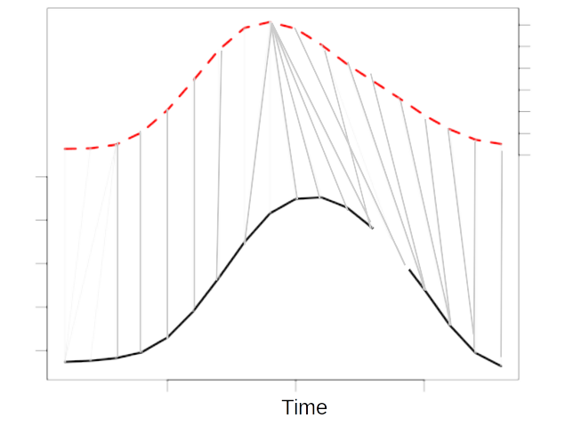

layout: false
background-image: url("https://upload.wikimedia.org/wikipedia/en/d/d2/Back_to_the_Future.jpg")
background-size: contain


```{r setup, include=FALSE, echo=FALSE}
library(xaringanExtra)
library(kableExtra)
library(dtwSat)
library(tibble)
library(dplyr)
library(tidyr)
library(RColorBrewer)

options(htmltools.dir.version = FALSE)
xaringanExtra::use_panelset()

# Read training samples
samples <- st_read(system.file("mato_grosso_brazil/samples.gpkg", package = "dtwSat"), quiet = TRUE)

# Satellite image time sereis files
tif_files <- dir(system.file("mato_grosso_brazil", package = "dtwSat"), pattern = "\\.tif$", full.names = TRUE)

# The acquisition date is in the file name are not the true acquisition date
# of each pixel. MOD13Q1 is a 16-day composite product, so the acquisition date
# is the first day of the 16-day period
acquisition_date <- as.Date(regmatches(tif_files, regexpr("[0-9]{8}", tif_files)), format = "%Y%m%d")

# Read the data as a stars object setting the time/date for each observation
# using along. This will prodcue a 4D array (data-cube) which will then be converted
# to a 3D array by spliting the 'band' dimension
dc <- read_stars(tif_files,
                 proxy = FALSE,
                 along = list(time = acquisition_date),
                 RasterIO = list(bands = 1:6))

dc <- st_set_dimensions(dc, 3, c("EVI", "NDVI", "RED", "BLUE", "NIR", "MIR"))
dc <- split(dc, c("band"))

# TWDTW function
# Create a knn1-twdtw model
m_p <- twdtw_knn1(x = dc,
                y = samples,
                cycle_length = 'year',
                time_scale = 'day',
                time_weight = c(steepness = 0.1, midpoint = 50),
                formula = band ~ s(time))

m_s <- twdtw_knn1(x = dc,
                y = samples,
                cycle_length = 'year',
                time_scale = 'day',
                time_weight = c(steepness = 0.1, midpoint = 50))

class_results <- readRDS("./class_results_dtwsat.rdf")

oa <- do.call('rbind', lapply(class_results, function(x){
  twdtw_err <- table("pred" = x$twdtw_pred, "ref" = x$ref)
  rf_err <- table("pred" = x$rf_pred, "ref" = x$ref)
  tibble(
    twdtw_oa = sum(diag(twdtw_err)) / sum(twdtw_err) * 100,
    rf_oa = sum(diag(rf_err)) / sum(rf_err) * 100)
})) |>
  pivot_longer(cols = c(twdtw_oa, rf_oa)) |>
  rename(`Overall accuracy` = value, Method = name) |>
  mutate(Method = factor(Method, c("twdtw_oa", "rf_oa"), c("TWDTW-1NN", "RF")))

oa_summary <- oa |>
  group_by(Method) |>
  summarise(
    sd = sd(`Overall accuracy`, na.rm = TRUE),
    `Overall accuracy` = mean(`Overall accuracy`)
  )

```


---

# Time Series Classification

<br>
.center[
```{r, echo=FALSE, out.width="80%"}
knitr::include_graphics("https://www.victor-maus.com/assets/talks/img/source_petitjean_2012.png")
```
]

.footnote-right[Figure: [Tan et al., 2017](https://doi.org/10.1137/1.9781611974973.32)]


---
layout: false

# Dimensionality

.pull-left[
## 1-D Array
```{r, echo=FALSE, eval=TRUE}
data.frame(
  b1_t1 = ".",
  b1_t2 = ".",
  b1_tm = ".",
  b2_t1 = ".",
  b2_t2 = ".",
  b2_tm = ".",
  bn_tm = ".") |>
  kbl() |>
  kable_styling()
```
]

.pull-right[
## 2-D Array
```{r, echo=FALSE, eval=TRUE}
data.frame(
  band_1 = c(time_1 = ".", time_2 = ".", time_3 = ".", "[...]" = ".", time_m = "."),
  band_2 = c(time_1 = ".", time_2 = ".", time_3 = ".", "[...]" = ".", time_m = "."),
  band_3 = c(time_1 = ".", time_2 = ".", time_3 = ".", "[...]" = ".", time_m = "."),
  band_n = c(time_1 = ".", time_2 = ".", time_3 = ".", "[...]" = ".", time_m = ".")) |>
  kbl() |>
  kable_styling()
```
]


---
layout: false

# Dynamic Time Warping (DTW)

<br>
.center[
```{r, echo=FALSE, out.width="80%"}
knitr::include_graphics("https://www.tandfonline.com/cms/asset/5a80ca23-5dec-4da6-99db-69972a37c2dc/tcag_a_890071_f0006_c.jpg")
```
]

.center.font-huw-red-dark.font150[
  **Allows out-of-season alignments**
]


.footnote-right[Figure: [Ranacher & Tzavella, 2014](https://doi.org/10.1080/15230406.2014.890071)]

---
layout: false

# Time-Weighted-DTW

.pull-left.font200[
  <br>
  $\omega(t_i,t_j) = \frac{1}{1 + e^{-{\alpha} (g(t_i,t_j){i,j} - {\beta})}}$
  <br><br>
  .font-huw-red-dark.font100[**Keep alignments within the correct season**]
]

.pull-right[
```{r, eval=T, echo=F, dev='png', dev.args=list(bg='transparent'), out.width="90%"}
tw <- function(x) 1 / (1 + exp(-0.1 * (x - 50)))
tibble(`Elapsed time` = 1:100, `Time-weight` = tw(`Elapsed time`)) |>
  ggplot(aes(x = `Elapsed time`, y = `Time-weight`)) +
  theme_bw() +
  theme(
    panel.background = element_rect(fill = 'transparent'),
    plot.background = element_rect(fill = 'transparent'),
    axis.title = element_text(size = rel(2.0), face = "bold"),
    axis.text = element_text(size = rel(1.7)),
    legend.title = element_text(size = rel(2.0), face = "bold"),
    legend.text = element_text(size = rel(1.7))) +
  geom_line()
```
]

.footnote-left[[Maus et al., 2016](http://doi.org/10.1109/JSTARS.2016.2517118)]


---
layout: false

# Advantages

.pull-left[
- ### Irregularly sampled time series

- ### Time series with different length

- ### No need for gap-filling

- ### .font-huw-red-dark.font100[Requires a small set of training samples]
]

.pull-right[
```{r, echo=FALSE, out.width="120%"}

```
]

--
.font-huw-red-dark.font150[
  **Dynamic Time Warping (DTW) and 1-Nearest Neighbor (1NN)**
]


---
layout: false

# Leave-all but one out cross-validation

<br>
.center[
```{r, eval=T, echo=F, dev='png', dev.args=list(bg='transparent'), fig.width=10, fig.height=6}
ggplot(oa, aes(x = `Overall accuracy`, fill = Method)) +
  geom_density(alpha=0.6, adjust = 2) +
  theme_bw() +
  theme(
    axis.title = element_text(size = rel(2.0), face = "bold"),
    axis.text = element_text(size = rel(1.7)),
    legend.title = element_text(size = rel(2.0), face = "bold"),
    legend.text = element_text(size = rel(1.7))) +
  ylab("Density") + 
  scale_fill_brewer(palette = "Dark2")
```
]

---

# Patterns from literature

.pull-left[
```{r, echo=FALSE, out.width="100%"}
knitr::include_graphics("https://www.victor-maus.com/assets/img/literature-patterns.png")
```
]
.pull-right[
```{r, echo=FALSE, out.width="70%"}
knitr::include_graphics("https://www.victor-maus.com/assets/img/literature-patterns-maps.png")
```
]

.footnote-left[[Maus et al., 2016](http://doi.org/10.1109/JSTARS.2016.2517118)]


---
layout: false

# Sample generation

.pull-left[
```{r, echo=FALSE, out.width="100%"}
knitr::include_graphics("https://ars.els-cdn.com/content/image/1-s2.0-S0303243420309077-gr1_lrg.jpg")
```
]
.pull-right[
```{r, echo=FALSE, out.width="90%"}
knitr::include_graphics("https://ars.els-cdn.com/content/image/1-s2.0-S0303243420309077-gr4_lrg.jpg")
```
]

.footnote-left[[Belgiu et al., 2021](https://doi.org/10.1016/j.jag.2020.102264)]


---
layout: false

# Samples

.center[
```{r, eval=T, echo=F, dev='png', dev.args=list(bg='transparent'), fig.width=13, fig.height=6}
plot(m_s) +
  theme_bw() +
  theme(
    axis.title = element_text(size = rel(2.0), face = "bold"),
    axis.text = element_text(size = rel(0.7)),
    legend.title = element_text(size = rel(2.0), face = "bold"),
    legend.text = element_text(size = rel(1.7))) 
    #scale_colour_manual(values = brewer.pal(n = 7, name = "Dark2")[-4])
```
]

.font-huw-red-dark.font150.center[
  **High computational cost**
]

---
layout: false

# Patterns

.center[
```{r, eval=T, echo=F, dev='png', dev.args=list(bg='transparent'), fig.width=13, fig.height=6}
plot(m_p) +
  theme_bw() +
  theme(
    axis.title = element_text(size = rel(2.0), face = "bold"),
    axis.text = element_text(size = rel(0.7)),
    legend.title = element_text(size = rel(2.0), face = "bold"),
    legend.text = element_text(size = rel(1.7))) 
    #scale_colour_manual(values = brewer.pal(n = 7, name = "Dark2")[-4])
```
]

.footnote-left[[Maus et al., 2019](http://doi.org/10.18637/jss.v088.i05)]

.font-huw-red-dark.font150.center[
  **Reduced number of comparisons**
]

---
layout: false

# Twenty-year maize distribution in China

.center[
```{r, echo=FALSE, out.width="60%"}
knitr::include_graphics("https://media.springernature.com/full/springer-static/image/art%3A10.1038%2Fs41597-023-02573-6/MediaObjects/41597_2023_2573_Fig8_HTML.png?as=webp")
```
]

.footnote-left[[Peng et al., 2023](https://doi.org/10.1038/s41597-023-02573-6)]


---
layout: false

# CRAN

.pull-left[
## R package `dwtSat (≥ 1.0-0)`

- Fortran 90 and C++ versions

### Land use mapping useing `stars`
```{r,echo=TRUE,eval=FALSE}
install.packages("dtwSat")

vignette("landuse-mapping", "dtwSat")
```

### Future versions:

- `gdalcubes`
- `sits`
]

--

.pull-right[
<br>
.font100[victor.maus@wu.ac.at]<br>
.font100[<a href='https://vwmaus.github.io'>vwmaus.github.io</a>]
]


