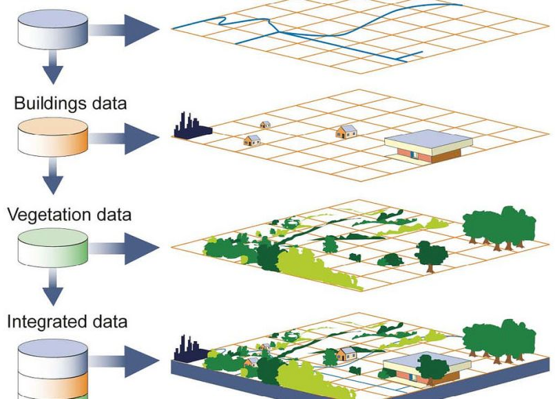
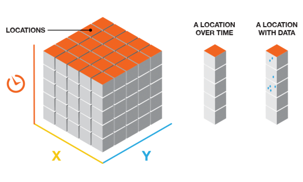

layout: false
class: 
```{r setup, include=FALSE, echo=FALSE}
library(xaringanExtra)
options(htmltools.dir.version = FALSE)
xaringanExtra::use_panelset()
```

# Learning Outcome

.font150[Recall the concept of space-time data cubes in geographic information systems (GIS).]

# Requirements

.font150[Basic knowledge of GIS data models for representing geographic information as vector and raster formats.]

---
layout: false
class: 

.pull-left[
# Data Layers
<div class="left">
  
  .font60[Figure: [U.S. Government Accountability Office](https://education.nationalgeographic.org/resource/geographic-information-system-gis/#undefined)]
</div>
]

.pull-right[
# Data Cube Structure
### Dimensions and Attributes
<div class="left">
  
  .font60[Figure: [ArcGIS Pro Space Time Cube](https://pro.arcgis.com/en/pro-app/3.1/tool-reference/space-time-pattern-mining/learnmorecreatecube.htm)]
</div>
]

---
layout: false
class:

# Summary

.font150[
- Data cubes are a data structure where data is stored in multidimensional arrays (n-D arrays).
- Data cubes are discrete and regularly sampled.
- Enable effective scalability of environmental analysis.
]

# Next session

.font150[
- Construct data cubes using a GIS environment.
- Perform basic operations with data cubes: filter, apply, reduce, and redimension.
]


