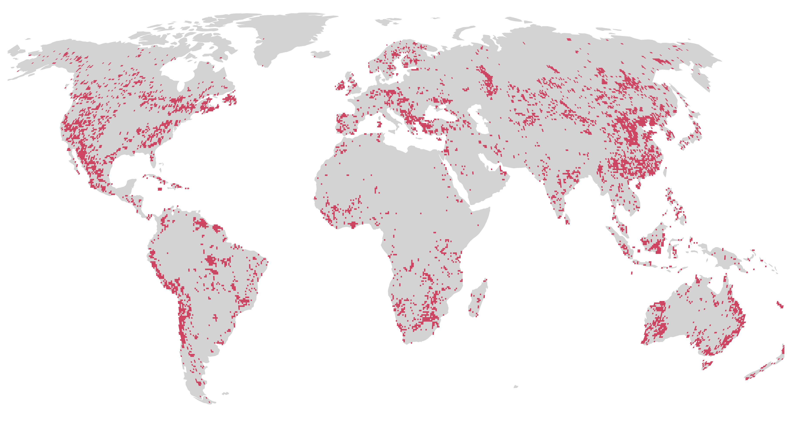
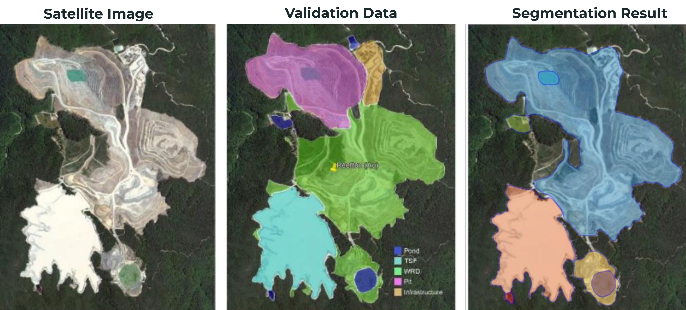

```{r setup, include=FALSE, echo=FALSE}
library(xaringanExtra)
options(htmltools.dir.version = FALSE)
xaringanExtra::use_panelset()
```

.pull-left[
```{r, echo=FALSE, out.width="90%"}
knitr::include_graphics("./img/maus2024-nature.png")
```
```{r, echo=FALSE, out.width="90%"}

```
]

.footnote-left[Source: [Maus & Werner, 2024](http://doi.org/10.1038/d41586-023-04090-3)]

--

.pull-right[
```{r, echo=FALSE, out.width="85%"}
knitr::include_graphics("https://media.nature.com/lw767/magazine-assets/d41586-023-04090-3/d41586-023-04090-3_26550018.png?as=webp")
```
]

---
layout: false
class: clear, center
background-image: url(https://www.esa.int/var/esa/storage/images/applications/observing_the_earth/copernicus/sentinel-2/19729272-10-eng-GB/Sentinel-2_pillars.jpg)
background-size: cover

# .font-light.font90[Due Diligence Needs Systematically Produced Data]

.cc-bottom-left.font-light[Image: © <a href="https://www.esa.int/Applications/Observing_the_Earth/Copernicus/Sentinel-2">European Space Agency (ESA)</a>]

<!-- .center.font140.font-light[**Satellite earth observation is the only feasible data source available globally**] -->


---
layout: false
class: clear
background-image: url(./img/global-mining-map.png)
background-size: cover

# .font-light[Global Mining Land Use]

.footnote-right[.font-light.font120[[Maus et al. (2020, 2022) Nature Sci. Data](http://doi.org/10.1038/s41597-022-01547-4) Figure: [FINEPRINT Viewer](https://www.fineprint.global/viewer)]]

.left-column.pl1.mt0.font120.left.bottom.font-light[
<br><br><br><br><br><br><br>
**45,000 Polygons**

**100,000 km²**

]


---


## How to keep track of existing mines and new ones?


---
layout: false

### Can AI (computer vision) detect mines like other more regular objects?
.pull-left.center[
<div class="copyright-container">
  
  <div class="copyright-bottom-left2">Photo by Tiina Häyhä <a href='https://creativecommons.org/licenses/by-sa/4.0'>CC BY-SA 4.0 license</a></div>
</div>
]

.pull-right.center[
<div class="copyright-container">
  
  <div class="copyright-bottom-left2">Screenshots of <a href="https://goo.gl/maps/xDkqyGdMAn8ZJTZJ7">Google Maps</a></div>
</div>
]


---

# Semantic Segmentation Using AI

.center[
```{r, echo=FALSE, out.width="90%"}

```
]

.footnote-left[Source: Jasansky & Maus (Ongoing)]


---
class: title, no-number

# Thank you!
.lut-illustration-large[].wu-logo-mtg[].copyright-bottom-right.font60[OECD Forum on Responsible Mineral Supply Chains, Paris, May 22<sup>th</sup>, 2024]


.pull-left.left[
Dr Victor Maus<br>.font90[Institute for Ecological Economics<br>Vienna University of Economics and Business]<br>.font90[victor.maus@wu.ac.at]<br>.font90[<a href='https://vwmaus.github.io'>vwmaus.github.io</a>]<br>

]
