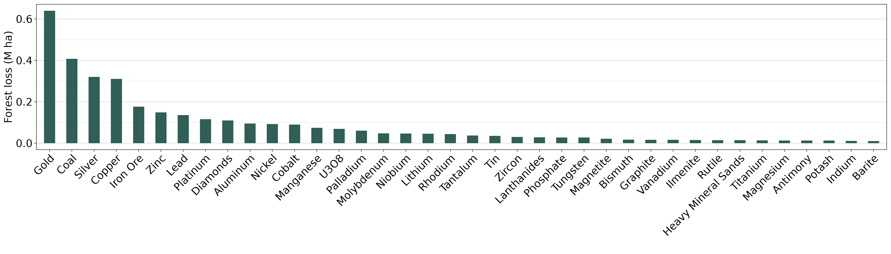

layout: false
class: clear

.footnote-left[Source: Maus et al., (Under Review)]


.center[
```{r, echo=FALSE, out.width="95%"}

```
]

---
layout: false
class: clear

.footnote-left[Source: Maus et al., (Under Review)]


.center[
```{r, echo=FALSE, out.width="95%"}

```
]


.center[
```{r, echo=FALSE, out.width="95%"}

```
]


---

# Forest Loss Due to Mining in Brazil

.center[
```{r, echo=FALSE, out.width="95%"}

```
]

.footnote-left[Source: Maus et al., (Under Review)]

<!-- ---

# Indirect Forest Loss

.center[
```{r, echo=FALSE, out.width="75%"}
knitr::include_graphics("https://www.victor-maus.com/assets/talks/2024-05-15-lut/img/pnas-ind-def.png")
```
]

.footnote-left[Source: [Giljum et al., 2022 PNAS](http://doi.org/10.1073/pnas.2118273119)] -->


---
# Forest Loss on Minerals Supply Chain

.center[
```{r, echo=FALSE, out.width="90%"}
knitr::include_graphics("https://www.victor-maus.com/assets/talks/2024-05-15-lut/img/forest-loss-mrio-res.png")
```
]

.footnote-left[Source: Luckeneder et al., (Under Review)]


---
class: title, no-number

# Thank you!
.lut-illustration-large[].wu-logo-mtg[].copyright-bottom-right.font60[OECD Forum on Responsible Mineral Supply Chains, Paris, May 22<sup>th</sup>, 2024]


.pull-left.left[
Dr Victor Maus<br>.font90[Institute for Ecological Economics<br>Vienna University of Economics and Business]<br>.font90[victor.maus@wu.ac.at]<br>.font90[<a href='https://vwmaus.github.io'>vwmaus.github.io</a>]<br>

]
