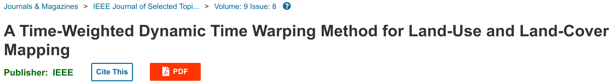
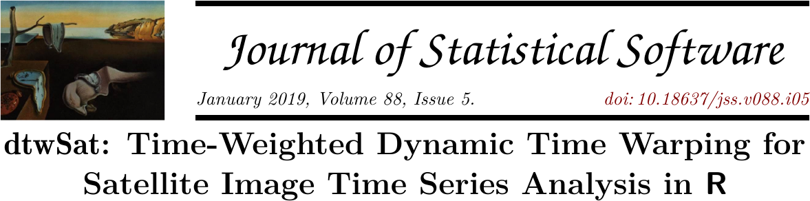
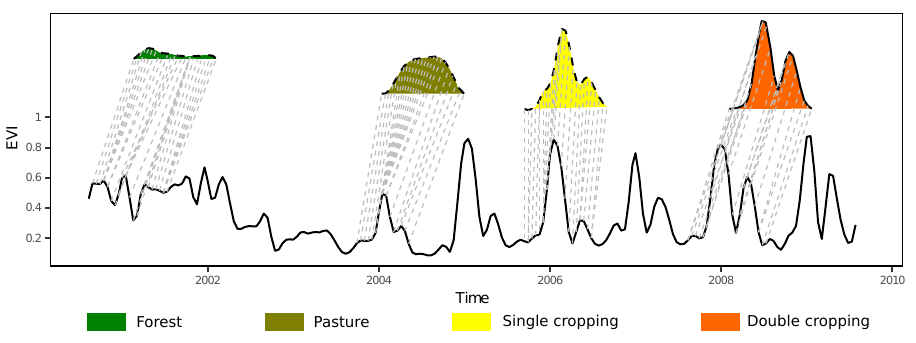
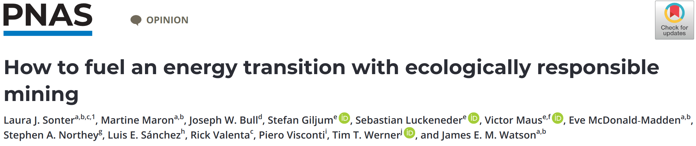
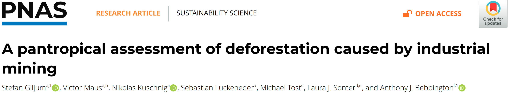

layout: false
class: clear

# Research Interest
<br>

.pull-left[
```{r, echo=FALSE, out.width="100%"}
knitr::include_graphics("https://www.victor-maus.com/assets/talks/img/what-is-sds.png")
```
]

--

.pull-right[
```{r, echo=FALSE, out.width="100%"}
knitr::include_graphics("https://upload.wikimedia.org/wikipedia/commons/a/a7/Sustainable_Development_Goals.svg")
```
]

---
.pull-left[
```{r, echo=FALSE, out.width="100%"}

```
<br><br>
```{r, echo=FALSE, out.width="100%"}

```
<br><br>
```{r, echo=FALSE, out.width="100%"}

```
<br><br>
.font150[
  $\omega(t_i,t_j) = \frac{1}{1 + e^{-{\alpha} (g(t_i,t_j){i,j} - {\beta})}}$
]
]


--

.pull-right[
```{r, echo=FALSE, out.width="90%"}
knitr::include_graphics("https://www.victor-maus.com/assets/talks/20240522-oecd-eo/img/maus2024-nature.png")
```
<br><br>
```{r, echo=FALSE, out.width="90%"}

```
<br><br>
```{r, echo=FALSE, out.width="90%"}

```
]


---
background-image: url(./img/network.png)
background-size: cover

# International Recognition

<br><br><br><br><br><br><br>
- .font120[**National and International Awards**]
- .font120[**Collaboration across \>15 countries \>20 organizations**]
- .font120[**OECD Forum on Responsible Mineral Supply Chains 2024**]

---
## Research funding

- Total acquired fund 450,000.00 EUR (as PI and co-applicant)

--

- Ongoing funding 135,000.00 EUR (Sources: FAO, NGO Fern, and WU)

--

## Under Consideration

- 2,000,000.00 EUR - ERC Consolidator Grand (Mining Indicators from EO)


--

- 350,000.00 EUR - EU Horizon-Europe Consortium (Climate Change and Minerals Supply Change)


--

- 100,000.00 EUR - The World Bank (Mining Land-Use)

--

- 50,000.00 EUR - DFG: German Research Foundation (iDiv Research Network on Biodiversity)


