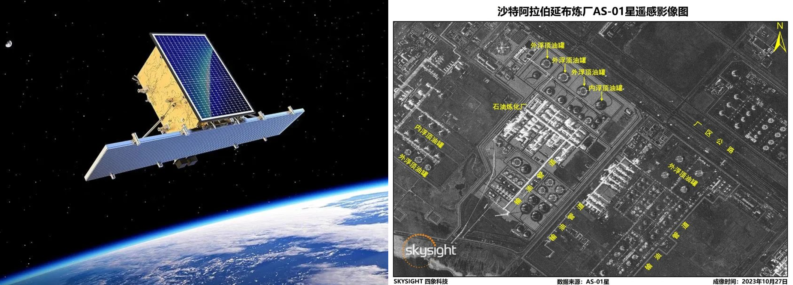

<style type="text/css">
  a {
    color: inherit;
    text-decoration: none; /* Optional: Remove underline if desired */
  }
</style>

# Education and Work Experience (Brazil and the EU)

.pull-left[
- BSc in Engineering, Franciscan University, Brazil
- MSc in Computer Science, Federal University of Juiz de Fora, Brazil
- PhD in Earth System Science, **INPE - Institute for Space Research**, Brazil
]
.pull-right[
```{r, echo=FALSE, out.width="70%"}
knitr::include_graphics("https://www.refugiosnointerior.com.br/sistema/_lib/file/img/lugar/6027/capa_instituto_nacional_de_pesquisas_espaciais(1).webp")
```
<div style="position: relative; height: 100%;">
  
</div>
]

--

## .font90.font-huw-red-light[10 years of work experience in the EU, in Austria, Germany, and Sweden]
.pull-left[
```{r, echo=FALSE, out.width="90%"}
knitr::include_graphics("https://iiasa.ac.at/sites/default/files/styles/social_media/public/2021-11/15300419120_ce7fc56b9a_c.jpg?itok=D74B29jL")
```
### International Institute for Applied Systems Analysis, IIASA
]
.pull-right[
```{r, echo=FALSE, out.width="70%"}
knitr::include_graphics("https://www.wu.ac.at//fileadmin/wu/_processed_/9/e/csm_LC_aussen_12f50b2a93.jpg")
```
### WU Vienna University of Economics and Business
]

---

# Major Academic Achievements


.pull-left[
### .font-huw-red-light[Scientific Software and Data]
<a href="https://www.scimagojr.com/journalsearch.php?q=12137&amp;tip=sid&amp;exact=no" title="SCImago Journal &amp; Country Rank">
    
</a>
<a href="https://www.scimagojr.com/journalsearch.php?q=21100451321&amp;tip=sid&amp;exact=no" title="SCImago Journal &amp; Country Rank">
    
</a>
<br><br>
```{r, echo=FALSE, out.width="95%"}
knitr::include_graphics("https://www.victor-maus.com/assets/talks/20240530-lut/img/dtwsat.png")
```
<br>
```{r, echo=FALSE, out.width="90%"}
knitr::include_graphics("https://www.victor-maus.com/assets/talks/20240530-lut/img/sits-color.png")
```
<br>
```{r, echo=FALSE, out.width="95%"}
knitr::include_graphics("./img/sci-data-maus2020.png")
```
]

--

.pull-right[
### .font-huw-red-light[Insights on Global Mining Impacts]
<a href="https://www.scimagojr.com/journalsearch.php?q=21206&amp;tip=sid&amp;exact=no" title="SCImago Journal &amp; Country Rank">
    
</a>
<a href="https://www.scimagojr.com/journalsearch.php?q=21121&amp;tip=sid&amp;exact=no" title="SCImago Journal &amp; Country Rank">
    
</a>
<br><br>
```{r, echo=FALSE, out.width="65%"}
knitr::include_graphics("https://www.victor-maus.com/assets/talks/20240522-oecd-eo/img/maus2024-nature.png")
```
<br>
```{r, echo=FALSE, out.width="95%"}
knitr::include_graphics("https://www.victor-maus.com/assets/talks/20240530-lut/img/pnas-sonter2023.png")
```
<br>
```{r, echo=FALSE, out.width="95%"}
knitr::include_graphics("https://www.victor-maus.com/assets/talks/20240530-lut/img/pnas-giljum2022.png")
```
]


<!-- ---
background-image: url(https://www.victor-maus.com/assets/talks/20240530-lut/img/network.png)
background-size: cover

# International Recognition

<br><br><br><br><br><br><br>
- .font120[**National and International Awards**]
- .font120[**Collaboration across \>15 countries \>20 organizations**]
- .font120[**Invited expert at the OECD Forum on Responsible Mineral Supply Chains 2024**]
- .font120[**Wide media coverage, including .font-huw-red-light[The Guardian and BBC]**] -->

---
layout: false
class: clear
background-image: url(https://www.victor-maus.com/assets/talks/2024-05-15-lut/img/global-mining-map.png)
background-size: cover

# .font-light.font150[How to Monitor Mining Land Use Globally?]

.footnote-right[.font-light.font120[[Maus et al. (2020, 2022) Nature Sci. Data](http://doi.org/10.1038/s41597-022-01547-4)]]


]

---
# Innovative Approach

<br>
```{r, echo=FALSE, out.width="98%"}
knitr::include_graphics("./img/nsfc-project-overview.png")
```

# .font-huw-red-light[Crete a extensive training data collections and use multimodal predictors space]


---
# Feasibility

## PI's Solid Research Foundation

- Geoinformatics
- AI and big-EO data analytics
- Large labelled data collections
- Mining land use assessments
- Extensive international network of collaborators

--

## Excellent Research Team and Support from CUMT

- Researchers with a vast experience on satellite and mining
- Highly skilled MSc and PhD students to support the project
- Computing Center: high-performance computing clusters for AI
- "CUMT Nanhu" of AS-01 SAR satellite


<div style="position: relative; height: 100%;">
  
  <div class="font-huw-red-light" style="position: absolute; top: -500px; right: 0px; width: 45%; font-size: 133%; font-weight: bold">
    Research visit to the CUMT
  </div>
  <div class="font-dark" style="position: absolute; top: -275px; left: 700px; width: 45%; font-size: 60%; font-weight: bold">
    Nov 2023, Xuzhou, China
  </div>
  
  
  
</div>


---
# Summary


