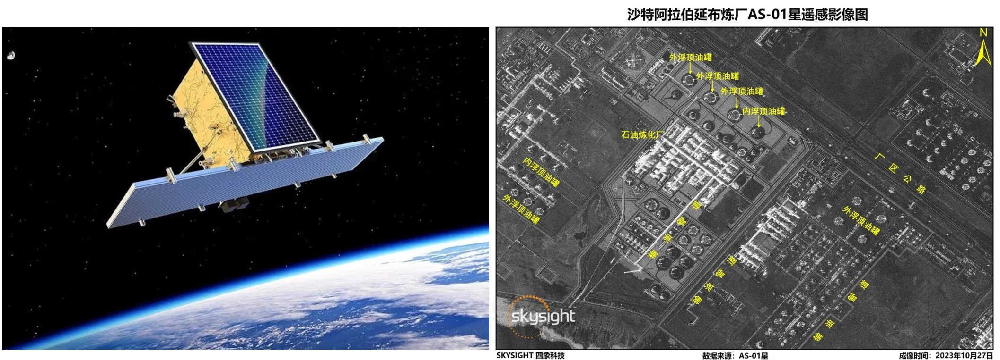

<style type="text/css">
  a {
    color: inherit;
    text-decoration: none; /* Optional: Remove underline if desired */
  }
  .bg_map {
    position: relative;
    z-index: 1;
  }
  .bg_map::before {    
        content: "";
        background-image: url('./img/outreach.png');
        background-size: cover;
        position: absolute;
        top: 0px;
        right: 0px;
        bottom: 0px;
        left: 0px;
        opacity: 0.4;
        z-index: -1;
  }
</style>

# Education and Work Experience (Brazil and the EU)

.pull-left.font90[
- BSc in Engineering, Franciscan University, Brazil
- MSc in Computer Science, Federal University of Juiz de Fora, Brazil
- PhD in Earth System Science, **INPE - Institute for Space Research**, Brazil
]
.pull-right[
```{r, echo=FALSE, out.width="70%"}
knitr::include_graphics("https://www.refugiosnointerior.com.br/sistema/_lib/file/img/lugar/6027/capa_instituto_nacional_de_pesquisas_espaciais(1).webp")
```
<div style="position: relative; height: 100%;">
  
</div>
]

--

## .font80.font-huw-red-light[10 years of work experience in the EU, in Austria, Germany, and Sweden]
.pull-left[
```{r, echo=FALSE, out.width="90%"}
knitr::include_graphics("https://iiasa.ac.at/sites/default/files/styles/social_media/public/2021-11/15300419120_ce7fc56b9a_c.jpg?itok=D74B29jL")
```
### .font80[IIASA International Institute for Applied Systems Analysis]
]
.pull-right[
```{r, echo=FALSE, out.width="70%"}
knitr::include_graphics("https://www.wu.ac.at//fileadmin/wu/_processed_/9/e/csm_LC_aussen_12f50b2a93.jpg")
```
### .font80[WU Vienna University of Economics and Business]
]

---

# Major Academic Achievements

.pull-left[
**Scientific Software and Data**
<a href="https://www.scimagojr.com/journalsearch.php?q=12137&amp;tip=sid&amp;exact=no" title="SCImago Journal &amp; Country Rank">
    
</a>
<a href="https://www.scimagojr.com/journalsearch.php?q=21100451321&amp;tip=sid&amp;exact=no" title="SCImago Journal &amp; Country Rank">
    
</a>
<br><br>
```{r, echo=FALSE, out.width="95%"}
knitr::include_graphics("https://www.victor-maus.com/assets/talks/20240530-lut/img/dtwsat.png")
```
<br>
```{r, echo=FALSE, out.width="90%"}
knitr::include_graphics("https://www.victor-maus.com/assets/talks/20240530-lut/img/sits-color.png")
```
<br>
```{r, echo=FALSE, out.width="95%"}
knitr::include_graphics("./img/sci-data-maus2020.png")
```
]

--

.pull-right[
**Insights on Global Mining Impacts**
<a href="https://www.scimagojr.com/journalsearch.php?q=21206&amp;tip=sid&amp;exact=no" title="SCImago Journal &amp; Country Rank">
    
</a>
<a href="https://www.scimagojr.com/journalsearch.php?q=21121&amp;tip=sid&amp;exact=no" title="SCImago Journal &amp; Country Rank">
    
</a>
<br><br>
```{r, echo=FALSE, out.width="65%"}
knitr::include_graphics("https://www.victor-maus.com/assets/talks/20240522-oecd-eo/img/maus2024-nature.png")
```
<br>
```{r, echo=FALSE, out.width="95%"}
knitr::include_graphics("https://www.victor-maus.com/assets/talks/20240530-lut/img/pnas-sonter2023.png")
```
<br>
```{r, echo=FALSE, out.width="95%"}
knitr::include_graphics("https://www.victor-maus.com/assets/talks/20240530-lut/img/pnas-giljum2022.png")
```
]


---
class: bg_map

# Academic Influence

## International Recognition
 - .font110[Young Scientist Award from the International Society for Mine Surveying]
 - .font110[WU-Vienna's Researcher of the Month, January 2022]

## Third Mission (transfer of academic knowledge)
- .font110[**OECD** Forum on Responsible Mineral Supply Chains]
- .font110[**UNEP** Workshop on Remote Sensing to Detect Illegal Mining]
- .font110[**FAO** Crop Monitoring Under]
- .font110[**World Bank** Coal Mining Mapping]

## Media Coverage

- .font110[National and international coverage (e.g. **The Guardian** and **BBC**)]

<br><br>
.font-huw-red-light.font120[**My research on the impacts of mining has had global visibility**]

---
# Knowledge Gap

.pull-left[
```{r, echo=FALSE, out.width="90%"}
knitr::include_graphics("https://www.victor-maus.com/assets/talks/20240522-oecd-eo/img/maus2024-nature.png")
```
```{r, echo=FALSE, out.width="90%"}
knitr::include_graphics("https://www.victor-maus.com/assets/talks/20240522-oecd-eo/img/gap_grid_map.png")
```
]

.pull-right[
```{r, echo=FALSE, out.width="85%"}
knitr::include_graphics("https://media.nature.com/lw767/magazine-assets/d41586-023-04090-3/d41586-023-04090-3_26550018.png?as=webp")
```
]

.font-huw-red-light.font120[**
EO and AI open an opportunity to filling knowledge gaps in mining land use. 
**]


 
.footnote-right[Source: [Maus & Werner, *Nature* 2024](http://doi.org/10.1038/d41586-023-04090-3)]

---
layout: false
class: clear, middle, inverse
background-image: url(https://www.victor-maus.com/assets/talks/2024-05-15-lut/img/global-mining-map.png)
background-size: cover

<br>
# .font120.center.bg-washed-blue.bw0.br3.pr3.font-dark[Current AI models for mapping mining land use do not generalize globally]

.footnote-right[.font-light.font120[[Maus et al. (2020, 2022) Nature Scientific Data](http://doi.org/10.1038/s41597-022-01547-4)]]

---
# Innovative Approach

<br>
```{r, echo=FALSE, out.width="98%"}
knitr::include_graphics("./img/nsfc-project-overview.png")
```

.font-huw-red-light.font120[**
  Integrating multimodal EO data with extensive global 
  training datasets can reliably expand the area of applicability 
  of AI models to map mining land use.
**]


---
# Feasibility

## PI's Solid Research Foundation

- Geoinformatics
- AI and big-EO data analytics
- Large labelled data collections
- Mining land use assessments
- Extensive international network of collaborators

--

## Excellent Research Team and Support from CUMT

- Researchers with a vast experience on satellite and mining
- Highly skilled MSc and PhD students to support the project
- Computing Center: high-performance computing clusters for AI
- "CUMT Nanhu" of AS-01 SAR satellite


<div style="position: relative; height: 100%;">
  
  <div class="font-huw-red-light" style="position: absolute; top: -500px; right: 0px; width: 45%; font-size: 130%; font-weight: bold">
    Research visit to the CUMT
  </div>
  <div class="font-dark" style="position: absolute; top: -285px; left: 660px; width: 45%; font-size: 60%; font-weight: bold">
    Nov 2023, Xuzhou, China
  </div>
  
  
  
</div>


---
class: title, no-number

# Thank you!
.lut-illustration-large[].wu-logo-mtg[].copyright-bottom-right.font60[June 27<sup>th</sup>, 2024]


.pull-left.left[
Dr Victor Maus<br>.font90[Institute for Ecological Economics<br>Vienna University of Economics and Business]<br>.font90[victor.maus@wu.ac.at]<br>.font90[<a href='https://vwmaus.github.io'>vwmaus.github.io</a>]<br>

]
