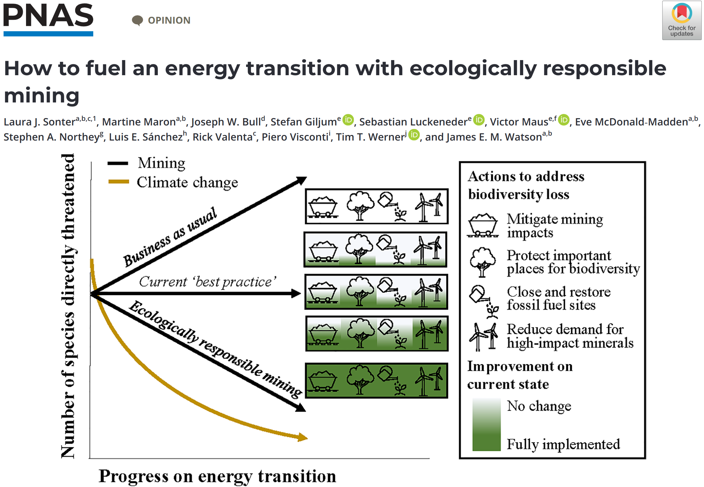
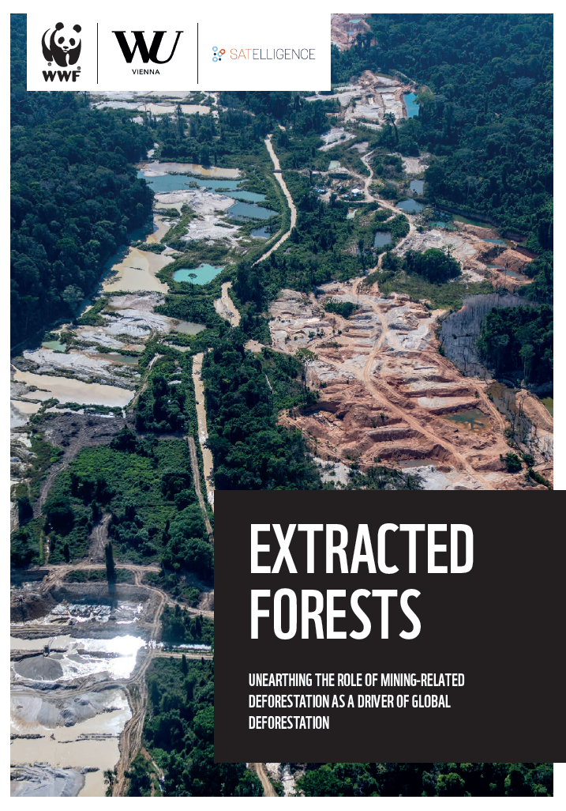
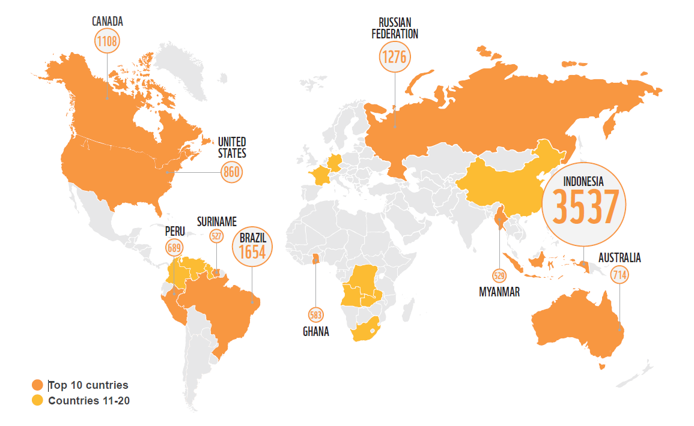
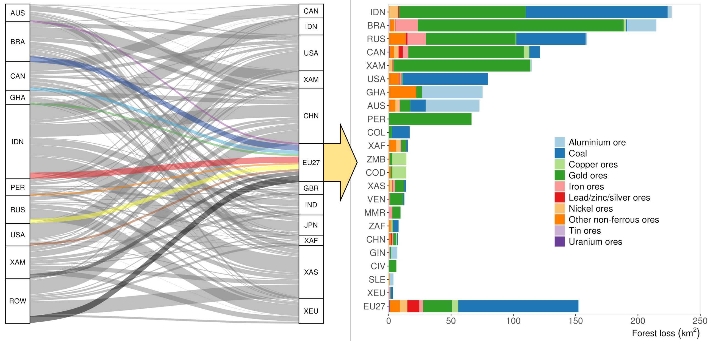
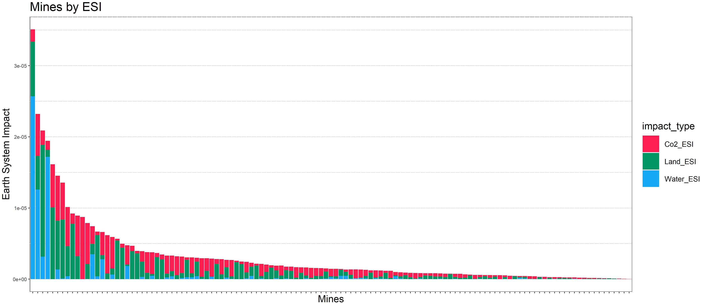
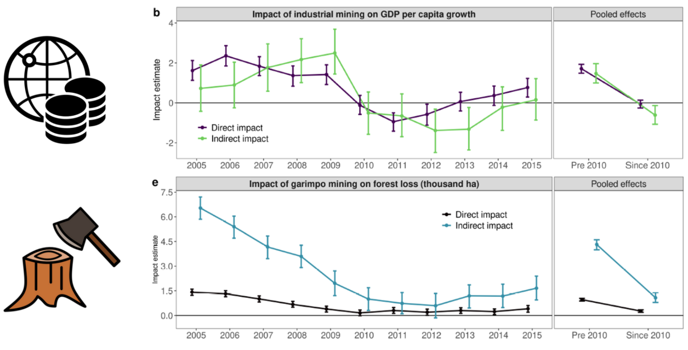
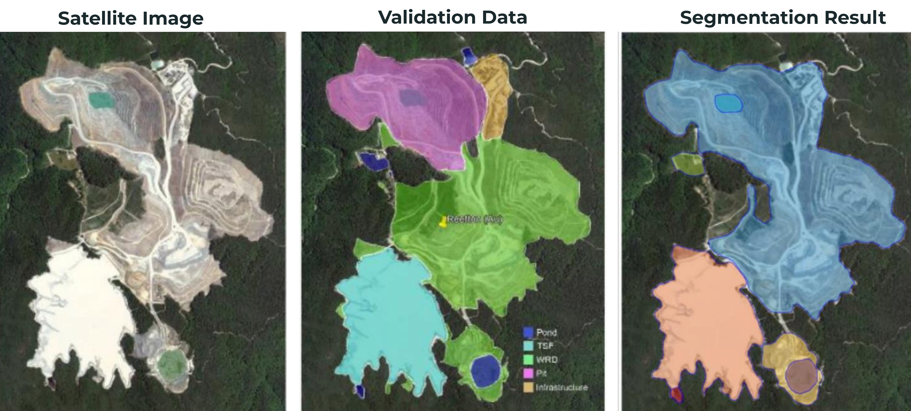
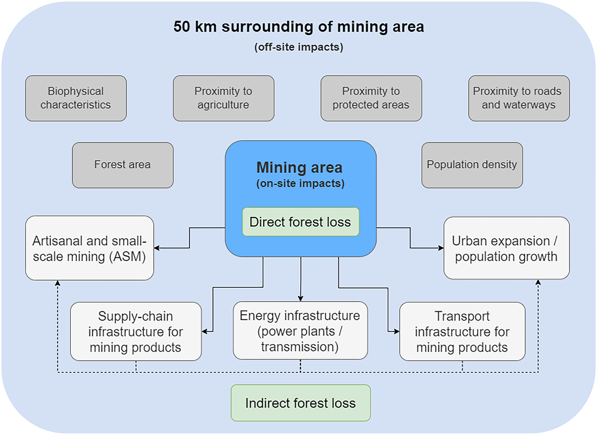
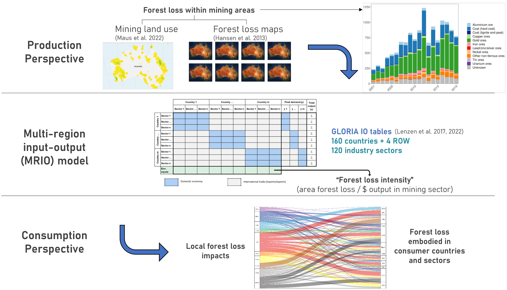

layout: false
class: clear

```{r setup, include=FALSE, echo=FALSE}
library(xaringanExtra)
options(htmltools.dir.version = FALSE)
xaringanExtra::use_panelset()
```


.center[
```{r, echo=FALSE, out.width="75%"}

```
]

.footnote-left[Source: [Sonter et al., 2023 PNAS](http://doi.org/10.1073/pnas.2307006120)]


---
layout: false
class: clear, center
background-image: url(https://www.esa.int/var/esa/storage/images/applications/observing_the_earth/copernicus/sentinel-2/19729272-10-eng-GB/Sentinel-2_pillars.jpg)
background-size: cover

.cc-bottom-left.font-light[Image: © <a href="https://www.esa.int/Applications/Observing_the_Earth/Copernicus/Sentinel-2">European Space Agency (ESA)</a>]

<!-- .center.font140.font-light[**Satellite earth observation is the only feasible data source available globally**] -->


---
layout: false
class: clear
background-image: url(./img/global-mining-map.png)
background-size: cover

# .font-light[Global Mining Land Use]

.footnote-right[.font-light.font120[Data: [Maus et al. (2020, 2022) and](http://doi.org/10.1038/s41597-022-01547-4) [Tang & Werner (2023)](http://doi.org/10.1038/s43247-023-00805-6)]]

.left-column.pl1.mt0.font120.left.bottom.font-light[
<br><br><br><br><br><br><br>
**217,201 Polygons**

**150,000 km²**

]


---

# Deforestation Due to Mining

.left-column[
```{r, echo=FALSE, out.width="100%"}

```
.footnote-left[Source: [WWF et al., 2023](https://www.wwf.de/fileadmin/fm-wwf/Publikationen-PDF/Wald/WWF-Studie-Extracted-Forests.pdf)]
]


.right-column[
```{r, echo=FALSE, out.width="95%"}

```
]


---

# Indirect Forest Cover Loss

.center[
```{r, echo=FALSE, out.width="75%"}
knitr::include_graphics("./img/pnas-ind-def.png")
```
]

.footnote-left[Source: [Giljum et al., 2022 PNAS](http://doi.org/10.1073/pnas.2118273119)]


---
# Forest Loss on Minerals Supply Chain

.center[
```{r, echo=FALSE, out.width="90%"}

```
]

.footnote-left[Source: Luckeneder et al., (Under Review in Science)]


---
# Earth System Impact of Mining

```{r, echo=FALSE, out.width="100%"}

```

.footnote-left[Source: [Crona et al., 2023](https://doi.org/10.1016/j.jclepro.2023.139523)]


---

# Mining and Development

.center[
```{r, echo=FALSE, out.width="85%"}

```
]

.footnote-left[Source: Luckeneder et al., (Under Review in Nat. Communications)]


---
layout: false
class: clear

.pull-left[
```{r, echo=FALSE, out.width="90%"}
knitr::include_graphics("./img/maus2024-nature.png")
```
```{r, echo=FALSE, out.width="90%"}
knitr::include_graphics("./img/gap_grid_map.png")
```
]

.footnote-left[Source: [Maus & Werner, 2024](http://doi.org/10.1038/d41586-023-04090-3)]

--

.pull-right[
```{r, echo=FALSE, out.width="85%"}
knitr::include_graphics("https://media.nature.com/lw767/magazine-assets/d41586-023-04090-3/d41586-023-04090-3_26550018.png?as=webp")
```
]


---


## How to keep track of existing mines and new ones?


---
layout: false

# What is Mine Land Use?

.pull-left.center[
<div class="copyright-container">
  
</div>
**Plato**
]

.pull-right.center[
<div class="copyright-container">
  
</div>
**Ludwig Wittgenstein**
]

---
layout: false

# Mine

<br>
<br>
<br>
.font150["*An excavation or system of excavations made underground for the extraction of metals or metallic ores, coal, salt, precious stones, (less commonly) building stone, clay, etc.; an open-air excavation for the extraction of such substances. Also: a place where such excavations are conducted. Source: Oxford English Dictionay*"]

---

# Semantic Segmentation Using AI

.center[
```{r, echo=FALSE, out.width="90%"}

```
]

.footnote-left[Source: Jasansky et al. (Under review in ISPRS Journal of Photogrammetry and Remote Sensing)]


---
class: title, no-number

# Thank you!
.lut-illustration-large[].wu-logo-mtg[].copyright-bottom-right.font60[Lappeenranta–Lahti University of Technology, Finland, May 15<sup>th</sup>, 2024]


.pull-left.left[
Dr Victor Maus<br>.font90[Institute for Ecological Economics<br>Vienna University of Economics and Business]<br>.font90[victor.maus@wu.ac.at]<br>.font90[<a href='https://vwmaus.github.io'>vwmaus.github.io</a>]<br>

]


---

# Indirect Deforestation Modelling

.center[
```{r, echo=FALSE, out.width="60%"}

```

]

.footnote-left[Source: [Giljum et al., 2022 PNAS](http://doi.org/10.1073/pnas.2118273119)]


---
# Minerals Supply Chain Modelling

.center[
```{r, echo=FALSE, out.width="80%"}

```
]

.footnote-left[Source: Luckeneder et al., (Under Review)]


---
# Visual Interpretation of Mining Areas

.pull-left.center[
.font100[
**Open cut of the Carajás Iron Mine, Brazil**
]
<div class="copyright-container">
  
  <div class="copyright-bottom-left2 font-light">Figure: <a href="https://www.fineprint.global/viewer">FINEPRINT Viewer</a></div>
</div>
]

.pull-right.center[
.font100[
**Parauapebas municipality, Brazil**
]
<div class="copyright-container">
  
  <div class="copyright-bottom-left2 font-light">Figure: <a href="https://www.fineprint.global/viewer">FINEPRINT Viewer</a></div>
</div>
]
