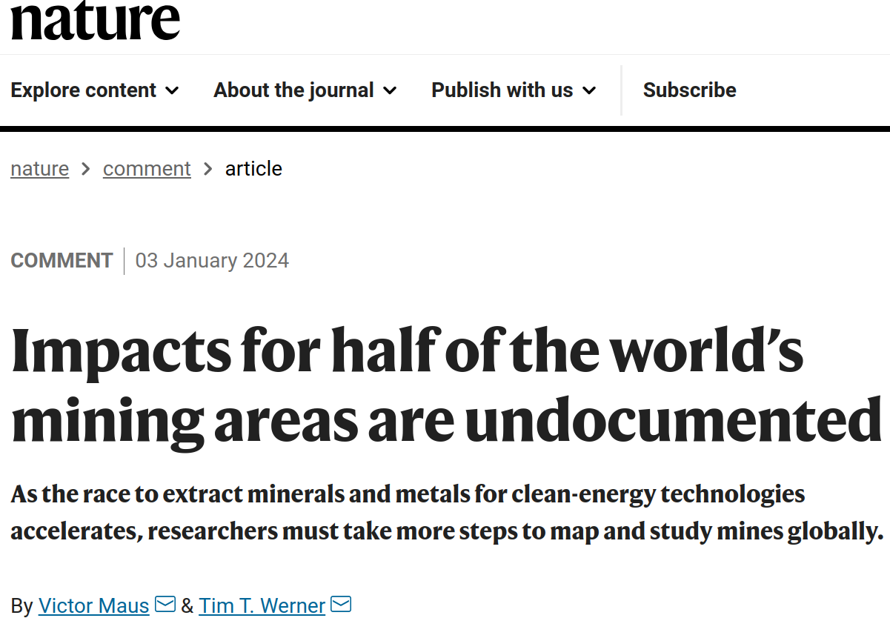
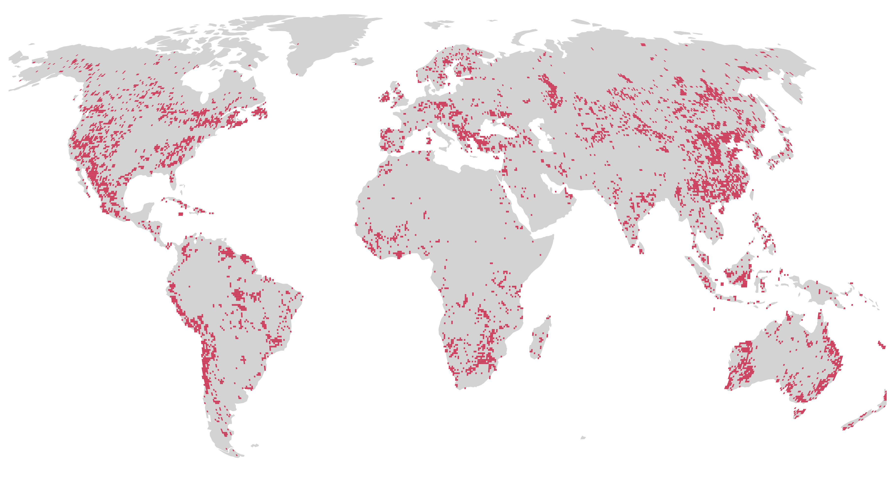
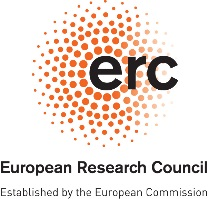
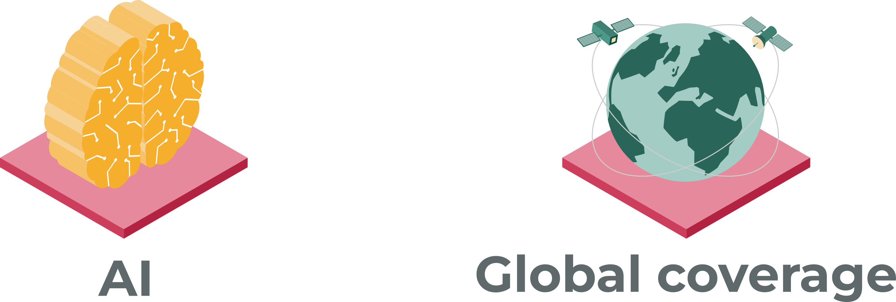
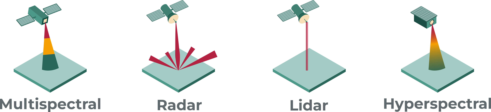

layout: false
class: clear

```{r setup, include=FALSE, echo=FALSE}
library(xaringanExtra)
options(htmltools.dir.version = FALSE)
xaringanExtra::use_panelset()
```

.pull-left[
```{r, echo=FALSE, out.width="90%"}

```
```{r, echo=FALSE, out.width="90%"}

```
]

.footnote-left[Source: [Maus & Werner, 2024](http://doi.org/10.1038/d41586-023-04090-3)]


.pull-right[
```{r, echo=FALSE, out.width="85%"}
knitr::include_graphics("https://media.nature.com/lw767/magazine-assets/d41586-023-04090-3/d41586-023-04090-3_26550018.png?as=webp")
```
]

---
layout: false
class: clear
background-image: url(./img/global-mining-map.png)
background-size: cover

# .font-light[Global Mining Land Use]

.footnote-right[.font-light.font120[[Maus et al. (2020, 2022) Nature Sci. Data](http://doi.org/10.1038/s41597-022-01547-4)]]


---
layout: false
class: 
count: false
# .font-huw-yellow-light[MINE-THE-GAP]
### .font-dark.op80[Mine-level indicators using EO and AI]

<!--  -->



---
class: title, no-number

# Thank you!
.lut-illustration-large[].wu-logo-mtg[].copyright-bottom-right.font60[Sustainability Science Summit, Berlin, Feb 21<sup>st</sup>, 2025]


.pull-left.left[
Dr Victor Maus<br>.font90[Institute for Ecological Economics<br>Vienna University of Economics and Business]<br>.font90[victor.maus@wu.ac.at]<br>.font90[<a href='https://vwmaus.github.io'>vwmaus.github.io</a>]<br>

]
